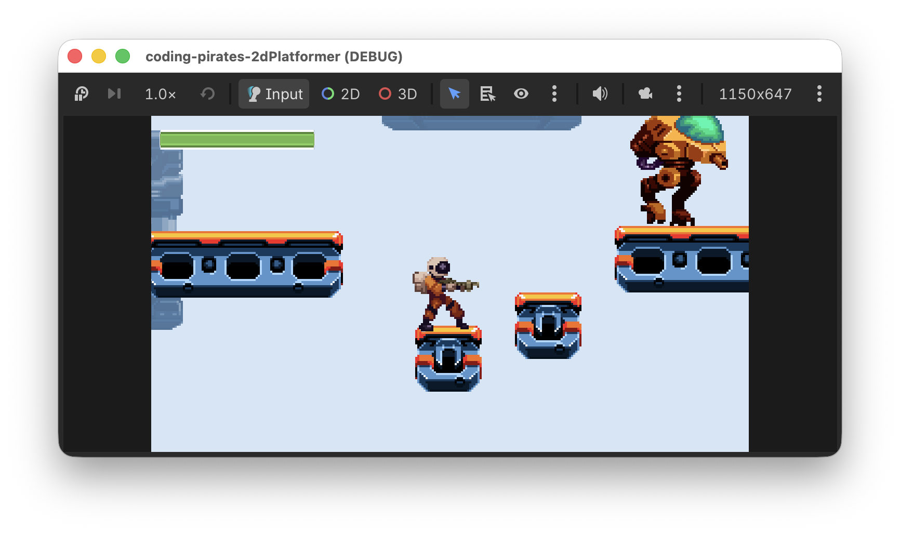

# Coding Pirates Godot 2D Platformer
Velkommen til endnu en Godot guide serie!

I denne guide serie skal vi lave endnu et 2D spil, for der er stadig så meget vi kan lære bare om 2D i Godot.

Vi skal lave et 2D platform spil hvor den tapre space pirate Piry McPirate skal bevæge sig på platforme og elevatorer mens han nedkæmper ondsindede Walkers, samler førstehjælpspakker op og bare holder sig i live.

Udover alle de ting vi allerede kan i Godot (scripts, UI, signals og så videre) skal vi lære:

- At lave en level med `TileMapLayer`s.
- Om Physics i Godot og hvordan vi kan bruge en `CharacterBody2D`s til vores player og fjender sådan at de reagerer med tyngdekraft.
- Om `collision_layer` og `collision_mask`.
- Hvordan vi kan opbygge vores kode ved hjælp af "komponenter" sådan at vi kan lave en masse små "byggeklodser" som vi så kan sætte sammen, som vi vil på de enkelte scener vi laver.
- Hvordan vi kan bruge en `RayCast2D` node til at få vores fjender til at bevæge sig i et mønster.

Og sikkert også en masse andet...så helt ærligt! Vi har temmelig travlt!! Lad os komme i gang.

Her er en oversigt over de levels vi skal igennem

## Levels
- [Level 1, opsætning](lessons/lesson01)
- [Level 2, TileMapLayers](lessons/lesson02)
- [Level 3, TileMapLayers Part II](lessons/lesson03)
- [Level 4, Game scene og start på Player](lessons/lesson04)
- [Level 5, komponenter og start på Player script](lessons/lesson05)
- [Level 6, videre med Player og komponenter](lessons/lesson06)
- [Level 7, animationer](lessons/lesson07)
- [Level 8, hop!](lessons/lesson08)
- [Level 9, skyd!](lessons/lesson09)
- [Level 10, fjender](lessons/lesson10)
- [Level 11, fjender der vender](lessons/lesson11)
- [Level 12, fjender der dør](lessons/lesson12)
- [Level 13, fjender der vender - part II](lessons/lesson13)
- [Level 14, fjender der skyder](lessons/lesson14)
- [Level 15, time...to die](lessons/lesson15)
- [Level 16, healthbar](lessons/lesson16)
- [Level 17, Game Over man!](lessons/lesson17)
- [Level 18, Startskærm](lessons/lesson18)

## Bonus levels
Bare når du er færdig med de andre :)
- [Bonus level 01, Extra health](lessons/bonus01)
- [Bonus level 02, Elevatorer](lessons/bonus02)

## Assets
[Assets kan downloads her](assets/gameassets/assets.zip)

Det er en zip fil så den skal du pakke ud, sig til hvis du skal have hjælp med det.

## Get Ready Player 1!
Når du er klar klikker du bare på [Level 1, opsætning](lessons/lesson01)