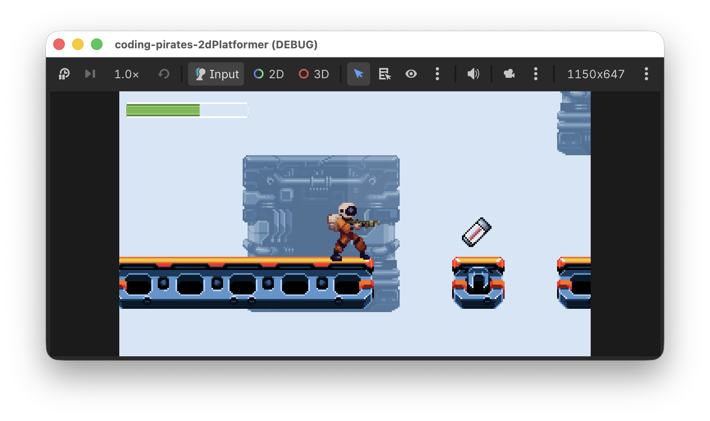
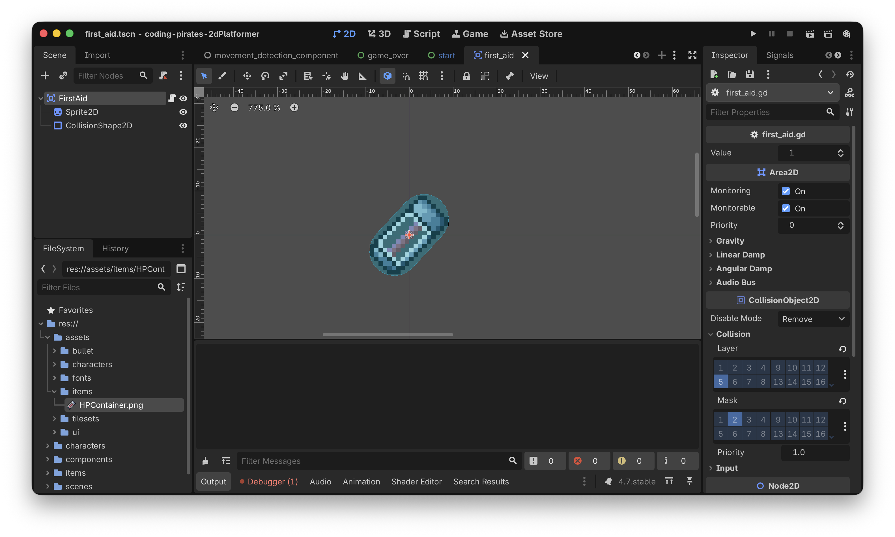
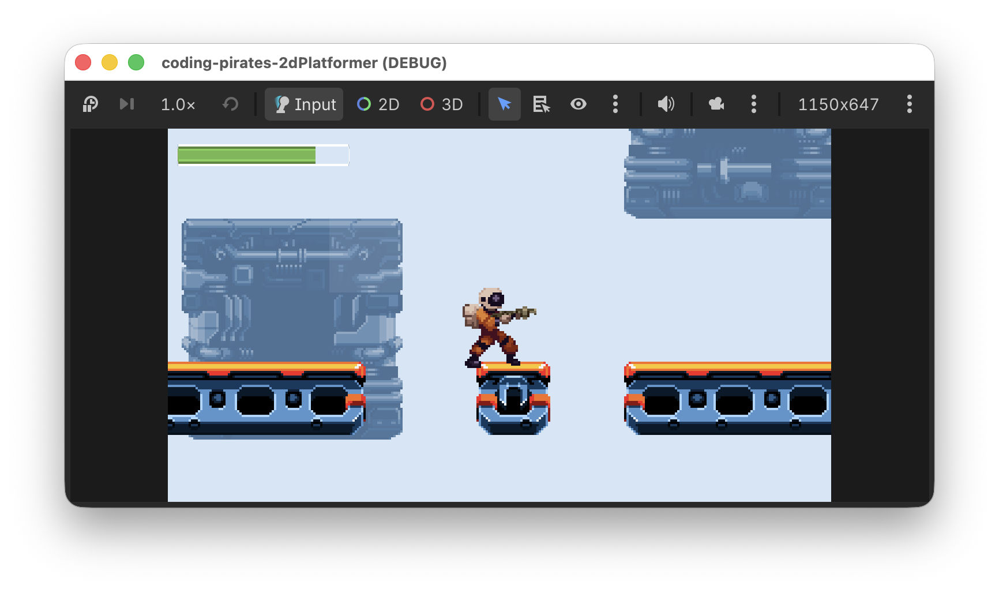

# Godot 2D Platformer - bonus level 01, Extra health

I denne bonusepisode vil vi forsøge os med at lave en lille powerup/health/first aid ting som vores spiller kan samle op og få ekstra energi.



Lad os komme igang, you know the drill...say it with me...

## Hvad er det vi gerne vil?
Vi vil gerne have lavet en "ting" som vores `Player` kan gå ind i, og når det sker får den ekstra energi som kan være variabel. Dog kan `Player` aldrig få mere end `max_health`, så altså.

- Hvis vores `Player` har `health = 3` og samler ekstra health med værdien 1 op, bliver `health = 4`
- Hvis vores `Player` har `health = 5` og samler ekstra health med værdien 1 op, bliver `health = 5` for den var allerede = `max_health`

Nå, men det lyder jo ikke så slemt. En `Area2D` med en `CollisionShape2D` og et script som connecter til `body_entered` og så checker om det er noget i gruppen "Player" vores "ting" er stødt sammen med, og hvis det er så laver vi en funktion på `Player` som vi kan kalde og som tæller `Player`s `HealthComponent` op med den værdi som vores "ting" nu har.

Lad os lave en liste og gå i gang.

- [ ] Lav ny `FirstAid` som er en `Area2D` med en `CollisionShape2D`
- [ ] Lav script der checker kollision og hvis det er en `Player` så lav og kald en ny `increase_health` funktion på `Player`
- [ ] Udvid `HealthComponent` så den kan opdatere `health`, dog kun op til `max_health`

Det skulle vel være det.

## Ny `FirstAid` Scene
Du kan godt selv, den er simpel. Du kan bruge "HPContainer.png" som du finder i assets mappen til din `Sprite2D` (ups, så fik vi røbet at du skulle bruge sådan en).

Husk "collision_layer" og "collision_mask", du kan bruge "Items" til "collision_layer"

Her er vores forsøg:



Det var step 1

- [X] Lav ny `FirstAid` som er en `Area2D` med en `CollisionShape2D`
- [ ] Lav script der checker kollision og hvis det er en `Player` så lav og kald en ny `increase_health` funktion på `Player`
- [ ] Udvid `HealthComponent` så den kan opdatere `health`, dog kun op til `max_health`

Videre.

## Lav script
Du skal lave et script der:

- Definerer en værdi som vores `FirstAid` tæller spillerens energi op med, kald din variabel `value` og lad den være af typen `int`
- Connecter `body_entered` til en funktion du laver, som skal tage parameter som vi kalder `body` af typen `Node2D`
- I din funktion skal du se om den `body` der er stødt ind i vores `FirstAid` er i gruppen "Player" (eller hvad du nu kaldte den gruppe du har tilføjet din `Player` til i dens `_ready` funktion). Hvis den er, så kald funktionen `increase_health` med `value` som parameter og bagefter skal du fjerne din `FirstAid` scene fra spillet.

Prøv selv, du er en garvet Godot programmør nu så det kan du godt! :)

Her er vores forsøg:

```gdscript
extends Area2D

@export var value: int = 1

func _ready() -> void:
	body_entered.connect(_on_body_entered)
	
func _on_body_entered(body: Node2D) -> void:
	if body.is_in_group("Player"):
		body.increase_health(value)
        queue_free()
```

### Udvid `Player`
Og så skal vi lige have udvidet vores `Player` med `increase_health` funktionen som vi så frækt antager findes her ovenfor :)

Det skal bare være en simpel "gennemstillings funktion" som tager værdien ind fra `FirstAid` og sender den videre ned til `Player`s `HealthComponent` hvor vi så også skal have lavet en ny funktion som kan lave magien for os.

Det kunne se sådan her ud:

```gdscript
func increase_health(value: int) -> void:
	health_component.increase(value)
```

Igen sparker vi problemet ned af vejen og forholder os ikke til noget som helst her, vi kalder bare videre til `health_component` med den værdi vi har fået med ind.

Det var step 2

- [X] Lav ny `FirstAid` som er en `Area2D` med en `CollisionShape2D`
- [X] Lav script der checker kollision og hvis det er en `Player` så lav og kald en ny `increase_health` funktion på `Player`
- [ ] Udvid `HealthComponent` så den kan opdatere `health`, dog kun op til `max_health`

Og så kan vi ikke trække den længere, vi skal have udvidet `HealthComponent`
 også og have lavet logikken.

## Udvid `HealthComponent`
Ovenfor lovede vi jo at der nu ville være en funktion som vi kalder `increase` på vores `HealthComponent` så lad os starte med at skrive signaturen i `HealthComponent`:

```gdscript
func increase(value: int) -> void:
```

Og hvad skal der så ske her? Ja altså, vi skal jo egentlig bare lægge `value` til `health`...nemt hva!

Ja det var så også _for_ nemt!

Der er jo lige den lille krølle at `health` +  `value` _ikke_ må blive > `max_health`.

Det kan vi skrive på forskellige måder. Vi kan være super detaljerede:

```gdscript
if health + value < max_value:
   health += value
```

Altså...først checke om den nuværende værdi af `health` plus `value` er mindre end `max_value` og hvis de er, jamen så lav udregningen.

Det virker og det er til at forstå.

Men...vi er jo ikke nybegyndere længere så vi bruger selvfølgelig [`min` funktionen](https://docs.godotengine.org/en/stable/classes/class_%40globalscope.html#class-globalscope-method-min).

Som der står i dokumentationen:

> Returns the minimum of the given numeric values

Så vi kan sige:

```gdscript
health = min(max_health, health + value)
```

Og så vil Godot selv sørge for at `health` får den laveste af de to værdier. 

Lad os se et par eksempler for `min` (og dens bror `max`) er gode at kende.

- `health` = 3
- `value` = 1 
- `max_health`= 5

`health = min(5, 3 + 1) // 5 er større end 4 så health = 4`

- `health` = 3
- `value` = 3 
- `max_health`= 5

`health = min(5, 3 + 3) // 5 er mindre end 6 så health = 5`

For en god ordens skyld er her hele den opdaterede `HealthComponent`

```gdscript
class_name HealthComponent
extends Node

@export_category("Settings")
@export var max_health: int = 3

var health: int = max_health

func hit(damage: int) -> void:
	health -= damage
	
func increase(value: int) -> void:
	# Sæt health = det mindste tal af
	# max_health 
	# og
	# health + value
	health = min(max_health, health + value)
	
func is_dead() -> bool:
	return health <= 0
```

Det var step 3

- [X] Lav ny `FirstAid` som er en `Area2D` med en `CollisionShape2D`
- [X] Lav script der checker kollision og hvis det er en `Player` så lav og kald en ny `increase_health` funktion på `Player`
- [X] Udvid `HealthComponent` så den kan opdatere `health`, dog kun op til `max_health`

## Tilføj en `FirstAid` til din `Level01`
Nu kan du "Instantiate Child Scene" i "Items" containeren i din `Level01` og tilføje en `FirstAid`.

Kør så dit spil og prøv at se om du kan samle din `FirstAid` op og få ekstra energi.




Aaaaah! Energi!

## Det var det
Vi er nu fulde af energi og helt oppe at ringe over at vi nu kan samle ekstra energi op i vores spil

Du kan selv prøve at eksperimetere med at lave `FirstAid` kasser med forskellig værdi hvis du har lyst.