# Godot 2D Platformer - bonus level 02, Platforme

I denne bonusepisode vil vi forsøge os med at lave en platform/lift som automatisk kan køre op og ned mellem to punkter (eller fra side til side...eller skråt...eller i zig zag...no limits!)

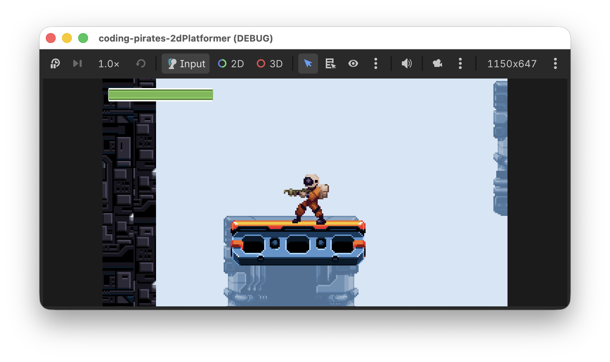

Den "gode" nyhed er at vi ikke skal lave nye komponenter...ja vi skal ikke engang lave et script.

Til gengæld skal du lære om [`AnimationPlayer`](https://docs.godotengine.org/en/stable/classes/class_animationplayer.html) som godt kan være lidt svær at forstå hvordan man bruger...mest fordi den kan så meget.

Lad os komme i gang!

## Hvad er det vi gerne vil?
Vi vil gerne have lavet "noget" som bevæger sig mellem to `Vector2` koordinater i vores `Level01` scene.

Det "noget" skal egentlig bare være en simpel scene med en `Sprite2D` og en `CollisionShape2D` og så kan vi bruge en `AnimationPlayer` til at lave en animation som opdaterer scenens y position således at scenen flytter sig fra punkt A til punkt B og tilbage igen. Den animation kan vi så loope og hopla, vi har en elevator!

> Nå! Nemt! Så bruger vi da bare et `Area2D`

Tænker du så

Først og fremmest...godt tænkt! Det vil desværre ikke du'. Hvis vi gør det falder vores `Player` direkte igennem vores `Lift`, hvorfor nu det?

Ah jo...vores `Player` er jo en `CollisionShape2D` så den skal bruge andre scener med fysiske egenskaber for at du'.

Vi kigger lidt i dokumentationen og finder [`AnimatableBody2D`](https://docs.godotengine.org/en/stable/classes/class_animatablebody2d.html) og vi læser:

> A 2D physics body that can't be moved by external forces. When moved manually, it affects other bodies in its path.

Yes, det lyder jo lovende, vi læser videre:

> When AnimatableBody2D is moved, its linear and angular velocity are estimated and used to affect other physics bodies in its path. *This makes it useful for moving platforms, doors, and other moving objects.*

Hallo mand!! Det er jo lige det vi vil.

Så har vi vist alle elementerne til en plan, så vi laver en liste:

- [ ] Lav en ny `Platform` af typen `AnimatableBody2D`
  - [ ] Den skal ha en `CollisionShape2D`
  - [ ] Den skal ha en `Sprite2D` og så bruger vi et billede fra vores tileset til elevatoren
- [ ] Tilføj en `Platform` til vores `Level01`
- [ ] Tilføj en `AnimationPlayer` til vores `Platform` _i_ vores `Level01``
- [ ] Animer vores `Platform`s y position

Lad os komme i gang!

## Lav en ny `Platform`
Du får det bare i stikordsform, det eneste nye her er at du skal være sikker på at vælge en `AnimatableBody2D` som rod scene/node:

- Lav en ny 2D node af typen `AnimatableBody2D`
- Omdøb den til at hedde "Platform"
- Gem den i "items" mappen
- Tilføj en `Sprite2D`
- Tilføj en `CollisionShape2D`
- Husk at sætte "collision_layer" til Terrain (layer 1) og "collision_mask" til Player (layer 2) så vi kan stå på platformen

Og så skal vi have valgt et billede.

Vi vil gerne bruge de samme billeder som vi brugte til vores platforme, altså en del af tilesettet.

Men betyder det at vi skal til at lave et helt nyt `TileMapLayer` og alt muligt...for _det_ gider vi altså ikke!

Nej...rolig, vi kan snyde.

Som du måske kan huske fra vores 2D space shooter kan vi bruge "regions" af et billede, altså sige: "giv mig et udklip af billedet, det skal starte i x = 16, y = 32 og det skal være 16 px højt og 16 px bredt" f.eks.

Lad os gøre det her.

Du kan trække "1_Industrial_Tileset_1B.png" ind på din `Sprite2D`, den har de pæneste platforme.

Vælg nu din `Sprite2D` i venstre side og kig i "Inspectoren" i højre side.

Under Sprite2D finder du "Region" som du kan sætte et flueben ud for, gør det.

Nu kan vi få lov til at vælge hvilket "Rect" (rectangle) vi gerne vil bruge af billedet.

Vores tiles er 16 x 16 pixels og vi vil gerne bruge den del der er i øverste venstre hjørne og som er markeret med en rød firkant her

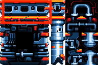

Så vi skal starte i:

x = 0
y = 0

Og så skal vi bruge 6 tiles i bredden og 2 i højden, så vi sætter

w = 96
h = 32

Se billedet her:

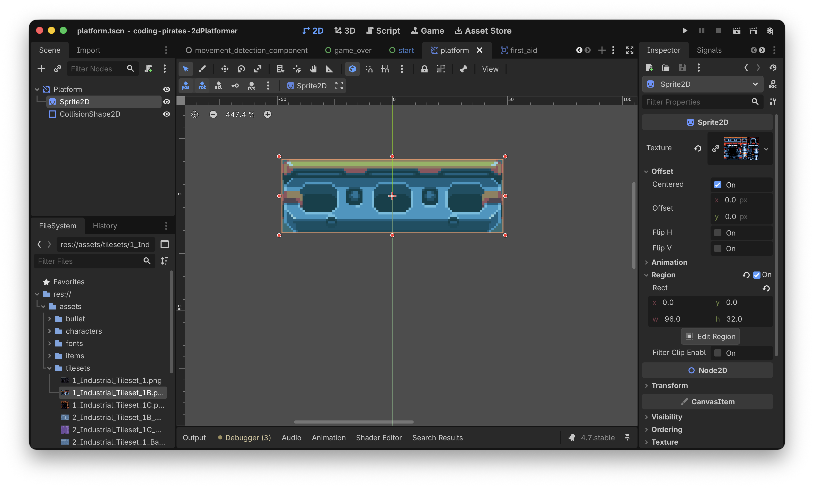

Og vupti! Så har vi en platform...nemt!

Vi kan strege på listen

- [X] Lav en ny `Platform` af typen `AnimatableBody2D`
  - [X] Den skal ha en `CollisionShape2D`
  - [X] Den skal ha en `Sprite2D` og så bruger vi et billede fra vores tileset til elevatoren
- [ ] Tilføj en `Platform` til vores `Level01`
- [ ] Tilføj en `AnimationPlayer` til vores `Platform` _i_ vores `Level01``
- [ ] Animer vores `Platform`s y position

Videre, de to næste er også nemme

## Tilføj en `Platform` til vores `Level01`
Ovre i vores `Level01` har vi allerede lavet en container til "Platforms" så vi markerer den og vælger "Instantiate Child Scene" og vælger herefter vores nye `platform.tscn`.

Til sidst flytter vi den lige ned hvor vi godt kunne tænke os at den skulle være.

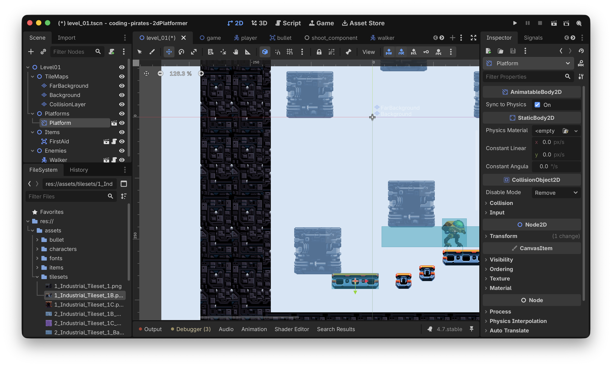

Og så kan vi køre vores spil og prøve at hoppe op på den og se at vi bliver stående

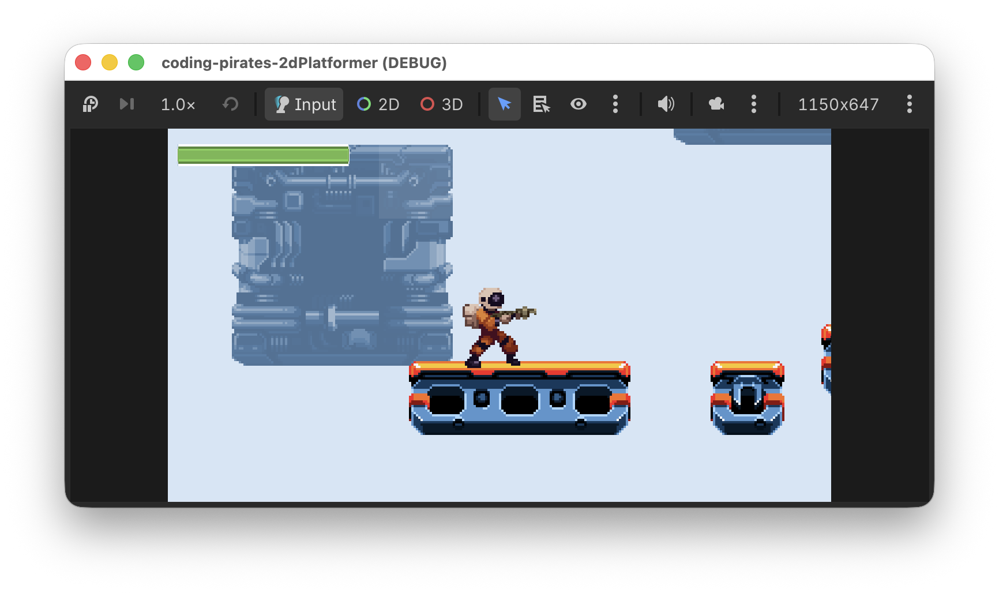

Hvis ikke du gør, så check lige at du har sat "collision_layer" og "collision_mask" korrekt.

Vi streger igen

- [X] Lav en ny `Platform` af typen `AnimatableBody2D`
  - [X] Den skal ha en `CollisionShape2D`
  - [X] Den skal ha en `Sprite2D` og så bruger vi et billede fra vores tileset til elevatoren
- [X] Tilføj en `Platform` til vores `Level01`
- [ ] Tilføj en `AnimationPlayer` til vores `Platform` _i_ vores `Level01``
- [ ] Animer vores `Platform`s y position

Videre!

## Tilføj en `AnimationPlayer` til vores `Platform`
Du tænker måske:

> Det der med at animere...hvorfor er det ikke platformen selv der kan stå for det?

Igen...det er godt tænkt, du har fattet hvad det går ud på :)

Grunden til at vi ikke kan sætte en `AnimationPlayer` _direkte_ på vores `Platform` i selve `platform.tscn` er, at vi gerne vil animere y værdien for vores platform (eller x hvis du gerne vil have den til at køre fra side til side) i _selve_ `Level01`, og den kender vi jo ikke ovre i vores `Platform`. Vi kunne måske godt lave noget med at sende det med over som parametre og så sætte det op meeeeen, det bliver måske også en kende for bøvlet.

Så derfor er vi nødt til at tilføje vores `AnimationPlayer` der hvor vi skal bruge vores `Platform`, altså i det her tilfælde i `Level01`.

Så derfor:

- Marker din `Platform` under Platforms i `Level01`
- Højreklik og vælg "Add Child Nodd" (eller brug genvejen hvis du kender den)
- Vælg en `AnimationPlayer`

Det skulle gerne se sådan her ud:

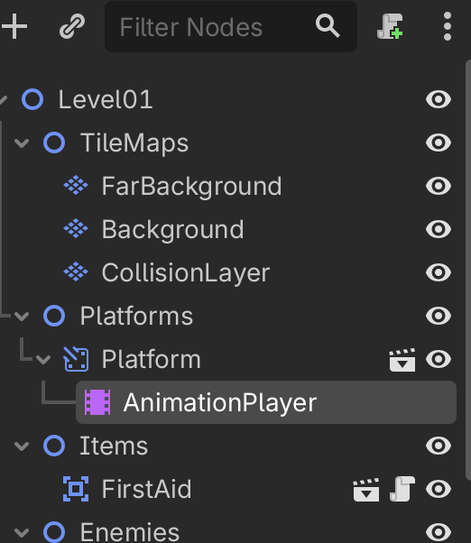

Det var sådan set bare det vi skulle her, så vi streger igen

- [X] Lav en ny `Platform` af typen `AnimatableBody2D`
  - [X] Den skal ha en `CollisionShape2D`
  - [X] Den skal ha en `Sprite2D` og så bruger vi et billede fra vores tileset til elevatoren
- [X] Tilføj en `Platform` til vores `Level01`
- [X] Tilføj en `AnimationPlayer` til vores `Platform` _i_ vores `Level01``
- [ ] Animer vores `Platform`s y position

Sidste skridt.

## Animer vores `Platform`s y position
Nu skal du være vågen. Det er ikke svært at bruge en `AnimationPlayer` men der er lige lidt ting man skal igennem så følg godt med.

### Opret ny animation
1. I venstre side vælger du din `AnimationPlayer`
2. I bunden kan du nu vælge "Animation" fanen
3. Tryk så på "Animation" og vælg "New", kald din animation for "move"

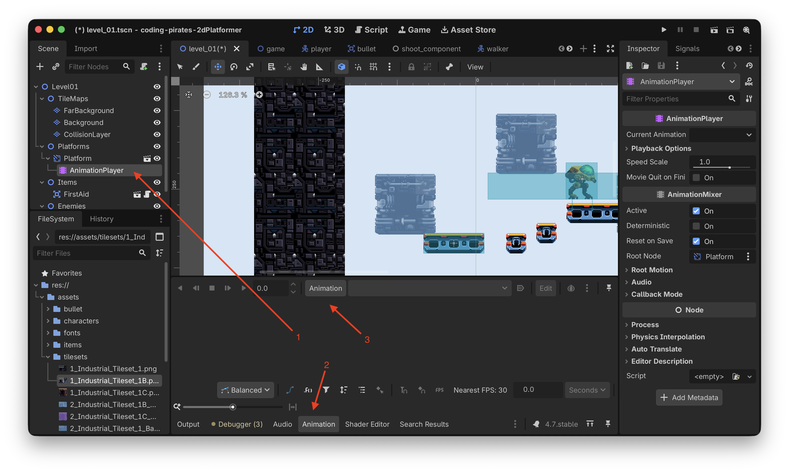

Nu får vi et nyt "animation track" hvor vi kan skrue på en masse ting, f.eks.

1. Længden på animationen
2. Skal animationen loope eller ej
3. Hvilken type track er det her (den er tom lige nu)

### Tilføj property track
Vi vil gerne lave et "property track" som man kan bruge til at opdatere properties, altså position, size, scale, rotation og så videre.

Her i [dokumentationen](https://docs.godotengine.org/en/stable/tutorials/animation/animation_track_types.html) kan du se en liste over hvilke typer af tracks der ellers er.

For at oprette et nyt "property track" skal du:

1. Klikke på plusset i venstre hjørne
2. Vælge "Property Track"

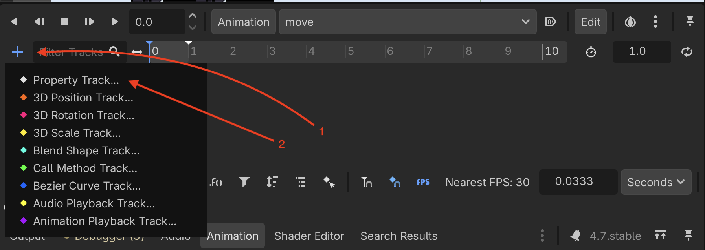

Så bliver du spurgt hvilken node du gerne vil animere. Det er jo vores `Platform` så den vælger vi

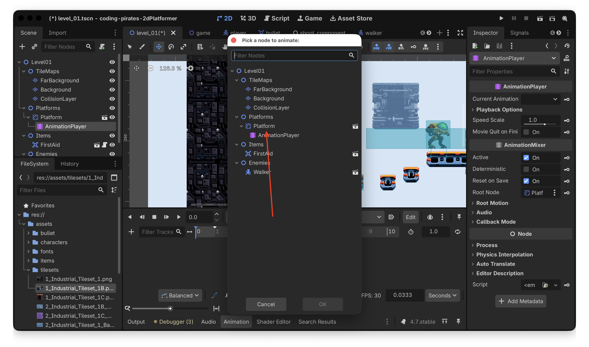

Så bliver vi spurgt hvilken property vi gerne vil animere, i vores tilfælde er det "position" som vi finder under "Node2D" så den vælger vi

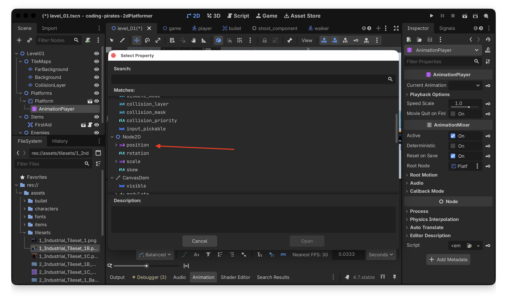

Og det var det, nu har vi et nyt property track på vores `Platform` som gør at vi kan animere dens `position`

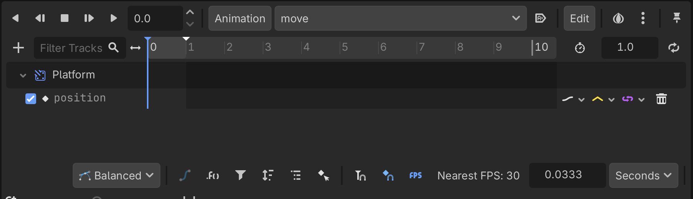

Nemt hva!

### Lav animation
Nå, men så er vi klar til at lave vores animation! Bare rolig, det er knap så bøvlet

Vi vil gerne lave en animation der er 10 sekunder lang og som looper så start med at rette de to ting.

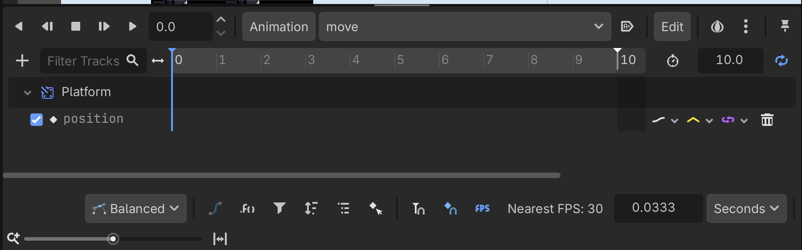

Og så kan vi animere y værdien...hvordan gør vi det?

Hvis du i venstre side af skærmen vælger din `Platform`  **mens du har "Animation" åbnet i bundet af skærmen** og så kigger i "Inspectoren" i højre side vil du se at der er kommet nogle små nøgler ud for properties. Det betyder at vi kan animere dem.

Så, mens du har "Animation" åbnet kan du nu i "Inspectoren" i højre side, under Node2D -> Transform trykke på nøglen ud for "Position"

Nu er der kommet et punkt i vores animation

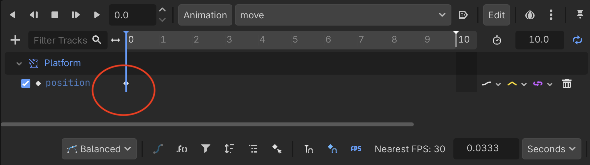

Hvis du klikker på det kan du se properties i højre side

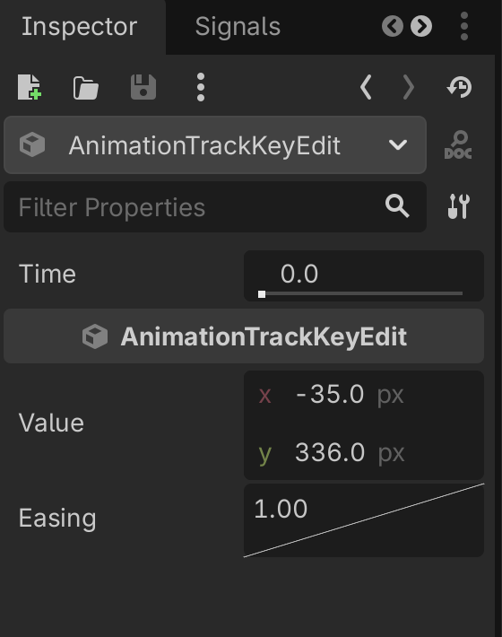

Her kan vi se at punktet er i time 0 (altså i starten af animationen) og at værdierne på det tidspunkt (på vores platform) er:

x = -35
y = 336

Nu vil vi så gerne gøre sådan at vores lift efter 5 sekunder (altså halvvejs i vores animation) har flyttet sig 150 pixels opad.

Så vi tager fat i den blå streg som lige nu står i 0.0 og flytter den hen så tæt på 5.0 som vi kan (bare rolig, vi kan fin-tune det i properties senere), hvis den er svær at få fat på kan du også bare skrive værdien 5.0

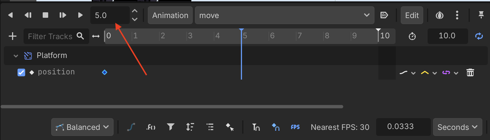

Og så skal vi fortalt vores animation hvad y værdien skal være efter 5 sekunder så vi:

1. Finder den samme Position under "Inspectoren" som før
2. Retter y værdien til den nuværende værdi - 150 for at få platformen til at flytte sig opad
3. Trykker på nøglen igen
4. Kan se at nu har vi et nye animation point efter 5 sekunder

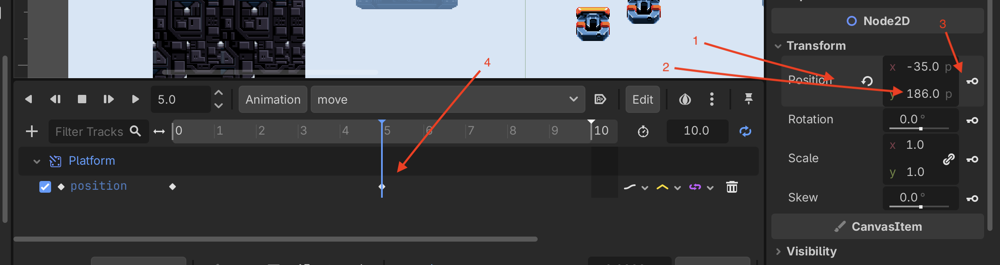

Så nu vil vores animation altså bruge 5 sekunder på at flytte liften 150 pixels opad...fedt! Så skal vi bare ned igen så vi efter 10 sekunder er tilbage hvor vi startede, så derfor:

- Flytter vi den blå streg hen til 10.0 (eller skriver 10.0)
- Finder den samme Position under "Inspectoren" som før
- Sikrer os at den er tilbage i startpunktet
- Trykker på nøglen igen

Tada, nu har vi en animation med 3 punkter:

Punkt 1 i 0.0

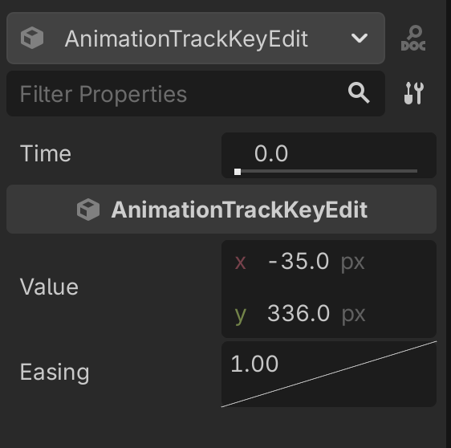

Punkt 2 i 5.0 hvor y værdien er ændret

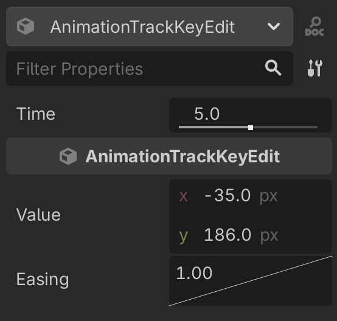

Punkt 3 i 10.0 hvor y værdien er mage til den vi havde i 0.0

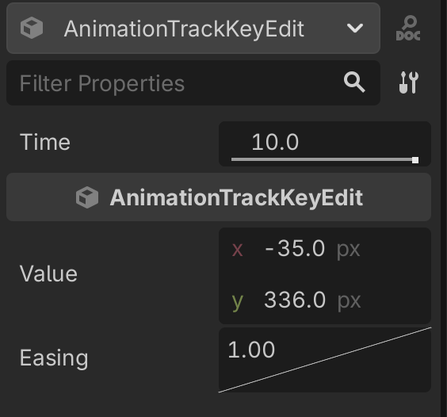

Hvis nogle af dine værdier er "skæve" fordi du har trukket i den blå streg kan du rette dem til her så de står korrekt.

Kør dit spil.

Hmmmm, platformen bevæger sig ikke, kan du regne ud hvad der er galt?

Det er det samme som når vi brugte en `AnimatedSprite2D` tidligere...vi skal huske at sætte den til at "autoplay on load" sådan at vores animation starter

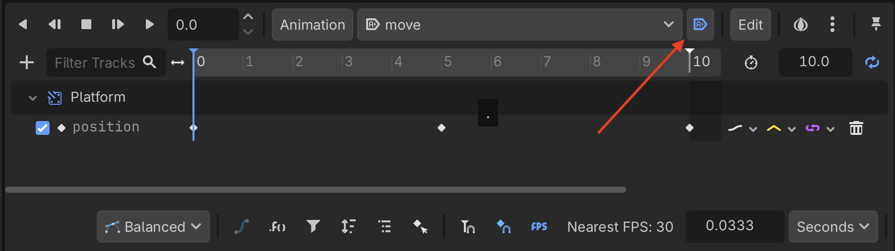

Prøv at kør dit spil igen nu...tada, vores elevator kører nu lystigt op og ned, det er da for fedt!

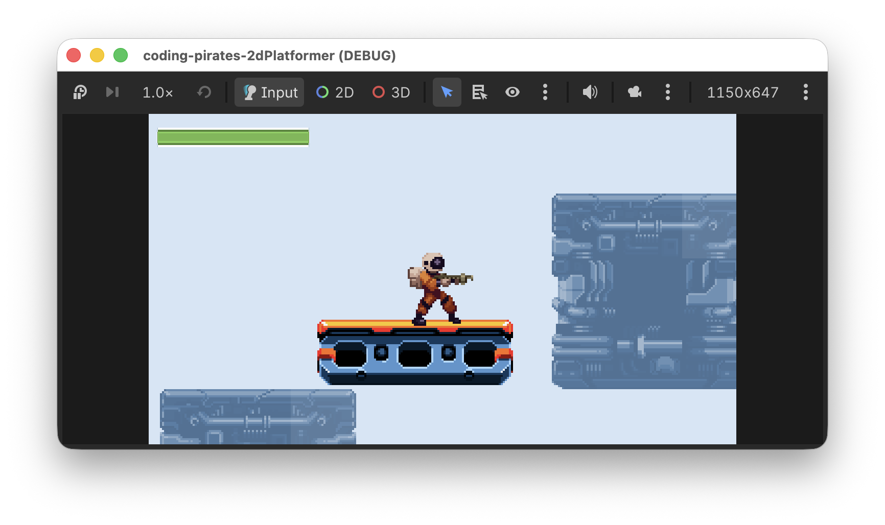

Vi streger for sidste gang og klapper os selv på skulderen for det var godt arbejde med den `AnimationPlayer` der!

- [X] Lav en ny `Platform` af typen `AnimatableBody2D`
  - [X] Den skal ha en `CollisionShape2D`
  - [X] Den skal ha en `Sprite2D` og så bruger vi et billede fra vores tileset til elevatoren
- [X] Tilføj en `Platform` til vores `Level01`
- [X] Tilføj en `AnimationPlayer` til vores `Platform` _i_ vores `Level01``
- [X] Animer vores `Platform`s y position

## Hvad så nu
Forhåbentlig kan du se at en `AnimationPlayer` kan bruges til mange ting, du kan f.eks:

- Lave platforme der kan køre fra side til side, eller skrå
- Animere de `FirstAid` elementer som du måske har lavet i [Bonus level 01](../bonus01/) så de ser ud som om de snurrer rundt

Nu ved du hvordan man gør, vi glæder os til at se hvad du finder på :)