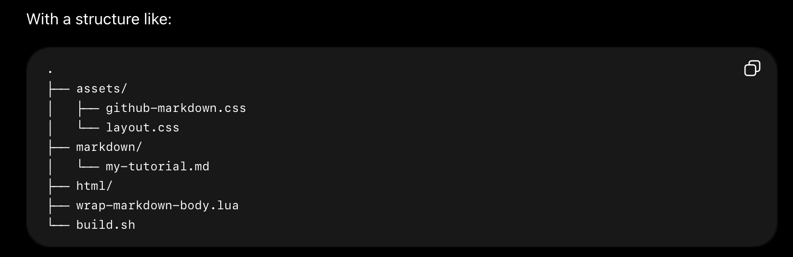

# Godot 2D Platformer - level 1, opsætning
Velkommen til endnu en Godot guide serie!

I denne guide serie skal vi lave endnuet 2D spil, for der er stadig så meget vi kan lære bare om 2D i Godot.

Vi skal lave et 2D platform spil hvor den tapre space pirate Piry McPirate skal bevæge sig på platforme og elevatorer mens han nedkæmper ondsindede Walkers, samler førstehjælpspakker op og bare holder sig i live

Udover alle de ting vi allerede kan i Godot (scripts, UI, signals og så videre) skal vi lære:

- At lave en level med `TileMapLayer`s.
- Om Physics i Godot og hvordan vi kan bruge en `CharacterBody2D`s til vores player og fjender sådan at de reagerer med tyngdekraft.
- Om `collision_layer` og `collision_mask`.
- Hvordan vi kan opbygge vores kode ved hjælp af "komponenter" sådan at vi kan lave en masse små "byggeklodser" som vi så kan sætte sammen, som vi vil på de enkelte scener vi laver.
- Hvordan vi kan bruge en `RayCast2D` node til at få vores fjender til at bevæge sig i et mønster.
- Hvordan vi kan bruge `CanvasModulate` og `PointLight2D` til at sætte lys på vores levels.

Og sikkert også en masse andet...så helt ærligt! Vi har temmelig travlt!! Lad os komme i gang.

## Hent Godot
Hvis du ikke allerede har hentet Godot så ville det nok være et godt sted at starte. Du kan finde nyeste version af Godot på [deres download side](https://godotengine.org/download). Vælg den øverste version der bare hedder "Godot Engine", vi skal ikke bruge .Net versionen... dot Niet til dot Net som russerne siger...tror jeg.

Installer Godot og husk hvor du har installeret det så du kan finde det næste gang! Spørg evt. om hjælp med at installere Godot hvis det driller.

## Nyt projekt
1. Start Godot
2. Vælg *+ Create* i øverste venstre hjørne


3. Giv dit spil et navn (og _husk_ hvor du gemte det til næste gang)


And can you write code?

```gdscript
func _ready():
    var hello = "Hello"
```

And it updates

Here's a list
- one
- two
- three

**bold** _italic_

A single line of code `var meh = 1`

And an image here


| header | tada |
| --- | --- |
| look | here|

# One
## Two
### Three
#### Four
##### Five
###### Six

> Quote