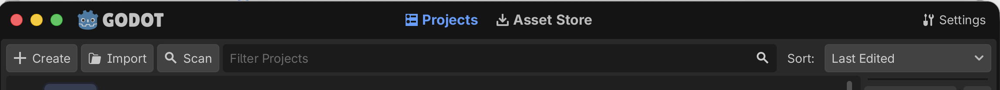
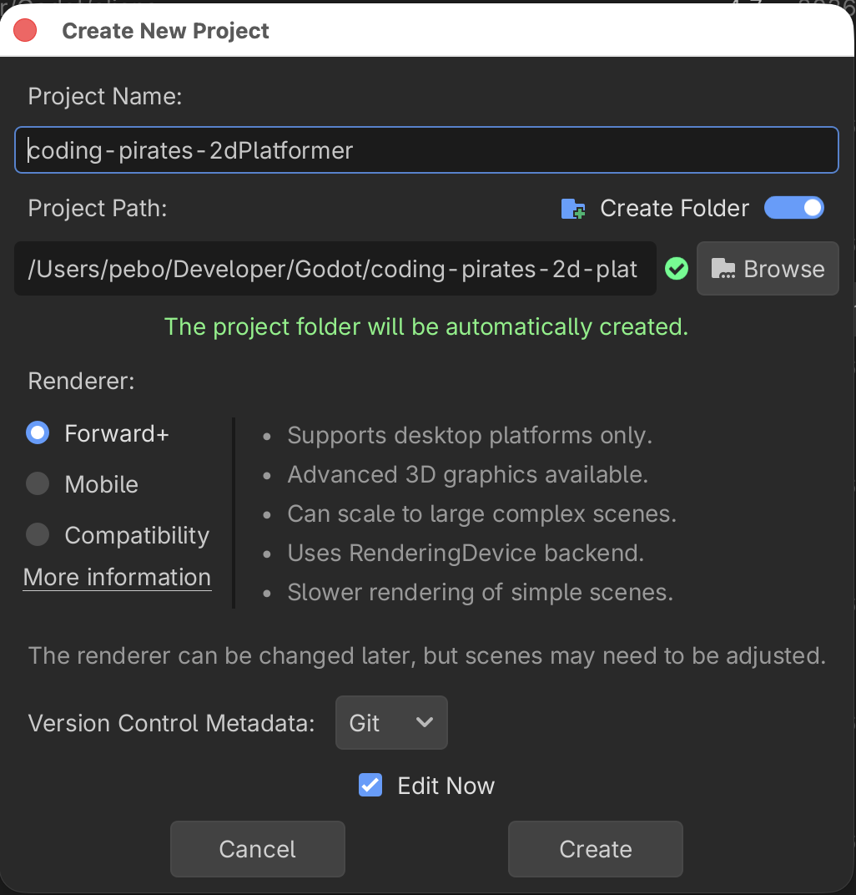
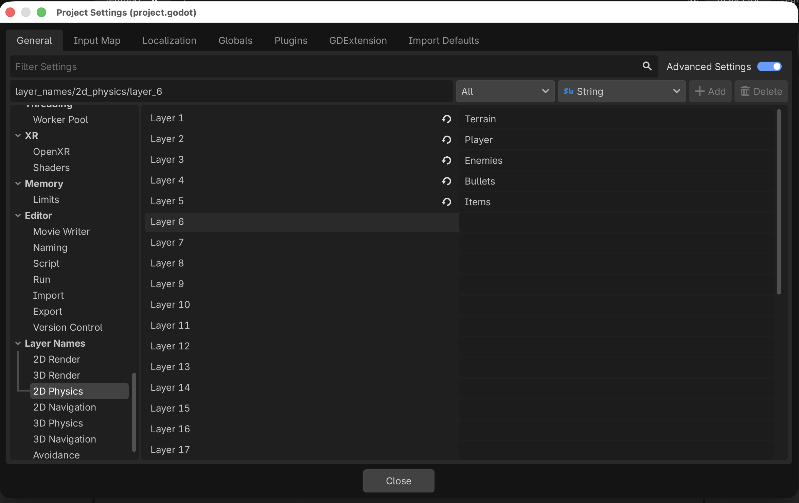
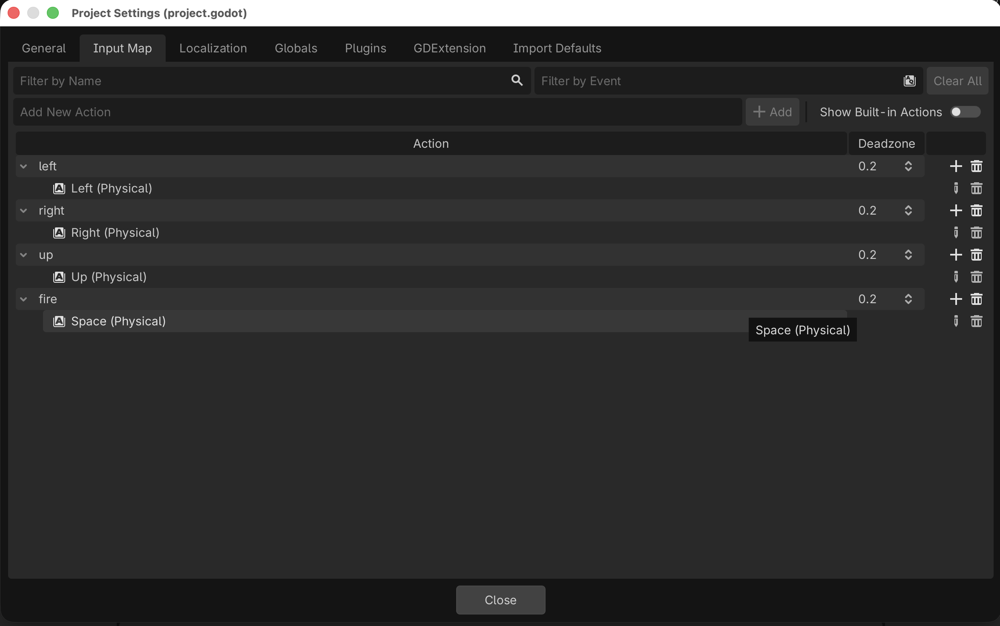
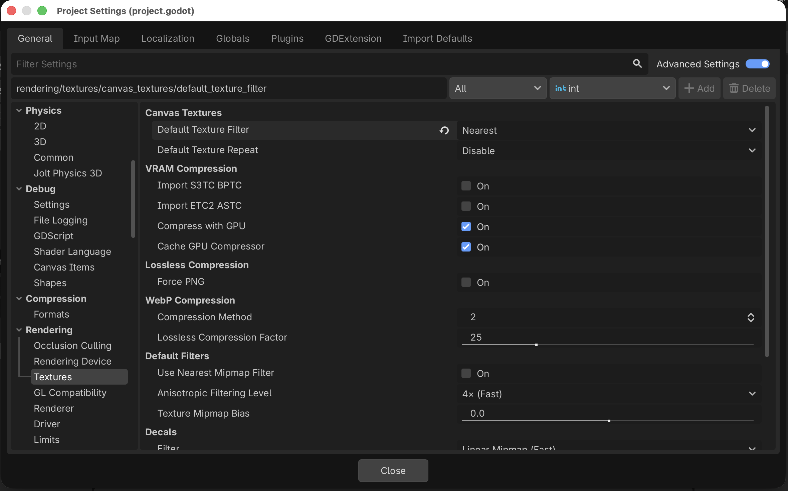

# Godot 2D Platformer - level 1, opsætning
Velkommen til endnu en Godot guide serie!

I denne guide serie skal vi lave endnuet 2D spil, for der er stadig så meget vi kan lære bare om 2D i Godot.

Vi skal lave et 2D platform spil hvor den tapre space pirate Piry McPirate skal bevæge sig på platforme og elevatorer mens han nedkæmper ondsindede Walkers, samler førstehjælpspakker op og bare holder sig i live

Udover alle de ting vi allerede kan i Godot (scripts, UI, signals og så videre) skal vi lære:

- At lave en level med `TileMapLayer`s.
- Om Physics i Godot og hvordan vi kan bruge en `CharacterBody2D`s til vores player og fjender sådan at de reagerer med tyngdekraft.
- Om `collision_layer` og `collision_mask`.
- Hvordan vi kan opbygge vores kode ved hjælp af "komponenter" sådan at vi kan lave en masse små "byggeklodser" som vi så kan sætte sammen, som vi vil på de enkelte scener vi laver.
- Hvordan vi kan bruge en `RayCast2D` node til at få vores fjender til at bevæge sig i et mønster.
- Hvordan vi kan bruge `CanvasModulate` og `PointLight2D` til at sætte lys på vores levels.

Og sikkert også en masse andet...så helt ærligt! Vi har temmelig travlt!! Lad os komme i gang.

## Hent Godot
Hvis du ikke allerede har hentet Godot så ville det nok være et godt sted at starte. Du kan finde nyeste version af Godot på [deres download side](https://godotengine.org/download). Vælg den øverste version der bare hedder "Godot Engine", vi skal ikke bruge .Net versionen... dot Niet til dot Net som russerne siger...tror jeg.

Installer Godot og husk hvor du har installeret det så du kan finde det næste gang! Spørg evt. om hjælp med at installere Godot hvis det driller.

## Nyt projekt
1. Start Godot
2. Vælg *+ Create* i øverste venstre hjørne

3. Giv dit spil et navn (og _husk_ hvor du gemte det til næste gang)

## Opsætning
Inden vi går i gang er der lige et par indstillinger vi skal have klaret.

Vi skal have:

- Navngivet nogle physics layers, så er det nemmere for os selv at holde styr på senere
- Registreret hvilke taster vi gerne vil styre med (ligesom i vores 2D shooter)
- Sat texture rendering til "nearest" så vores sprøde 64x64 assets står knivskarpt og lækkert

### Navngiv physics layers
Når vi skal til at lave collision detection skal vi arbejde med forskellige layers. De har som default navnene Layer 1, Layer 2 og så videre og det er jo ikke så nemt at finde rundt i, men heldigvis kan vi give dem andre navne så det bliver lidt lettere, så det gør vi.

I topmenuen under _Project_ vælger du _Project Settings_, vær sikker på at du står på _General_ fanen i toppen, og så skal du finde Layer Names -> 2D Physics (_ikke_ 2D Render).

Nu kan du give dine lag nogle bedre navne, kald dem:

- Layer 1: Terrain
- Layer 2: Player
- Layer 3: Enemies
- Layer 4: Bullets
- Layer 5: Items

Så er det lidt nemmere at overskue hvor vi skal putte de forskellige ting hen senere.

### Vælg hvilke taster du skal bruge til at styre med
Skal gøres på samme måde som du gjorde i vores 2D shooter. 

Stadig inde i Project Settings skal du skifte til _Input Map_ fanen og så skal du tilføje nye controls. Vi skal bruge

- left
- right
- up
- fire

Og du har frit valg.

### Sæt texture rendering
Stadig inde i Project Settings skal du tilbage på _General_ og så finde Rendering -> Textures og sætte "Default Texture Filter" til Nearest

Læs mere [her](https://www.gdquest.com/library/pixel_art_setup_godot4/)

Og det var det

## Outro
Med opsætningsarbejdet af vejen er vi klar til at begynde på vores spil.

Første skridt er at få lavet en `Level` og bruge `TileMapLayer`s til at bygge vores map.

Når du er klar kan du hoppe videre til [level 2](../lesson02/)