# Godot 2D Platformer - level 2, TileMapLayers
I [level 1](../lesson01/) fik vi oprettet et nyt projekt og fik rettet diverse settings så de passer til vores 2D spil.

I denne level skal vi starte på at lave vores levels og til det formål skal vi bruge et [TileMapLayer](https://docs.godotengine.org/en/stable/classes/class_tilemaplayer.html#class-tilemaplayer) som giver os mulighed for at bygge vores level af "tiles", altså små kvadratiske pixel blokke med forskellige tegninger som vi kan bruge til at tegne vores level med.

Vi kan lægge flere lag af `TileMapLayer`s ovenpå hinanden sådan at vi kan have en baggrund i et lag, de platforme vi vil bevæge os på i et andet lag, og endda have et lag der ligger _foran_ vores platformslag så vores spiller kan bevæge sig _bag_ ting.

## Lidt mere om `TileMapLayer`s
Et `TileMapLayer` gemmer sine tiles i et [TileSet](https://docs.godotengine.org/en/stable/classes/class_tileset.html#class-tileset) så det vil sige:

- `TileMapLayer` = Det vi bruger til at tege med, sætte collisioner på og så videre
- `TileSet` = _Hvad_ er det vi vil tegne

## Opret vores første `TileMapLayer`
I vores projekt vil vi gerne lave en Level scene som vi kan bruge til alle de ting der har med vores level at gøre, dvs.

- Selve "mappet"
- Fjender
- Elevatorer
- Health
- Exit points
- Og hvad vi ellers kan finde på

Så vi skal nu:

- [ ] Have lavet en ny mappe til vores level
- [ ] Have lavet en level scene
- [ ] Tilføjet en `TileMapLayer` node

Lad os tage det et skridt af gangen.

### Ny mappe
Lad os være super organiserede og starte med at lave en mappe der hedder `scenes` og inden i den mappe laver vi mappe der hedder `levels`.

Du kan godt huske hvordan man gør ikke? Højreklik på `res://` mappen, vælg "Create New" og "Folder".

Kald mappen _scenes_

Inden i den mappe laver du nu en mappe der hedder _levels_ så det ser sådan her ud:

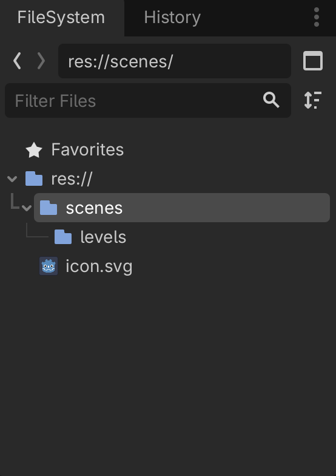

Sådan, nu har vi sat os selv op for succes og kan strege første item på vores liste

- [x] Have lavet en ny mappe til vores level
- [ ] Have lavet en level scene
- [ ] Tilføjet en `TileMapLayer` node

### Level scene
Så skal vi have lavet en scene til vores level. Den skal som sagt indeholde mange forskellige ting så vi laver lige lidt struktur i den også.

1. Opret en ny 2D Scene af typen `Node2D`. Vores "ydre" scene skal bare være sådan en slags container for alle de ting vi skal bruge, lidt ligesom en `
` i HTML.
2. Omdøb `Node2D` til `Level01`. Det skulle nu gerne se sådan her ud:

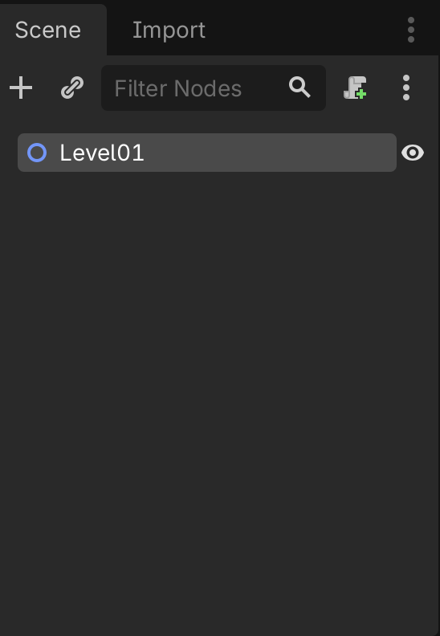

3. Gem din nyoprettede `Level01` i _scenes/levels_ mappen

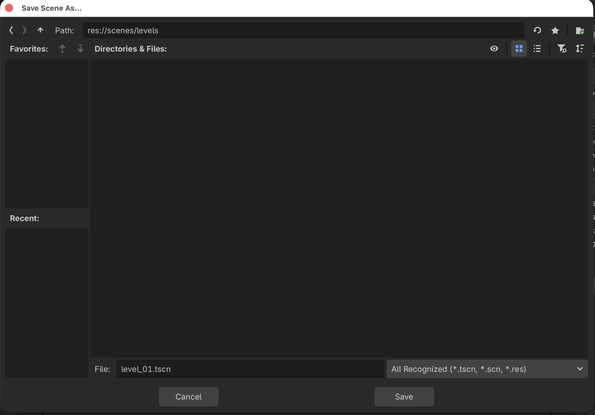

4. Lad os tilføje nogle flere "container noder" som vi kan smide ting i. Inde under din Level01 `Node2D` skal du tilføje nogle flere `Node2D` scener. Kald dem:
    - TileMaps
    - Platforms
    - Items
    - Enemies

Det skal nu gerne se sådan her ud

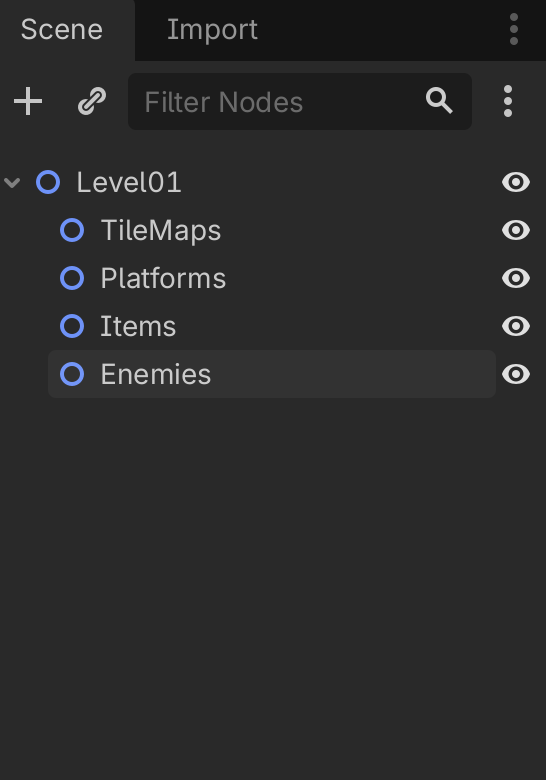

Hallo mand! Sikke en orden, fremtids os bliver så glade for nutids os fordi vi sådan har gjort det dejligt overskueligt.

Vi hakker af på listen:

- [x] Have lavet en ny mappe til vores level
- [x] Have lavet en level scene
- [ ] Tilføjet en `TileMapLayer` node

Glæder os over hvor gode vi er og så skynder vi os videre.

### Tilføj `TileMapLayer`
Endelig! Tid til at lave noget som vi kan se på skærmen! Sådan næsten da.

- Højreklik på TileMaps container noden
- Vælg "+ Add Child Node"
- Søg på `TileMap`
- Vælg `TileMapLayer`

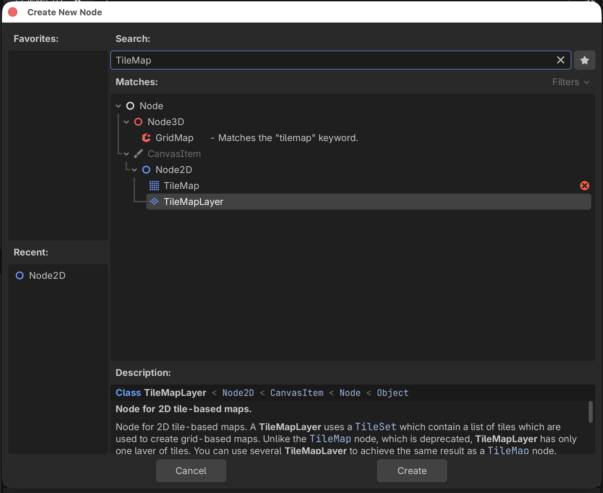

- Tryk på "Create"
- Omdøb `TileMapLayer` til "CollisionLayer", det er her vi laver den del af banen man kan stå på, senere laver vi også for- og baggrund

Så langt så godt. Nu har vi en `TileMapLayer` node som vi ikke kan bruge til noget som helst for vi skal også have tilføjet et `TileSet`, men vi kan da strege på vores liste:

- [x] Have lavet en ny mappe til vores level
- [x] Have lavet en level scene
- [x] Tilføjet en `TileMapLayer` node

Og glæde os igen.

Så har vi glædet os nok...Videre!

## TileSet
Nu har vi et `TileMapLayer` som er det vi bruger til at designe vores levels med, men det kræver som sagt et `TileSet` som er de "fliser" vi kan tegne med.

Så nu skal vi:

- [ ] Have lavet en mappe til vores assets
- [ ] Have tilføjet nogle tile assets til vores mappe
- [ ] Have lavet et nyt `TileSet` som skal tilknyttes vores `TileMapLayer`

### Lav mappe til assets
I "FileSystem" i nederste venstre hjørne skal vi have lavet en ny mappe på samme niveau som vores scenes mappe. Så vi:

1. Højreklikker på "res://"
2. Vælger "Create New..." -> "Folder"
3. Kalder vores folder for "assets"

Lad os være ordentlige og lave en mappe til tilesets under vores assets. Du har sikkert regnet det ud men altså:

1. Højreklik på den nye assets mappe
2. Vælge "Create New..." -> "Folder"
3. Kald vores nye folder for "tilesets"

Det skulle nu gerne se sådan her ud

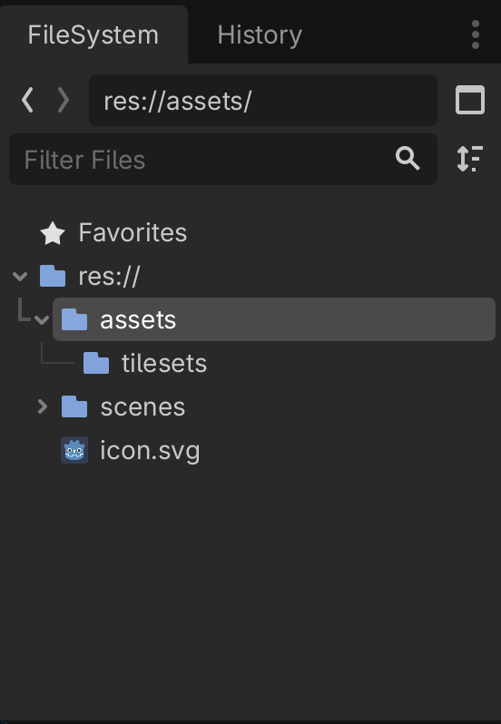

Vi streger af og går videre 
- [x] Have lavet en mappe til vores assets
- [ ] Have tilføjet nogle tile assets til vores mappe
- [ ] Have lavet et nyt `TileSet` som skal tilknyttes vores `TileMapLayer`

### Tilføj tile assets
Assets kan du som sagt finde [her](../../assets/gameassets/assets.zip).

I den mappe kan du nu finde mappen med tilesets og derfra trække de her tilesets over i den "tileset" mappe du lige har lavet:

- 1_Industrial_Tileset_1.png
- 1_Industrial_Tileset_1B.png
- 1_Industrial_Tileset_1C.png
- 2_Industrial_Tileset_1_Background.png
- 2_Industrial_Tileset_1B_Background.png
- 2_Industrial_Tileset_1C_Background_Violet.png

Så har vi lidt at tegne med.

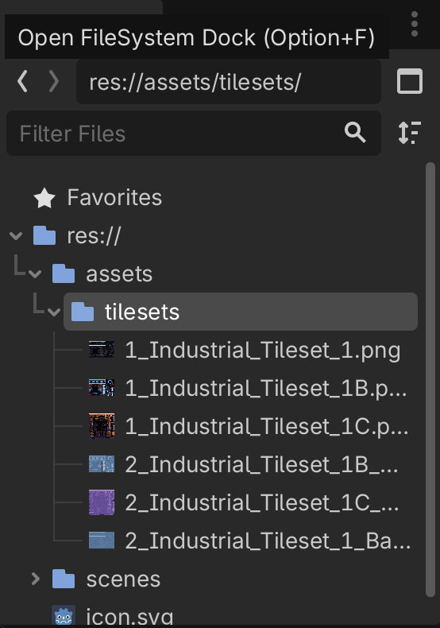

Sådan, det var step to

Vi streger af og går videre 
- [x] Have lavet en mappe til vores assets
- [x] Have tilføjet nogle tile assets til vores mappe
- [ ] Have lavet et nyt `TileSet` som skal tilknyttes vores `TileMapLayer`

### Lav et nyt `TileSet`
Nu er vi endelig klar til at binde et `TileSet` på vores `TileMapLayer`. Det gør vi sådan her:

1. Vælg vores "CollisionLayer" i strukturen i venstre side
2. I "inspectoren" i højre side, under "TileMapLayer" kan du klikke på drop down pilen og vælge "TileSet"

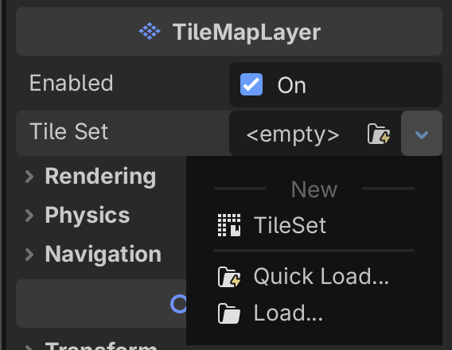

I bunden af skærmen er der nu dukket en ny "TileSet" fane op

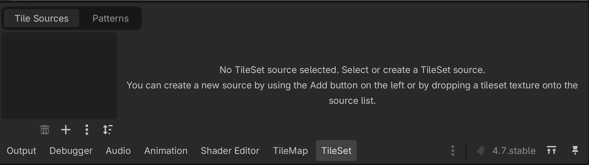

Her kan du nu vælge dine tilesets fra "assets" mappen og trække dem over på Tile Sources. Sigt efter det mørkere område i venstre side af fanen. 

Vi vil gerne bruge:

- 1_Industrial_Tileset_1.png
- 1_Industrial_Tileset_1B.png
- 1_Industrial_Tileset_1C.png

Så træk dem over (hint...hvis du er skrap med tastaturet kan du markere flere på en gang (brug <kbd>shift</kbd>) og så trække dem over på _en_ gang istedet for en af gangen som en anden hulemand)

Du får nu den her besked som du bare siger "Yes" til

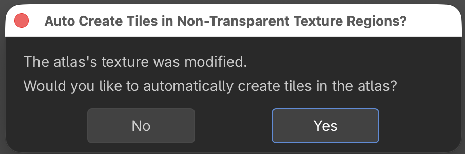

Nu skulle det gerne se sådan her ud ved dig

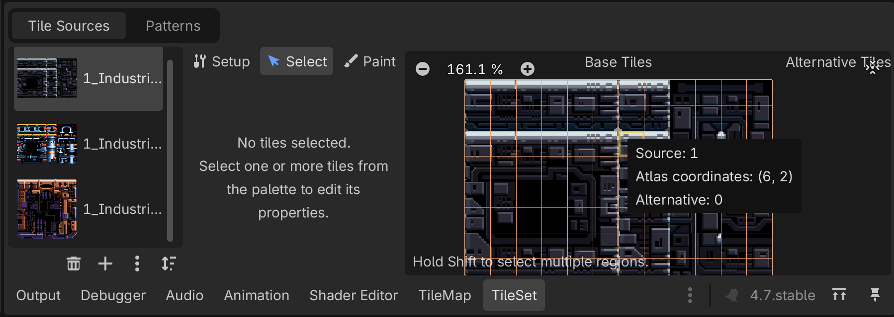

Det var det, nu har vi et `TileMapLayer` med tre tilhørende `TileSet`s som vi kan bruge til at tegne med.

- [x] Have lavet en mappe til vores assets
- [x] Have tilføjet nogle tile assets til vores mappe
- [x] Have lavet et nyt `TileSet` som skal tilknyttes vores `TileMapLayer`

## Næste skridt
Nu er vi næsten klar til at tegne. Først skal vi dog lige have tilføjet et lag af "fysisk dimension", sådan at vores player, fjender og så videre kan _stå_ på nogle af fliserne uden at falde af. Det kigger vi på i [level 3](../lesson03/) hvor vi også kommer i gang med at tegne...jeg lover!