# Godot 2D Platformer - level 3, TileMapLayers Part II
I [level 2](../lesson02/) fik vi startet op på at tilføje vores `TileMapLayer` og et `TileSet` men vi stoppede da vi skulle til at tilføje fysiske egenskaber, så lad os fortsætte der...meeen, først måske lige en introduktion til hvad vi egentlig mener når vi snakker fysike egenskaber i Godot...og spil generelt

## Fysike egenkaber i Godot
Når vi laver spil vil vi ofte gerne vide om to ting rører hinanden. Tænk tilbage på vores 2D skydespil f.eks, her ville vi gerne vide sådan noget som:

- har den her kugle vi har skudt afsted ramt et fjendtligt rumskib?
- eller har den her kugle fra fjenden ramt os?

Eller tænk på et platformspil som det vi er ved at lave nu, her vil vi gerne vide ting som:

- står vores spiller på jorden nu, eller er han i luften?
- har vores skud ramt væggen?
- er vores spiller gået ind i en power-up til deres våben? Eller noget førstehjælp måske?
- er vores walkers ved at gå ud over kanten på en platform?

Alt det kan vi bruge fysiske dimensioner til, det drejer sig alt sammen om _collision detection_, altså støder objekt A ind i objekt B (eller måske omvendt, er object A _holdt op_ med at støde ind i objekt B) Og hvis ja, hvad vil vi så gøre når det sker?

Du har allerede arbejdet med `CollisionShape2D` da vi lavede vores rumspil og ville se om kugler havde ramt rumskibe f.eks, så du kender allerede til fysiske dimenensioner i Godot.

 Nu vil vi så forsøge os med en [`CharacterBody2D`](https://docs.godotengine.org/en/stable/classes/class_characterbody2d.html#class-characterbody2d) og det kræver at vi lærer lidt om _Collision Layers og Collision Masks_ i Godot.

### Collision Layer
`CollisionLayer` er det lag som vi gerne vil have at vores node er i. Tænk tilbage på [level 1](../lesson01/) da vi navngav _physics layers_. Husk at vi kaldte dem:

- Layer 1: Terrain
- Layer 2: Player
- Layer 3: Enemies
- Layer 4: Bullets
- Layer 5: Items

Det var jo vanvittigt godt tænkt af os dengang! Når vi f.eks skal til at tilføje vores `TileSet` til et physic layer virker det logisk at de skal proppes i Terrain layer, og når vi skal til at lave en player skal den selvfølgelig i Player layer...tak fortids os!

Men hvorfor? Kan det ikke være lige meget? Nej for nu kommer _Collision Mask_ på banen

### Collision Mask
`CollisionMask` kan vi bruge til at styre _hvad_ vi gerne vil have besked om at vi er kollideret med. Samtidig kan du jo så også læse at vi _ikke_ får besked om _alt_ vi støder sammen med, vi skal selv fortælle _hvad_ vi vil have besked om.

Så for eksempel vil vores player gerne have besked om, at den står på nogle fliser i vores `TileSet` som man ikke kan falde igennem.

Eller hvad med vores bullets? De vil gerne have at vide om de har ramt en væg, en fjende eller måske spilleren.

Lad os tage eksemplet med spilleren.

- Spilleren er i det Collision Layer vi har kaldt _Player_
- I spillerens Collision Mask markerer vi at vi gerne vil have besked når spilleren rammer noget i _Terrain_ laget

Simpelt ikke?

Du kan læse mere om physics i Godot på deres [hjemmeside](https://docs.godotengine.org/en/stable/tutorials/physics/physics_introduction.html)

Nå, den bedste måde at lære det her på er vel at kaste sig ud i det, så lad os tilføje vores `TileSet` til _Terrain_ CollisionLayer.

## Tilføj `TileSet` til Terrain
I vores Level01 scene markerer du `CollisionLayer` og ovre i "Inspectoren" i højre side finder du settings for "TileMapLayer" og klikker på "TileSet"...det er lidt bøvlet, du skal ramme indenfor den røde firkant på billedet her

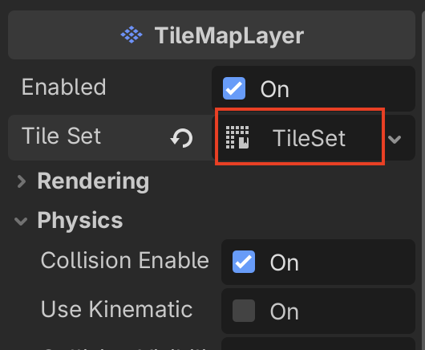

Nu skulle du gerne få en menu hvor du har adgang til diverse indstillinger for dit `TileSet`.

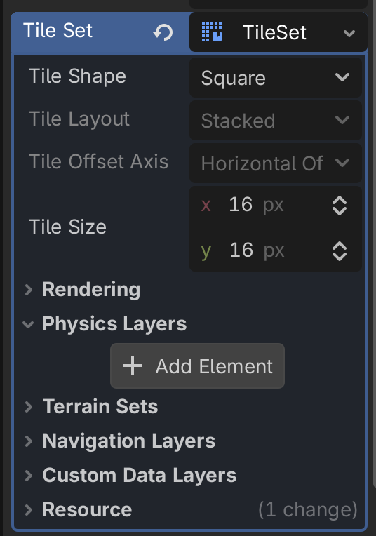

Klik på knappen "+ Add Element" under "Physics Layers" og se så, nu har vi adgang til Collision Layers og Collision Masks på vores `TileSet`

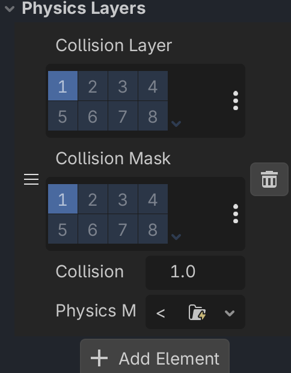

Nå! OK, nu bliver det jo let. Vi vil gerne have at vores `TileSet` er i Terrain laget og vi er faktisk ligeglade med om andre rammer os, det må være deres problem, ikke vores.

Så

- Under CollisionLayer tilføjer vi vores `TileSet` til lag et. Hvis vi hover musen kan vi se at der står Terrain...nemt!
- Vi sørger for at der ikke er valgt nogetsomhelst i CollisionMask

Det ser sådan her ud

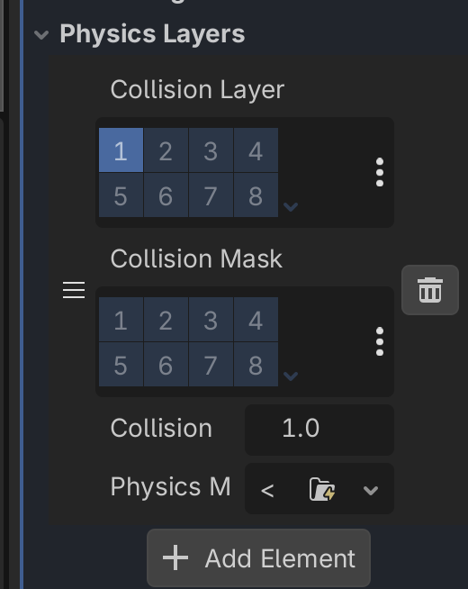

Så! Nu har vi tilføjet en fysisk dimension til vores `TileSet`, og det vil sige at vi nu kan fortælle nogle af vores tiles at dem kan man træde på, sådan at vores player og fjender kan gå på dem.

Hvordan gør man det? Fedt at du spørger, lad os kigge på det!

## Vælg Tiles der kan trædes på
Nu har vi tilføjet vores `TileSet` til et CollisionLayer, så nu kan vi markere hvilke der skal indgå i _collision detection_.

Det gør du sådan her:

1. I vores Level01 scene markerer du `CollisionLayer` og klikker på `TileSet` i "Inspectoren" i højre side af Godot.
2. Nu skulle der gerne dukke en "TileSet" editor op i bunden af skærmen ved siden af "TileMap"

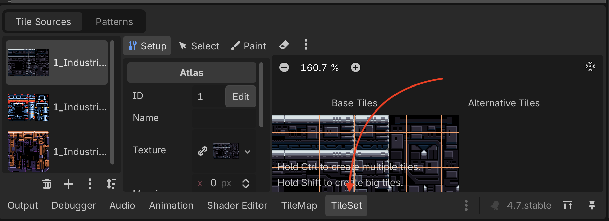

3. I den vælger du "Paint"

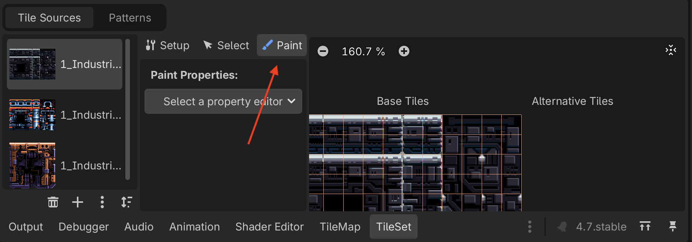

4. Under "Paint Properties" klikker du på "Select a property editor" og vælger "Physics layer 0" under "Physics"

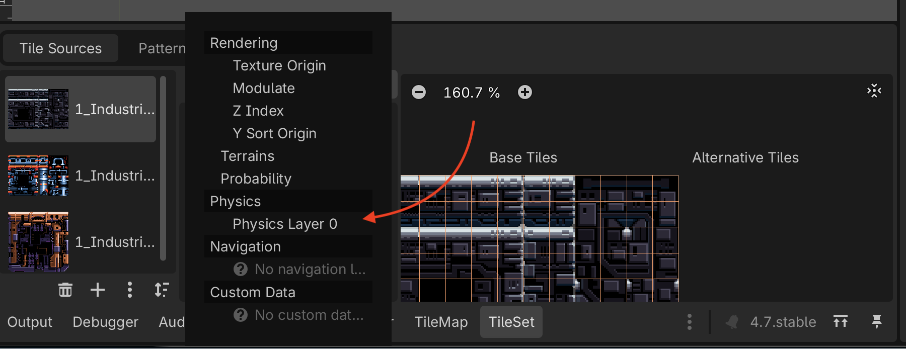

5. Nu kan du få lov til at "tegne" på de fliser som du gerne vil have skal tælle med i _collision detection_. Det foregår ved at du simpelthen bare klikker på de fliser der skal tælle med i højre side. Du kan zoome ind så det bliver nemmere at ramme. Her kan du se hvordan vi har valgt nogle fliser.

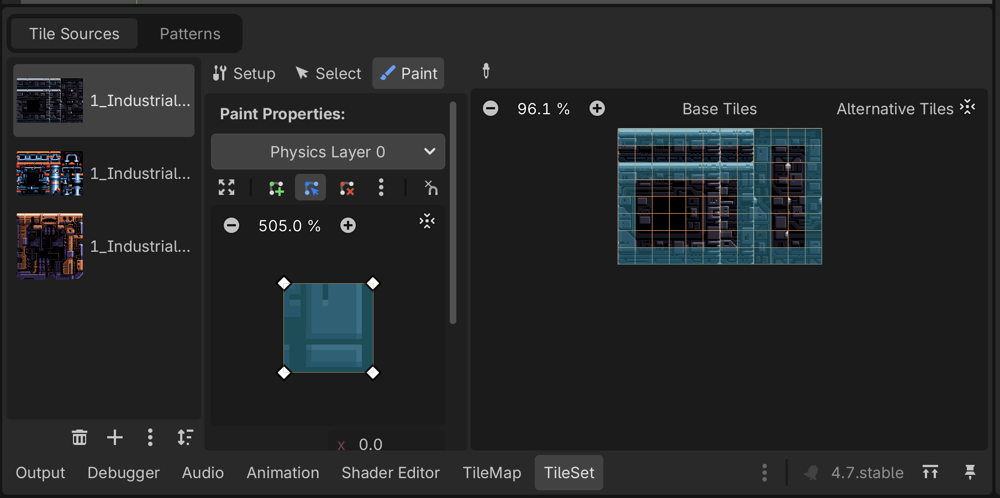

Husk at gentage dette for de to andre `TileSet`s

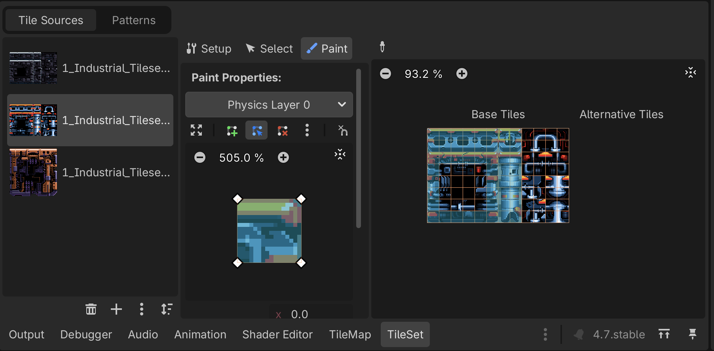

## Endelig tid til at tegne!
Nu kan du i bunden skifte tilbage til `TileMap`

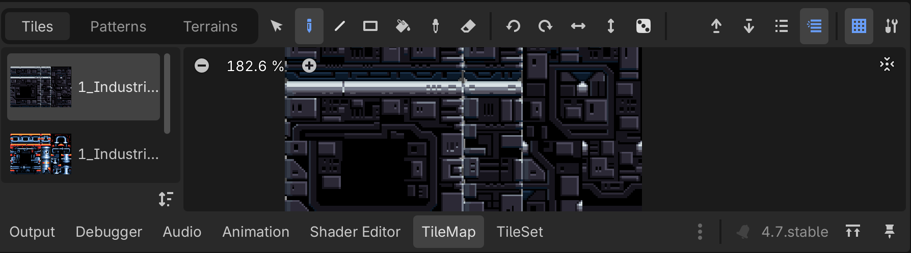

Og så kan du vælge tiles og begynde at tegne med dem.

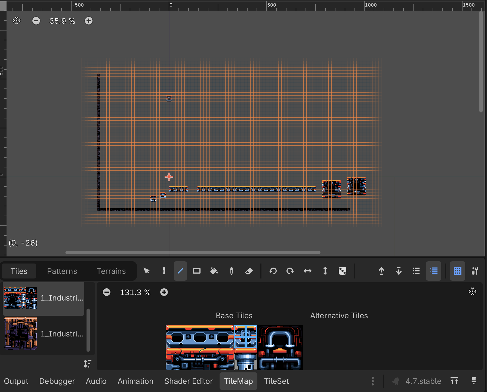

Prøv dig frem, du kan:

- Vælge flere tiles af gangen
- Bruge de forskellige værktøjer til at tegne med, pen, line, rect og eraser, prøv at se hvad de kan

Når du har noget du synes er værd at teste kan du prøve at vælge Level01 scenen og så køre "Run Current Scene"

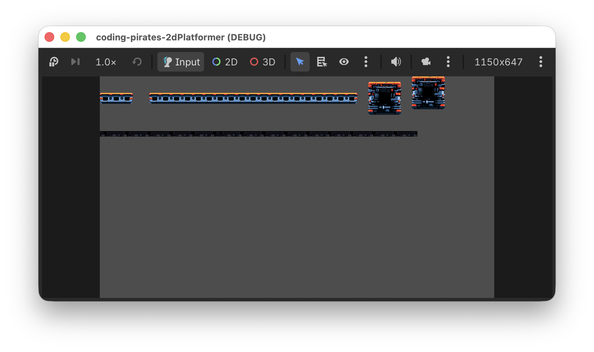

Kønt er det ikke men det fixer vi senere.

## Baggrundslag
Lad os som det sidste lave endnu et `TileMapLayer` som ligger _bag_ vores "CollisionLayer" og som vi kan bruge som baggrund. 

Da det er et baggrundslag betyder det jo så også at vi ikke skal tilføje CollisionLayer så det burde være en lille opgave.

1. Inde under vores Level01 -> TileMaps laver du et nyt `TileMapLayer`. Kald det Background og sørg for at det ligger _over_ vores CollisionLayer

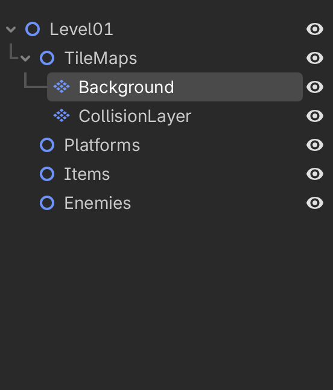

2. Tilføj et `TileSet` og brug de baggrunds tileset assets der er i assets mappen, altså:
- 2_Industrial_Tileset_1_Background.png
- 2_Industrial_Tileset_1B_Background.png
- 2_Industrial_Tileset_1C_Background_Violet.png

3. Nu kan du tegne i dit baggrundslag og så vil de ting du tegner ligge sig i et lag _bag_ dit CollisionLayer.

Det er jo meget fint og det betyder også at du kan lave forgrundslag så det ser ud som om din spiller løber om _bag_ ting på banen.

## Fri leg
Prøv dig frem. Her er vi gået helt amok og har lavet to baggrundslag hvor vi bruger 

- 3_Far_Background_Tile.png

Til det bageste lag, og så har vi også lagt et lag i forgrunden.

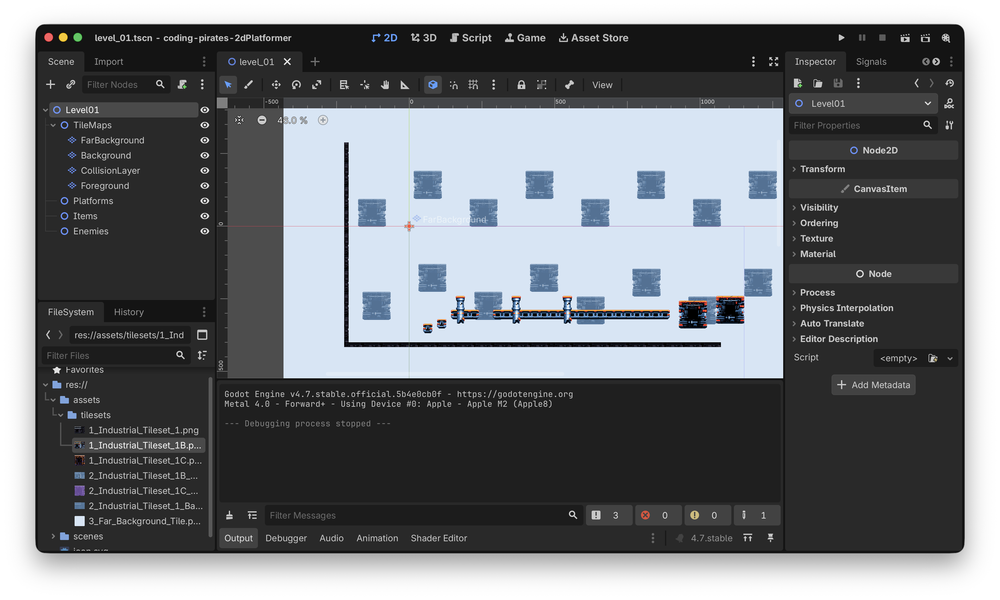

## Næste skridt
Endelig kom vi igang med at tegne og nu kan vi nemt lave levels i flere lag.

Næste skridt bliver at vi skal have lavet en "Game" scene som holder tingene sammen, og så skal vi have lavet en Player så vi kan begynde at flytte os rundt på banen.

Alt sammen i [level 4](../lesson04/), vi ses.