# Godot 2D Platformer - level 4, Game scene og start på Player
I [level 3](../lesson03/) fik vi startet på at tegne vores level, så vi endelig kunne se _noget_ på skærmen efter alt vores hårde arbejde!

I denne lektion vil vi lave en `Game` scene som vi kan bruge til at holde styr på:

- Levels
- Player
- UI

Præcis som vi gjorde i vores 2D skydespil. Derudover starter vi også på vores `Player` scene.

## Gruppering
Indenfor programmering handler det meget om at bryde ting ned i små logiske bidder og sørge for at ting grupperet pænt, sådan at man ikke prøver at gøre alt muligt i den samme blok kode som så bliver kæmpestor og svær at holde styr på.

Det er også det vi gør her. Vi har en `Game` scene som ikke kan ret meget selv, men som så til gengæld indeholder

- vores `Level01` fra før, som ved hvordan man skal tegne et map
- en `Player` scene som kan finde ud af at tegne og flytte vores helt
- senere noget UI så vi kan se hvor mange point vi har og så videre

Vores `Game` scene skal i første omgang indeholde:

- `Level01` som tilføjes som en child node, ganske som vi gjorde i vores 2D space shooter
- en `Player` som vi laver lige om lidt

Lad os komme i gang.

## Opret ny Node2D
1. Lav en ny 2D scene af typen `Node2D` og kald den "Game"
2. Gem din scene under navnet "Game.tscn" i roden af scenes mappen

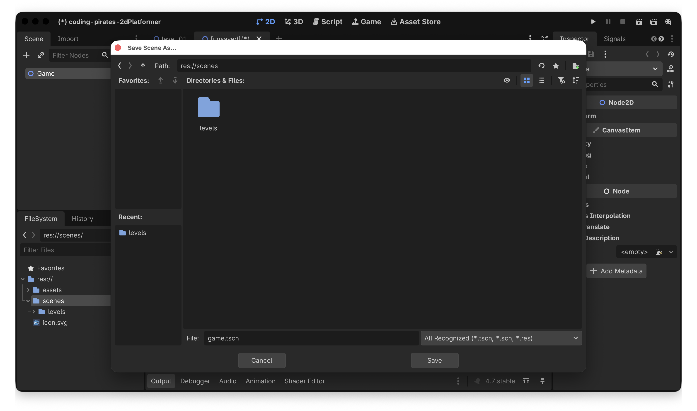

Det skulle gerne se sådan her ud i din "FileSystem" explorer i nederste venstre hjørne af Godot vinduet.

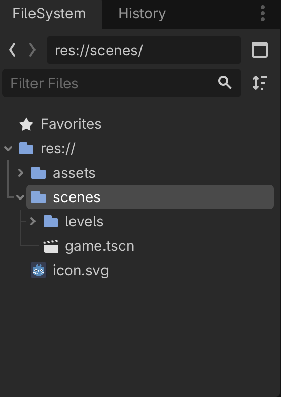

## Tilføj Level01 som child node
Du kan godt huske hvordan ikke?

1. Marker din nye Game node
2. Tryk på "Instantiate Child Scene", kæden lige over din Game node

Vælg nu din "Level01.tscn" scene. Det skulle nu gerne se sådan her ud

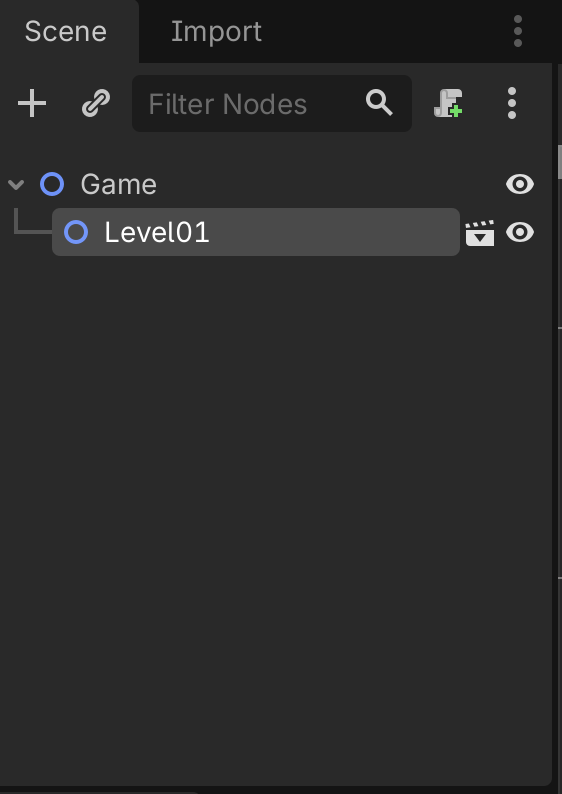

## Test
Nu kan du trykke på "Run Project" (play knappen øverst).

Godot vil komme og fortælle dig høfligt at du har glemt at vælge en "main scene" som er den man som default vil kører når spillet starter.

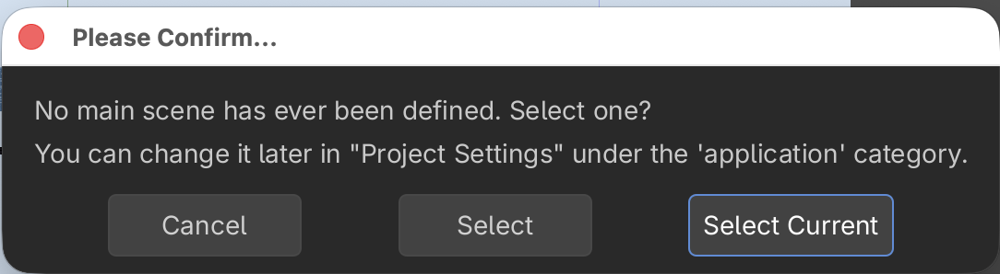

Her kan du bare vælge "Select Current"

(og hvis du nogensinde vil ændre det, så er det under Project Settings -> Application -> Run -> Main Scene)

Og nu skulle du gerne kunne se din `Game` scene, som indtil videre bare er det samme som `Level01`

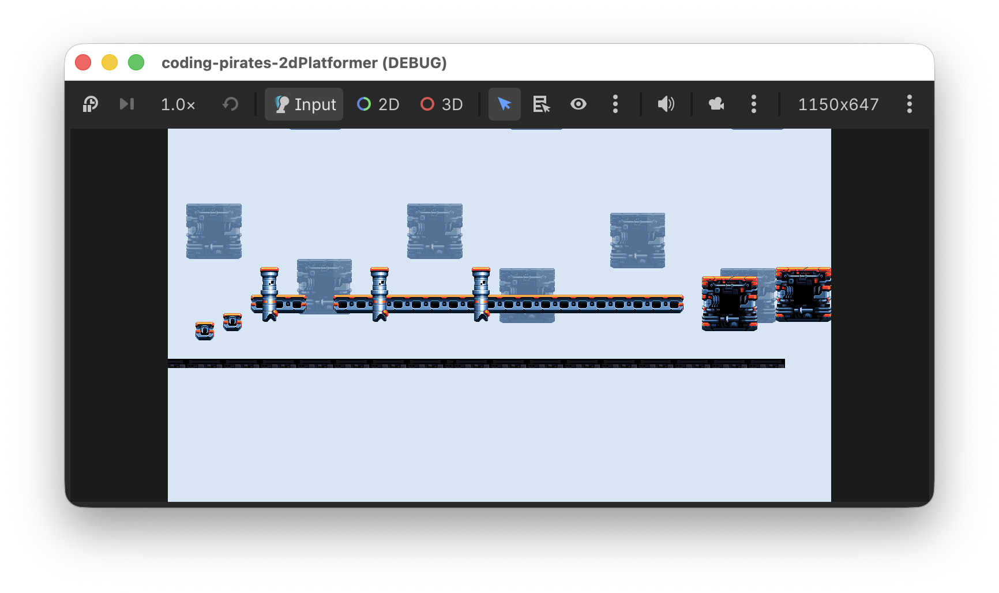

Altså...det er jo stadig ikke kønt men der er da noget på skærmen.

Lad os komme videre med at få lavet en Player

## Player
Til vores `Player` vil vi gerne bruge en `CharacterBody2D` scene.

Som der står i [dokumentationen](https://docs.godotengine.org/en/stable/classes/class_characterbody2d.html):

> **CharacterBody2D** is a specialized class for physics bodies that are meant to be user-controlled. They are not affected by physics at all, but they affect other physics bodies in their path.

Hallo mand! Det er jo lige det vi vil.

Så vi vil nu:

- [ ] Oprette en ny `CharacterBody2D` node
- [ ] Tilføje en `CollisionShape2D`
- [ ] Tilføje en `AnimatedSprite2D`
- [ ] Tilføje vores første animation

Lad os komme i gang

### Opret Player node
Du har gjort det her mange gange før så nu får du det bare i punktform og så klarer du den derfra.

1. Opret ny scene af type `CharacterBody2D`
2. Omdøb den til Player
3. Opret en ny mappe i roden af res mappen (altså på nivau med vores "assets" og "scenes" mapper). Kald mappen "characters" (her vil vi gemme vores Player og senere fjender)
4. Gem vores nye scene som "player.tscn"
5. Tilføj en `CollisionShape2D` som sub-node du kan bruge en CapsuleShape
6. Tilføj en `AnimatedSprite2D` som sub-node

Vi streger ud
- [X] Oprette en ny `CharacterBody2D` node
- [X] Tilføje en `CollisionShape2D`
- [X] Tilføje en `AnimatedSprite2D`
- [ ] Tilføje vores første animation

Og så skal vi lige have nogle assets også.

1. Opret en ny undermappe under assets og kald den "characters"
2. Kopier "space-marine-idle.png" fra assets som du tidligere hentede ind i den nyeoprettede "characters" mappe

Nu kan du oprette nye `SpriteFrames` på din `AnimatedSprite2D`i "Inspectoren" i højre side

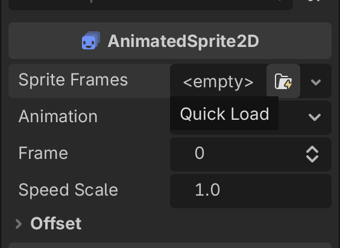

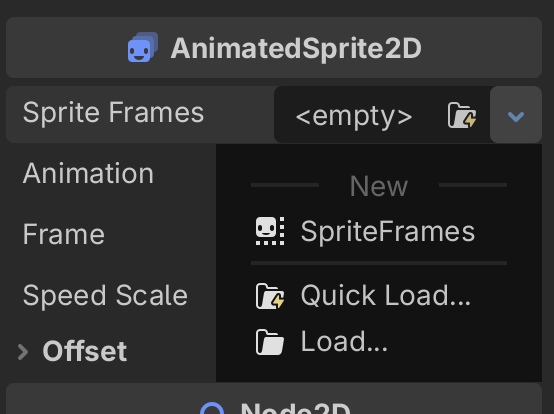

Og endelig kan du oprette en ny animation som du har gjort før.

1. Klik på den `SpriteFrames` du lige har oprettet
2. Nu kan du i bunden vælge "SpriteTrames"
3. Omdøb den animation der allerede er til at hedde "idle"
4. Klik på "ADd Frames from Sprite-Sheet" i topmenuen af "SpriteFrames" (den der ligner en Rubrics Cube eller vaffel eller hvad det nu er)
5. Tilføj nu "space-marine-idle.png" og ret Vertical til
6. Vælg alle 4 frames og tryk på "Add 4 Frame(s)"
7. Husk at slå "Autoplay on Load" til
8. Tada

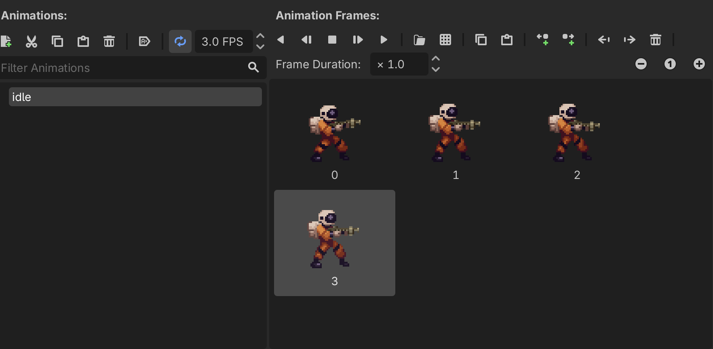

Vi kan sætte flueen ved sidste punkt
- [X] Oprette en ny `CharacterBody2D` node
- [X] Tilføje en `CollisionShape2D`
- [X] Tilføje en `AnimatedSprite2D`
- [X] Tilføje vores første animation

### Tilføj Player til Game
Præcis som vi tilføjede `Level01` til `Game` vil vi nu tilføje `Player` som en Child Scene.

Zoom lidt ind og skift til Move Mode så vi kan flytte vores `Player` inde i `Game`

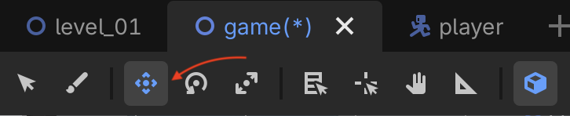

Flyt `Player` så den står nede ved gulvet, det behøver ikke være helt præcist, det klarer vi om lidt.

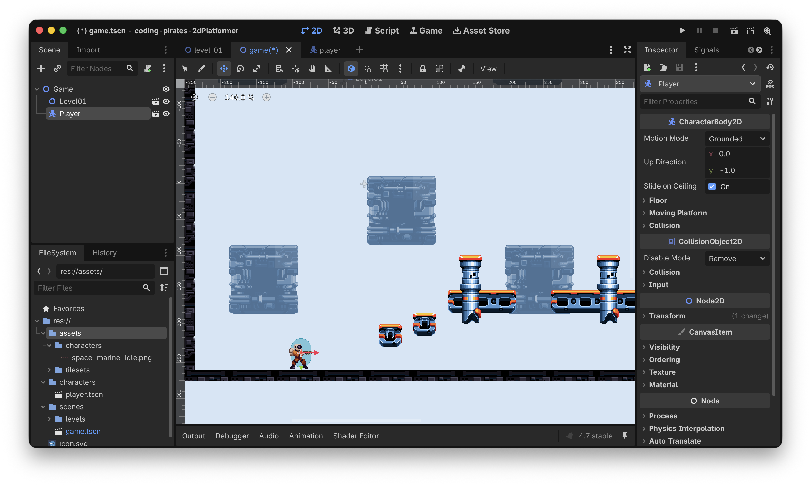

Kør vores spil igen

What the...

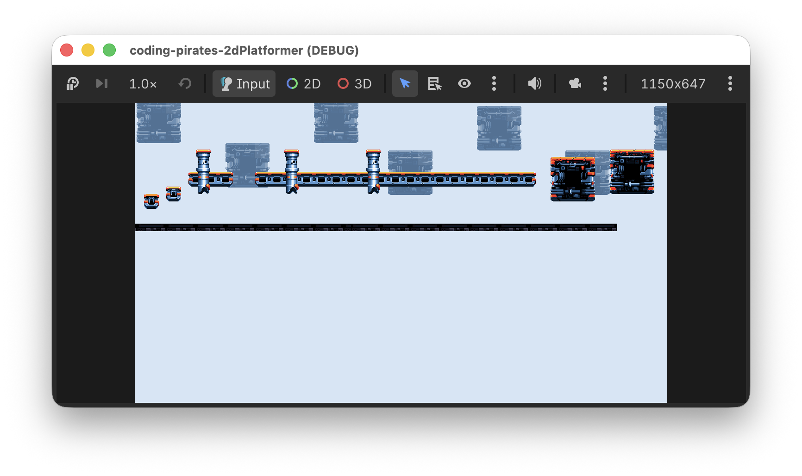

OK det er fesent! Vi kan jo intet se. Hvis bare der var noget vi kunne gøre ved det...

### Camera2D
Jamen vi _kan_ jo gøre noget ved det. Vi kan tilføje et `Camera2D` til vores `Player` og så vil det sørge for at følge vores `Player` rundt. Du kan læse mere om `Camera2D` i [dokumentationen](https://docs.godotengine.org/en/stable/classes/class_camera2d.html#camera2d).

Så:

1. Ind på vores `Player` scene igen og tilføj et `Caeera2D` som en child node
2. Sæt zoom level til 4 i "Inspectoren" i højre side

Det ser sådan her ud

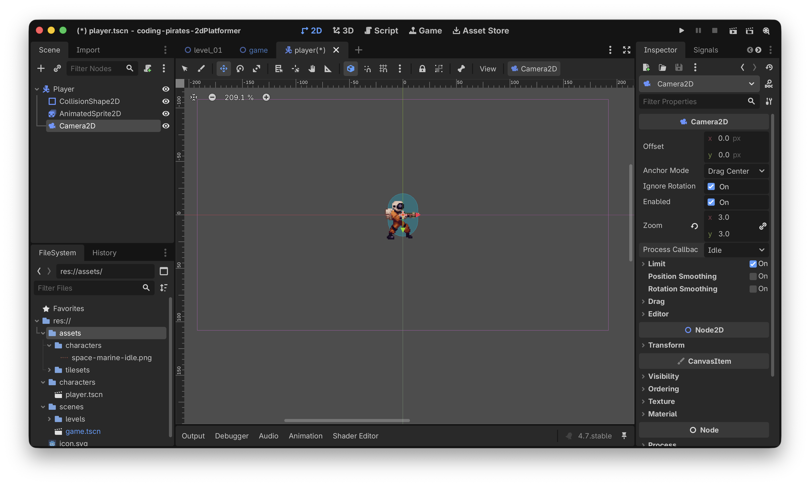

Kør vores spil igen...Jaeh ja! Se nu bare!

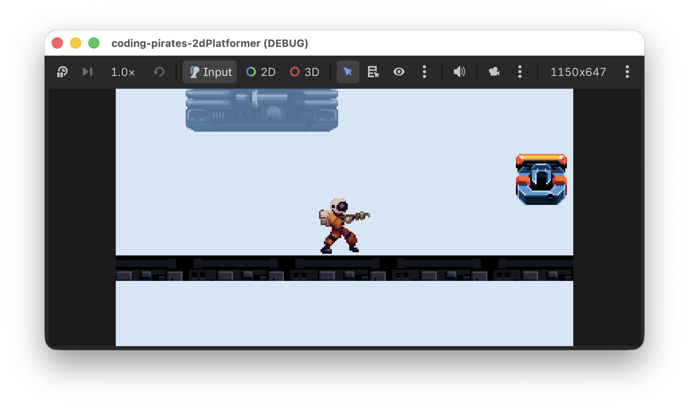

Nu er der zoomet ind på vores `Player` som står og animerer lige så fint.

Den svæver godtnok lidt over jorden men det klarer vi i næste lektion.

## Godt arbejde
Nu begynder det at ligne noget. Vi har et `Game` som har en `Level01` og vi har også en `Player` som vi kan se.

I [level 5](../lesson05/) vil vi begynde at tilføje scripts til vores `Player` så den følger tyngdeloven. Vi vil lave nogle "komponenter" som vi kan bruge sammen med vores scenes sådan at vi kan bruge det samme kode flere steder, det bliver godt! Vi ses i [level 5](../lesson05/).