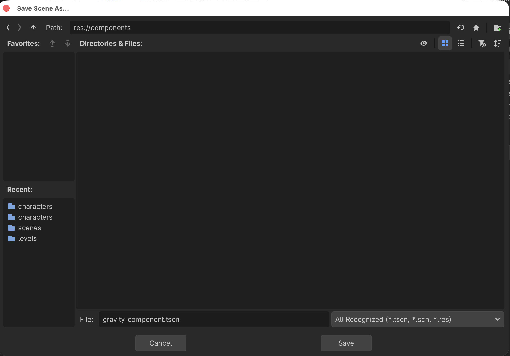
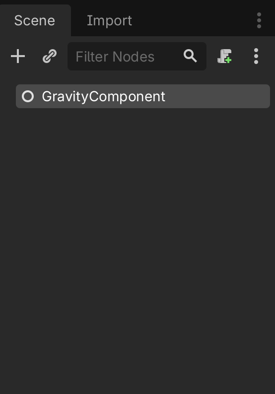
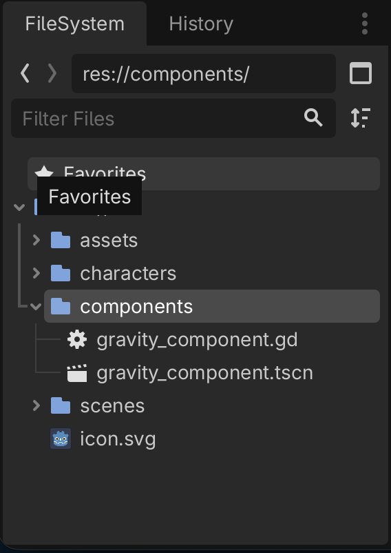
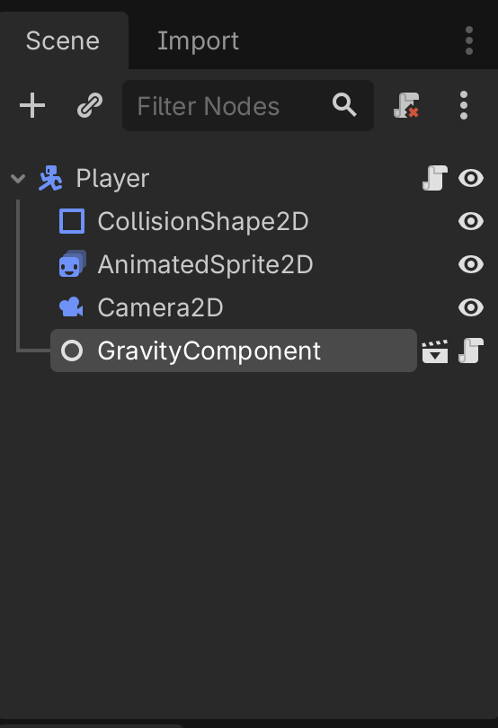
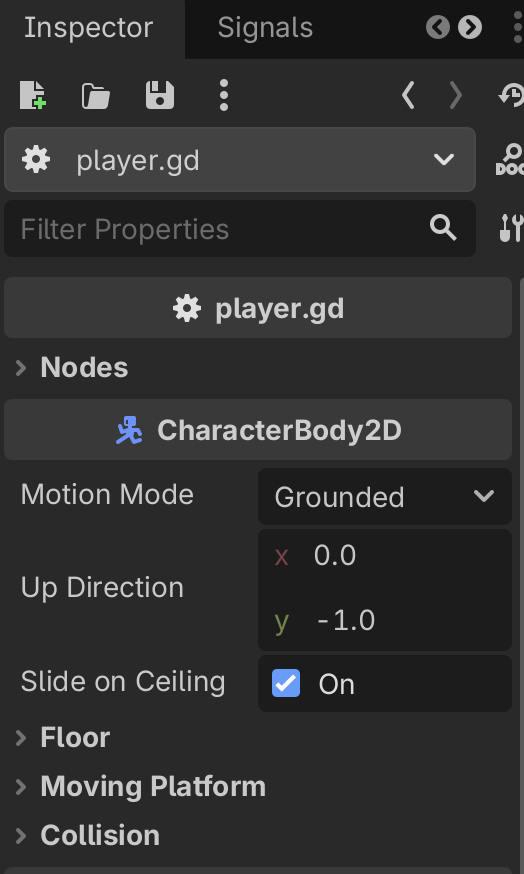
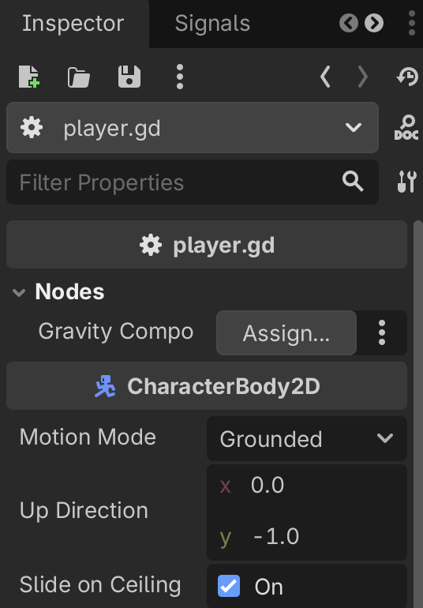
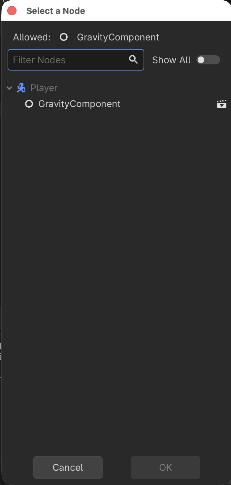
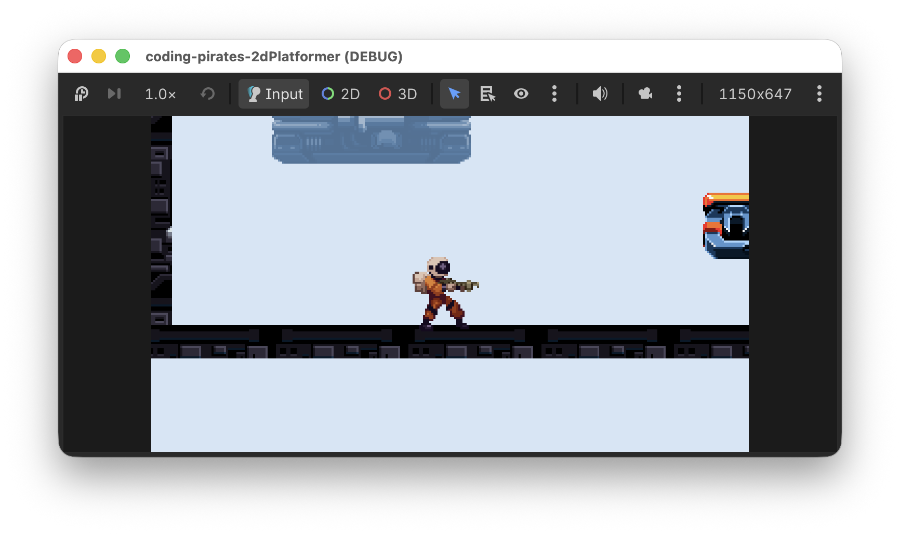

# Godot 2D Platformer - level 5, komponenter og start på Player script
I [level 4](../lesson04/) fik vi lavet en "main" `Game` scene som skal køre vores spil og vi fik begyndt på en `Player` scene som vi efterlod svævende et lille stykke over jorden.

I denne lektion vil vi begynde at arbejde med "komponenter" som vi kan genbruge på flere neder som skal have de samme egenskaber. Vi vil lave en `GravityComponent` og bruge den i et script som vi tilføjer til vores `Player` så den kan overholde tyngedekraften.

Lad os starte med at forstå hvad vi kan bruge komponenter til.

## Introduktion til komponenter
Lad os først forestille os at vi lavede vores spil _uden_ komponenter.

Vi har en `Player` som vi gerne vil:

- have til at overholde tyngdelovene
- kunne styre med tastaturet så den kan
    - løbe til siderne
    - hoppe
    - falde når den løber ud over kanten på en platform
- have til at skyde når vi trykker på en knap på tastaturet
- have til at miste health når den bliver ramt af fjendens kugler
- have til at kunne samle healthpacks op så den får ekstra health
- skifte mellem forskellige animationer alt efter om den står stille, hopper eller går

Så...vi går i gang med at skrive et _kæææææmpe_ langt script som gør alt det ovenstående.

Bagefter laver vi så en `Walker` fjende som vi gerne vil:

- have til at overholde tyngdelovene
- have til at gå selv fra side til side
- have til at skyde når den opdager vores `Player`
- have til at miste health når den bliver ramt af `Player`ens kugler
- skifte mellem forskellige animationer alt efter om den står stille eller går

Så...nu kunne vi så skrive et _kæææææmpe_ langt script som gør alt det ovenstående.

### Men hov! 
Stop lige, mange af de her ting er de samme uanset om man er `Player` eller `Walker` er de ikke?

Hvad nu hvis vi lige tænker os om og så istedet laver noget kode som kan _genbruges_ uanset om man er `Player` eller `Walker`?

### Komponenter
Det vil vi prøve her, ved at skrive en masse "komponenter" som så har _en_ specifik opgave hver.

F.eks kunne vi lave en `GravityComponent` hvis eneste opgave er at finde ud af om en `CharacterBody2D` står på en platform eller ej. Hvis den ikke står på en platform, så tilføjer vi noget tyngdekraft så den falder ned mod jorden.

Det gode er at vi nu har et lille - forholdsvist - forholdsvist simpelt script som vi kan knappe på både vores `Player` og vores `Walker` og så forstår de pludselig begge to tyngdelovene.

Det samme kunne være gældende for ting som:

- Animationer
- Det at kunne skyde
- Det at blive ramt
- Det at flytte sig

Hvis vi laver nogle komponenter til det, så kan vi sætte dem på vores forskellige scenes som det nu passer os.

Ulempen er at måske er en smule forvirrende at forstå til at starte med, men vi er kvikke unge mennesker der har gået til Coding Pirates i lang tid så det skal vi hurtigt fatte.

Så lad os prøve at skrive vores første komponent, nemlig en `GravityComponent`

## `GravityComponent`
Lad os tænke os om...hvad vil vi gerne have at vores `GravityComponent` skal gøre?

Ja det eneste den skal gøre er vel at se om vi er i luften og hvis vi er det, så trække os ned mod jorden.

OK...vi skrev: "vi er i luften". Hvem er vi?

I det her tilfælde er det vel en `CharacterBody2D` som er den node vi gerne vil bruge til både `Player` og `Walker`.

Hvordan kan vi se om en `CharacterBody2D` er i luften?

Ja vi kan se det modsatte i alle tilfælde. `CharacterBody2D` har en funktion der hedder `is_on_floor()` og det har vist ikke noget at gøre med, om den fyrer den af på dansegulvet :)

Du kan læse mere om den i [dokumentationen](https://docs.godotengine.org/en/stable/classes/class_characterbody2d.html#class-characterbody2d-method-is-on-floor)

OK, så skal vi bare finde ud af hvordan vi trækker en `CharacterBody2D` ned mod jorden, så vi læser videre i [dokumentationen](https://docs.godotengine.org/en/stable/classes/class_characterbody2d.html#class-characterbody2d-property-velocity) og ser at der er noget der hedder `velocity`, altså hastighed. Det er en `Vector2D` hvilket vi i vores tilfælde kan oversætte til at det er en X og en Y værdi der angiver hastigheden i en retning.

I vores tilfælde er vi kun interesserede i vertikal (op og ned) hastighed så det er Y aksen vi skal bruge.

- For at bevæge os nedad skal vi bruge et positivt tal (husk at koordinatsystemet i Godot starter med 0, 0 i øverste venstre hjærne).
- For at bevæge os opad skal vi bruge et negativt tal.

Så har vi vist alle de oplysninger vi skal bruge, så lad os prøve at skrive vores script

### Opsætning af GravityComponent
Vi får brug for mange komponenter så vi laver en ny mappe i roden af vores filsystem, direkte under res://.

1. Kald mappen "components"
2. Inde i den mappe laver du nu en ny scene af typen `Node` som du kalder "GravityComponent"



3. Og så tilføjer du et script til din `GravityComponent` som du kalder "gravity_component" du kan godt huske hvordan ikke?

Vælg `GravityComponent` i venstre side af Godot vinduet og tryk på det lille script med en grøn + knap øverst:



Det skulle nu gerne se sådan her ud



Og så er vi klar til at skrive vores script.

### Script
Hvad var det vi gerne ville i den her komponent?

_Hvis den `CharacterBody2D` vi kigger på nu, ikke er på jorden, så træk den ned mod jorden_

Så vi skal skrive en funktion der:

- [ ] Tager en `CharacterBody2D` som input parameter
- [ ] Kigger på om den _ikke_ er på jorden
- [ ] Hvis den ikke er, så træk den ned ved at øge `velocity.y` værdien

Lad os starte med en funktions definition.

I din `gravity_component.gd` fil skriver du:

```gdscript
extends Node

func handle_gravity(body: CharacterBody2D) -> void:
```

Altså, en funktion der:

- hedder `handle_gravity`
- tager en parameter kaldet `body` af typen `CharacterBody2D`
- ikke returnerer nogen værdi

Det var step 1
- [X] Tager en `CharacterBody2D` som input parameter
- [ ] Kigger på om den _ikke_ er på jorden
- [ ] Hvis den ikke er, så træk den ned ved at øge `velocity.y` værdien

Videre

```gdscript
extends Node

func handle_gravity(body: CharacterBody2D) -> void:
    if not body.is_on_floor():
        
```

Det var step 2

- [X] Tager en `CharacterBody2D` som input parameter
- [X] Kigger på om den _ikke_ er på jorden
- [ ] Hvis den ikke er, så træk den ned ved at øge `velocity.y` værdien

Videre

```gdscript
extends Node

func handle_gravity(body: CharacterBody2D) -> void:
    if not body.is_on_floor():
        body.velocity.y += ???
```

Hmmm...hvad skal vores gravity være? Lad os lave en varibel til det, så man kan styre det udefra, ganske som vi gjorde i vores 2D skydespil. Vores script ser nu sådan her ud:

```gdscript
extends Node

@export_subgroup("Settings")
@export var gravity: float = 100

func handle_gravity(body: CharacterBody2D) -> void:
	if not body.is_on_floor():
		body.velocity.y += gravity
```

Det var step 3
- [X] Tager en `CharacterBody2D` som input parameter
- [X] Kigger på om den _ikke_ er på jorden
- [X] Hvis den ikke er, så træk den ned ved at øge `velocity.y` værdien

Og med det skulle vores script virke. Lad os straks tilføje det til vores `Player`.

## Tilføj `GravityComponent` til `Player`
Første skridt er vel at lave et script til vores `Player`, så det gør vi, du kan godt huske hvordan ikke?

Vælg `Player` i venstre side af Godot vinduet og tryk på det lille script med en grøn + knap øverst:


Kald scriptet `player.gd` og gem det sammen med `Player.tscn` i "characters" mappen.

### Tilføj `GravityComponent` til vores `Player` script.
Vi skal have lavet en `@export` variabel af typen `GravityComponent` på vores `Player` script, hvordan katten gør vi mon det?

I Godot kan man give et script en type, så hvis vi nu gør det med vores `GravityComponent` så kan vi nemt oprette den på vores `Player`.

Derfor:

1. Tilbage på `GravityComponent`
2. Tilføj `class_name GravityComponent` som øverste linie så dit script ser sådan her ud:

```gdscript
class_name GravityComponent
extends Node

@export_subgroup("Settings")
@export var gravity: float = 100

func handle_gravity(body: CharacterBody2D) -> void:
	if not body.is_on_floor():
		body.velocity.y += gravity
```

3. Tilbage i dit `player.gd` kan du nu tilføje en referance til dit script sådan her:

```gdscript
extends CharacterBody2D

@export_subgroup("Nodes")
@export var gravity_component: GravityComponent
```

4. Og så kan du binde din `GravityComponent` på din `Player` i 2D mode ved at vælge `Player` i venstre side og så vælge "Instantiate child scene" ganske som vi gjorde da vil tilføjede `Level01` og `Player` til `Game`. 
5. Vælg `gravity_component.tscn`

Det skulle gerne se sådan her ud nu:



Nu er vores `GravityComponent` en child scene til vores `Player` men vi er nødt til lige at binde dem sammen en gang mere så vores `@export gravity_component: GravityComponent` virker inde i scriptet.

Derfor:

1. Klik på `Player` rod scenen i venstre side af Godot vinduet
2. I "Inspectoren" i højre side kan du nu se en ny kategori der hedder Nodes, præcis som vi skrev i vores `Player` script (`export_subgroup`)



3. Fold den ud ved at trykke på pilen til venstre for "Nodes", nu kan du se at der er en "Gravity Component" værdi som vi mangler at assigne så det gør vi.



4. Tryk på "Assign"
5. Eftersom vi har tilføjet "GravityComponent" som en child instance skulle vi nu få mulighed for at assigne "GravityComponent" til værdien af typen `GravityComponent`



6. Vælg "GravityComponent" og tryk på "OK"

Og nu er alting bundet sammen så vi har fortalt vores `Player` at vi gerne vil bruge en `GravityComponent`. Lidt besværligt men til gengæld er vi sikre på at tingene er bundet korrekt sammen og at vi ikke har glemt noget.

## Brug `GravityComponent` sammen med `Player`
Nu bliver det spændende. Efter vores hårde arbejde burde det nu være nemt at få vores `Player` til at overholde tyngdeloven.

Vi skal:

- [ ] have hooket ind i physics lifecycle
- [ ] kalde vores `handle_gravity` funktion med `Player`ens `ChararacterBody2D`

Lad os komme i gang.

### Physics lifecycle
Tænk tilbage på vores 2D space shooter. Der brugte vi Godots `process` funktion til at:

- lytte på tastaturindput
- flytte vores rumskib

Og så videre.

Det vil vi også gøre her, men samtidig, fordi vi bruger fysiske egenskaber, skal vi bruge en anden livscyklusmetode kaldet `_physics_process`. Som der står i [dokumentationen](https://docs.godotengine.org/en/stable/classes/class_node.html#class-node-private-method-physics-process):

> Called once on each physics tick, and allows Nodes to synchronize their logic with physics ticks. delta is the logical time between physics ticks in seconds.

Så, den vil vi gerne bruge i vores `Player`:

```gdscript
func _physics_process(delta: float) -> void:
```

Det var trin 1
- [X] have hooket ind i physics lifecycle
- [ ] kalde vores `handle_gravity` funktion med `Player`ens `ChararacterBody2D`

Og hvad vil vi så? Jamen vi har jo lavet en fin funktion i vores `GravityComponent` som gerne skulle gøre alt arbejdet for os.

Så lad os kalde den:

```gdscript
extends CharacterBody2D

@export_subgroup("Nodes")
@export var gravity_component: GravityComponent

func _physics_process(delta: float) -> void:
	gravity_component.handle_gravity(self)
```

Det var trin 2

- [X] have hooket ind i physics lifecycle
- [X] kalde vores `handle_gravity` funktion med `Player`ens `ChararacterBody2D`

Jamen burde det så ikke virke nu? Lad os da prøve! Kør dit spil?

Næh...vores `Player` svæver stadig rundt...så'noed fis!

Nå...vi læser lidt videre i dokumentationen om physics i Godot og finder [det her](https://docs.godotengine.org/en/stable/tutorials/physics/using_character_body_2d.html#movement-and-collision)

> When moving a CharacterBody2D, you should not set its position property directly. Instead, you use the move_and_collide() or move_and_slide() methods. These methods move the body along a given vector and detect collisions.

Aha! Så altså, for at flytte vores `CharacterBody2D` skal vi kalde `move_and_slide()` tilsidst i vores `_physics_process` eller sker der ingenting.

Tilføj `move_and_slide()` til dit script så det ser sådan her ud:

```gdscript
extends CharacterBody2D

@export_subgroup("Nodes")
@export var gravity_component: GravityComponent

func _physics_process(delta: float) -> void:
	gravity_component.handle_gravity(self)
	
	move_and_slide()
```

Og så kør dit spil igen.

Tada! Nu falder vores `Player` ned og står på en platform.



## Sådan!
Nu har vi taget hul på at bruge komponenter til vores `CharacterBody2D` scenes. Det kan måske virke lidt besværligt men når vi kommer i gang med at lave flere og især når vi nemt kan bruge vores komponenter sammen med en `Walker` f.eks. bliver det virkelig brugbart.

I [næste level](../lesson06/) vil vi arbejde videre med komponenter så vi kan få vores `Player` til at flytte sig. Vi ses