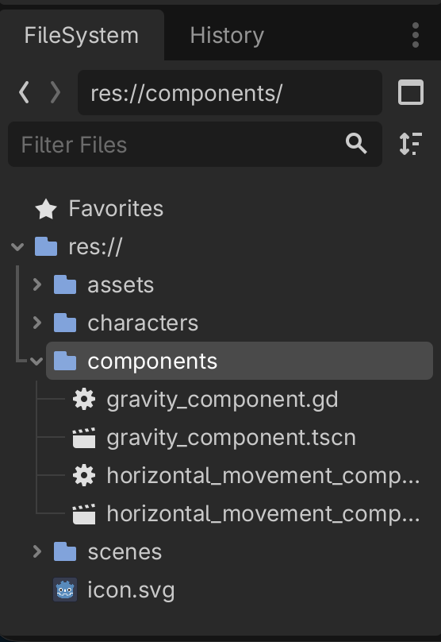
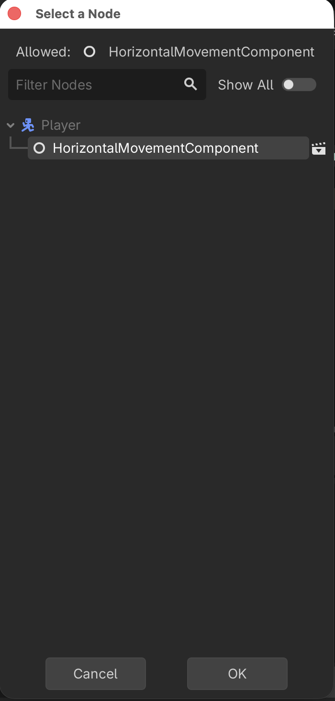
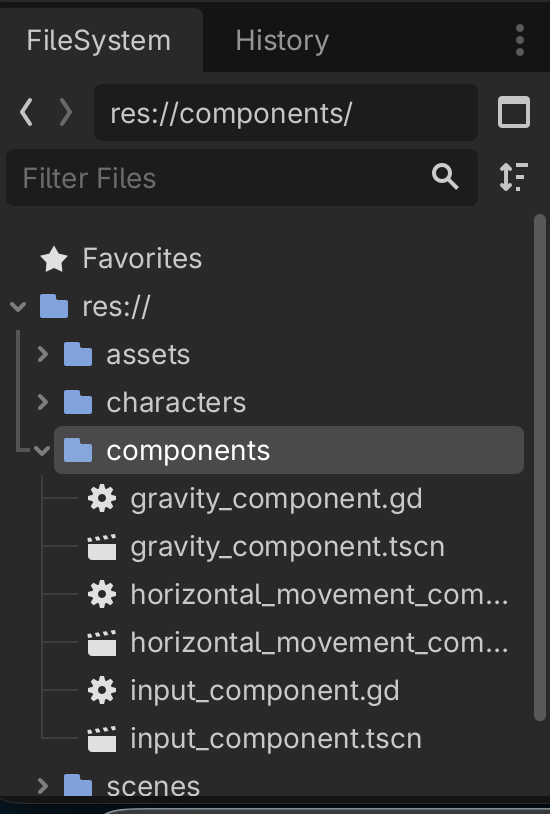

# Godot 2D Platformer - level 6, videre med Player og komponenter
I [level 5](../lesson05/) fik vi lavet vores første komponent, nemlig `GravityComponent` som sørger for at trække en `CharacterBody2D` ned mod jorden.

I den her level vil vi fortsætte arbejdet med vores `Player` og lave to komponenter så vi kan begynde at flytte vores `Player`.

Lad os komme i gang.

## Lad os tænke os om!
Hvad er det vi gerne vil?

Vi vil gerne have at når vi trykker på de taster vi nu har defineret styrer vores player, så skal vores figur flytte sig på skærmen.

Så kunne man jo umiddelbart godt tænke at vi skulle lave en komponent der kunne:

- lytte efter tastetryk
- baseret på hvilke tastetryk der er registreret, flytte spillerens `CharacterBody2D`

Men...vi vil jo også gerne kunne genbruge de her komponenter. I det her tilfælde vil vi gerne kunne genbruge dem til vores `Walker`s `CharacterBody2D` så den _også_ kan flytte sig ved hjælp af vores komponent.

Men...vi styrer jo ikke en `Walker` med tastaturet, så det dur jo ikke at komponenten lytter efter tastetryk og så flytter `CharacterBody2D` på baggrund af det.

Nej...vi bliver vist nødt til at splitte det op.

### To komponenter
I stedet vil vi gerne lave _to_ komponenter:

- en `HorizontalMovementComponent` som vi kan bruge til at bevæge os horisontalt (altså vandret, hen af en platform)
- en `InputComponent` som vi kan bede om at få en retning som spilleren bevæger sig i

Og så kan vi bruge `InputComponent` til at finde ud af om spilleren har trykket på tastaturet, og hvis de har, så kan vi sige til vores `HorizontalMovementComponent`: Flyt `CharacterBody2D` i den her retning tak.

Og når vi så skal til at lave vores `Walker` kan vi stadig bruge `HorizontalMovementComponent` og så give den en retning som vi selv styrer.

Det bliver godt!

## `HorizontalMovementComponent`
OK så vi er blevet enige om at vi vil lave en komponent som vi:

- giver en `CharacterBody2D` og en retning som input parametre
- ud fra det finder vores komponent så ud af at opdatere `CharacterBody2D`s x værdi

Lad os lige tænke lidt mere over hvordan vi flytter vores `CharacterBody2D`.

I [level 5](../lesson05/) gjorde vi sådan her i vores `GravityComponent` for at opdatere y værdien og dermed flytte os lodret:

```gdscript
body.velocity.y += gravity
```

Vi må kunne gøre det samme med x værdien hvis vi vil flytte os vandret.

Altså

```gdscript
body.velocity.x = hvad??
```

Ja hvad skal x værdien så være?

Først og fremmest skal den vel være:

- et negativt tal for at vi kan bevæge os til venstre
- et positivt tal for at vi kan bevæge os til højre
- 0 hvis vi vil stå stille

Heldigvist lærte vi jo allerede da vi lavede vores 2D space shooter at når vi spørger Godot om input på en akse (x eller y), så kan vi få 3 værdier tilbage:

- -1 hvis man har trykket på "flyt til venstre" tasten
- +1 hvis man har trykket på "flyt til hæjre" tasten
- 0 hvis man ikke har trykket på nogle taster

Det er jo nemt, hvis vi bare sørger for at det er den værdi vi får med ind som input parameter, så kan vi jo bruge den, lad os kalde variablen for `direction`

Men så kan vi vel sige noget i retning af:

```gdscript
body.velocity.x = direction
```

Og så vil vi bevæge os i den rigtige retning:

- hvis direction = -1 vil vi sige `body.velocity.x = -1`
- hvis direction = 1 vil vi sige `body.velocity.x = 1`
- hvis direction = 0 vil vi sige `body.velocity.x = 0`

Meeeeeeen, hvad var det nu velocoty dækkede over? Vi kigger lige i [dokumentationen](https://docs.godotengine.org/en/stable/classes/class_characterbody2d.html#class-characterbody2d-property-velocity) igen:

> Current velocity vector in pixels per second, used and modified during calls to move_and_slide().

OK så hvis vi siger:

```gdscript
body.velocity.x = direction
```

Så vil vi flytte os med 1 pixel i sekundet! Det er vist ikke hurtigt nok! Så vi er nok nødt til at have en `speed` konstant som vi kan gange på.

```gdscript
@export var speed: float = 150

body.velocity.x = direction * speed
```

### Men vi er stadig ikke tilfredse!
Tænk på dig selv når du løber, eller går, eller cykler. Når du starter med at bevæge dig, er du så oppe i fuld fart i det første skridt? Hvis du holder for rødt på din cykel i et lyskryds og det skifter til grønt, er du så oppe på 20 kilometer i timen når du træder på pedalerne første gang?

Det kan godt være du er ung og hurtig men for os andre gamle tager det tid at komme op i fart, det er det der hedder accelleration.

Det samme kan vi lave i vores `HorizontalMovementComponent`.

Hvis vi introducerer en accellerationshastighed kan vi bruge en smart funktion i Godot, nemlig den der hedder `move_toward`.

Vi kigger - igen - i [dokumentationen](https://docs.godotengine.org/en/stable/classes/class_@globalscope.html#class-globalscope-method-move-toward):

`float move_toward(from: float, to: float, delta: float)`

> Moves _from_ toward _to_ by the _delta_ amount. Will not go past to.

Hva??? hvad mener de?? Ja OK, det er måske nemmere at forstå hvis vi ser det med nogle tal:

`move_toward(0, 10, 2)`

Her er 
- from = 0
- to = 10
- delta = 2

Så det betyder at vi bevæger os fra 0 mod 10 med 2.

Og det kan vi så udvide endnu mere. 

Hvis vi nu introducerer en variabel kaldet `ground_acelleration_speed` kan vi bruge den sådan her:

```gdscript
@export var speed: float = 150
@export var ground_acelleration_speed: float = 12.0

body.velocity.x = move_toward(body.velocity.x, direction * speed, ground_acelleration_speed)
```

Altså:

`body.velocity.x` er lig med at vi bevøger os:

- fra den nuværende `body.velocity.x`
- mod direction * speed
- med ground_acelleration_speed

Og det vil vi så gøre indtil vi rammer vores tophastighed.

#### Et eksempel
- direction = 1, vi går altså mod højre
- ground_accelleration_speed = 10
- speed = 100
- body.velocity.x starter med at være 0

| gennemløb | body.velocity.x start | udregning | body.velocity.x slut |
| --- | --- | --- | --- |
| 1 | 0 | move_toward(0, 1 * 100, 10) | 10 |
| 2 | 10 | move_toward(10, 1 * 100, 10) | 20 |
| 3 | 20 | move_toward(20, 1 * 100, 10) | 30 |

Og så videre.

Det er godtnok en lineær accelleration, men det er godtnok til os.

### Vi er vist klar
Vi er vist - endelig - ved at være klar til at skrive vores `HorizontalMovementComponent`, så lad os starte med at få skelettet på plads præcis som vi gjorde i vores `GravityComponent`.

1. I "components" mappen laver du en ny `Node2D` som du omdøber til `HorizontalMovementComponent`.
2. Gem din scene som `horizontal_movement_component.tscn`
3. Tilføj et script til `HorizontalMovementComponent` og gem det som `horizontal_movement_component.gd`

Det skulle gerne se sådan her ud



### Script
Og så til det sjove, scriptet.

Som vi nåede frem til ovenfor skal vi have lavet en funktion der:

- [ ] tager en `CharacterBody2D` og en `direction` som input og ikke returnerer noget
- [ ] have lavet nogle `@export` variabler til `speed`, `ground_accelleration_speed` og `ground_decelleration_speed` (så vi kan standse hurtigere end vi starter)
- [ ] have regnet ud om vi skal accellerere eller decellerere
- [ ] bruge `move_toward`

Vi tar dem en af gangen

#### Skelet
Vi gir lige vores script et `class_name` så vi kan bruge det i vores `Player`
```gdscript
class_name HorizontalMovementComponent
extends Node
```

#### Funktions signatur
Vi vil det her:

- [ ] tager en `CharacterBody2D` og en `direction` som input og ikke returnerer noget

Så vi skriver:

```gdscript
class_name HorizontalMovementComponent
extends Node

func handle_horizontal_movement(body: CharacterBody2D, direction: float) -> void:
	
```

Det var skridt 1

- [X] tager en `CharacterBody2D` og en `direction` som input og ikke returnerer noget
- [ ] have lavet nogle `@export` variabler til `speed`, `ground_accelleration_speed` og `ground_decelleration_speed` (så vi kan standse hurtigere end vi starter)
- [ ] have regnet ud om vi skal accellerere eller decellerere
- [ ] bruge `move_toward`

#### Lav `@export` variabler
Vi skal bruge variabler til:

- speed
- accellerations hastighed
- decellerations hastighed

Det ser sådan her ud:

```gdscript
@export_subgroup("Settings")
@export var speed: float = 150
@export var ground_accelleration_speed = 6.0
@export var ground_decelleration_speed = 12.0
```

Og hele vores script ser sådan her ud nu:

```gdscript
class_name HorizontalMovementComponent
extends Node

@export_subgroup("Settings")
@export var speed: float = 150
@export var ground_accelleration_speed = 6.0
@export var ground_decelleration_speed = 12.0

func handle_horizontal_movement(body: CharacterBody2D, direction: float) -> void:
	
```

Det var skridt 2

- [X] tager en `CharacterBody2D` og en `direction` som input og ikke returnerer noget
- [X] have lavet nogle `@export` variabler til `speed`, `ground_accelleration_speed` og `ground_decelleration_speed` (så vi kan standse hurtigere end vi starter)
- [ ] have regnet ud om vi skal accellerere eller decellerere
- [ ] bruge `move_toward`

#### Skal vi accellerere eller decellerere
Altså...flytter vi os, så vi skal bevæge os op i fart, eller har spilleren sluppet tastaturet så vi skal bremse ned?

Vi kan kigge på `direction`.

- hvis den er forskellig fra 0 er vi i bevægelse
- hvis den er 0 er vi ved at stoppe

Det kan vi gøre sådan her

```gdscript
var horizontal_change_speed: float = 0.0
horizontal_change_speed = ground_accelleration_speed if direction != 0 else ground_decelleration_speed
```

Det er jo næsten som at læse en sætning :) 

Vores script ser nu sådan her ud:

```gdscript
class_name HorizontalMovementComponent
extends Node

@export_subgroup("Settings")
@export var speed: float = 150
@export var ground_accelleration_speed = 6.0
@export var ground_decelleration_speed = 12.0

func handle_horizontal_movement(body: CharacterBody2D, direction: float) -> void:
	var horizontal_change_speed: float = 0.0
	horizontal_change_speed = ground_accelleration_speed if direction != 0 else ground_decelleration_speed
```

Det var step 3

- [X] tager en `CharacterBody2D` og en `direction` som input og ikke returnerer noget
- [X] have lavet nogle `@export` variabler til `speed`, `ground_accelleration_speed` og `ground_decelleration_speed` (så vi kan standse hurtigere end vi starter)
- [X] have regnet ud om vi skal accellerere eller decellerere
- [ ] bruge `move_toward`

#### Bruge `move_toward`
Sidste skridt er at proppe værdierne ind i `move_toward`.

Vi vil altså gerne gå:

- fra body.velocity.x
- mod direction * speed
- med horizontal_change_speed

Så det gør vi:

```gdscript
body.velocity.x = move_toward(body.velocity.x, direction * speed, horizontal_change_speed)
```

Vores - færdige - script ser nu sådan her ud:

```gdscript
class_name HorizontalMovementComponent
extends Node

@export_subgroup("Settings")
@export var speed: float = 150
@export var ground_accelleration_speed = 6.0
@export var ground_decelleration_speed = 12.0

func handle_horizontal_movement(body: CharacterBody2D, direction: float) -> void:
	var horizontal_change_speed: float = 0.0
	horizontal_change_speed = ground_accelleration_speed if direction != 0 else ground_decelleration_speed
	body.velocity.x = move_toward(body.velocity.x, direction * speed, horizontal_change_speed)
```

Og det var step 4

- [X] tager en `CharacterBody2D` og en `direction` som input og ikke returnerer noget
- [X] have lavet nogle `@export` variabler til `speed`, `ground_accelleration_speed` og `ground_decelleration_speed` (så vi kan standse hurtigere end vi starter)
- [X] have regnet ud om vi skal accellerere eller decellerere
- [X] bruge `move_toward`

### Tilføj `HorizontalMovementComponent` til `Player`
[Præcis på samme måde som vi tilføjede `GravityComponent` tilføjer vi nu `HorizontalMovementComponent` til vores `Player` ved at:

1. Tilføje en `@export var horizontal_movement_component: HorizontalMovementComponent` til vores `Player` script
2. "Instantiate Child scene" og tilføje `horizontal_movement_component.tscn` på vores `Player`
3. Assigne `HorizontalMovementComponent` til "Horizontal Movement Component" i "Inspectoren" for vores "Player"
]



### Hurtig test
Vi har jo godtnok ikke nogen måde at opsamle tastaturtryk på endnu, men vi kan lave en hurtig test ved at tilføje `horizontal_movement_component.handle_horizontal_movement` til vores `_physics_process` og så bare sætter værdien til -1 f.eks.

```gdscript
func _physics_process(delta: float) -> void:
	gravity_component.handle_gravity(self, delta)
	horizontal_movement_component.handle_horizontal_movement(self, 1)
	move_and_slide()
```

Prøv at kør dit spil nu. Din `Player` skulle nu gerne glide mod venstre.

Fedt. Videre!

## `InputComponent`
Vores `InputComponent` er simpel. I første omgang skal vi bare vide om man har trykket på venstre/højre eller ej, og det vil vi så gerne gemme.

Husk at alle `Node2D` har en `_process` funktion, den kan vi lytte i og så bare gemme værdien så vi kan få fat i den i vores `Player` (eller hvor vi nu vil bruge dem).

### Skelet
Samme som før.

1. Lav en ny Node2D
2. Kald den "InputComponent"
3. Gem dem som `input_component.tscn` under "components"
4. Tilføj et script til "InputComponent"

Det ser sådan her ud:



### Script
Scriptet er simpelt, vi gemmer værdien for om man har trykket tasterne for venstre/højre ned, det skulle gerne give os et tal der er enten -1, 0 eller 1. Det ser sådan her ud:

```gdscript
class_name InputComponent
extends Node

var horizontal_direction: float = 0.0

func _process(delta: float) -> void:
	horizontal_direction = Input.get_axis("left", "right")
```

### Tilføj `InputComponent` til `Player`
Du begynder at kunne det i søvne nu.

1. Tilføj `@export var input_component: InputComponent` til `Player` scriptet
2. "Instantiate Child scene" og tilføj `input_component.tscn` på vores `Player`
3. Assigne `InputComponent` til "Input Component" i "Inspectoren" for vores "Player"

### Bind det hele sammen i vores `Player` script
Nu kan vi spørge vores `InputComponent` efter dens `horizontal_direction` og sende det med ind i vores `handle_horizontal_movement`.

`horizontal_movement_component.handle_horizontal_movement(self, input_component.horizontal_direction)`

Her er hele vores `Player` script:

```gdscript
extends CharacterBody2D

@export_subgroup("Nodes")
@export var gravity_component: GravityComponent
@export var horizontal_movement_component: HorizontalMovementComponent
@export var input_component: InputComponent

func _physics_process(delta: float) -> void:
	gravity_component.handle_gravity(self, delta)
	horizontal_movement_component.handle_horizontal_movement(self, input_component.horizontal_direction)
	move_and_slide()
```

### Test
Kør dit spil og prøv at bevæg dig til hæjre og venstre

Jaeh...joeh...vores spiller bevæger sig og den accellerer og decellererer når man starter og stopper. Meeeen den vender sig ikke rigtigt når vi løber mod venstre og der er heller ingen animationer. Det kigger vi på i [næste lektion](../lesson07/).

## Sådan!
Vi er nu kommet godt i gang med komponenter og har nogle fine byggeklodser som vi kan bruge senere også.

[Næste gang](../lesson07/) vil vi prøve at lave en `AnimationComponent` så vores spiller ser lidt mere realistisk ud.
