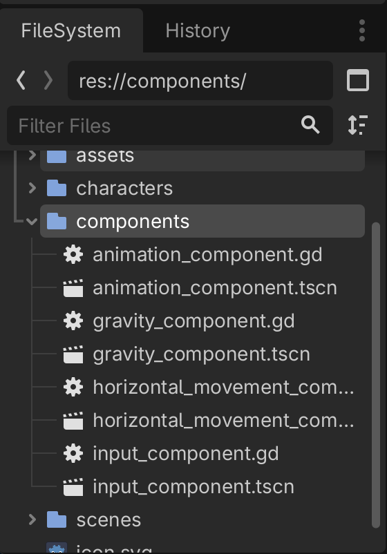
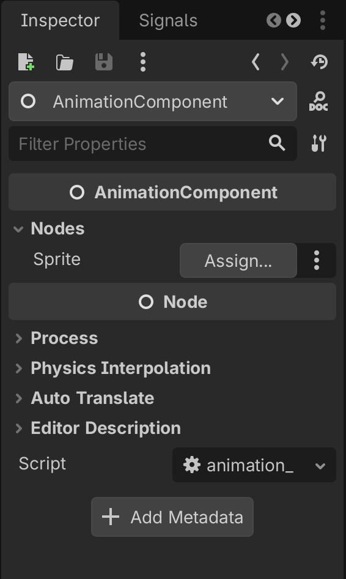
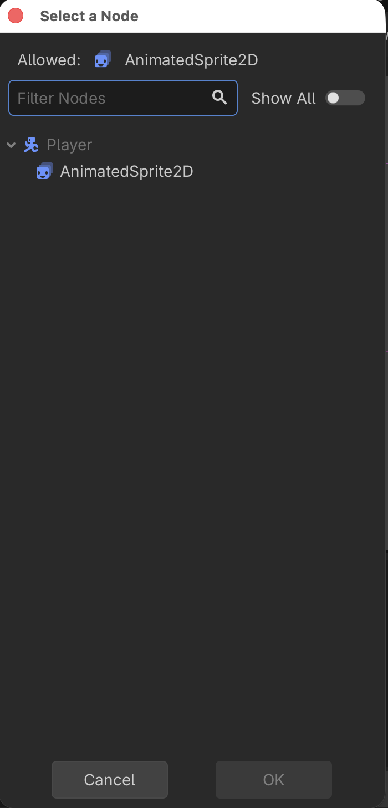
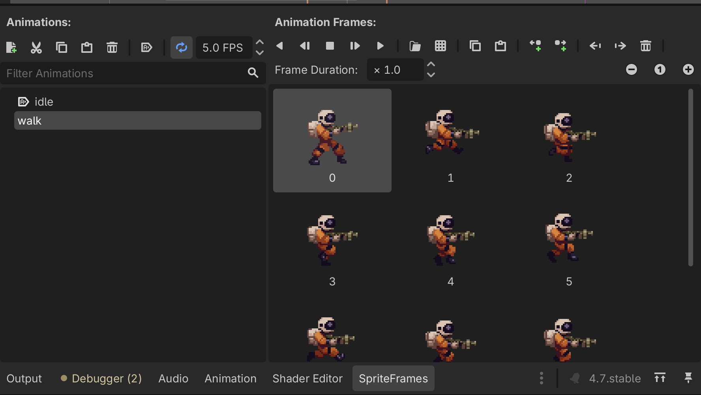
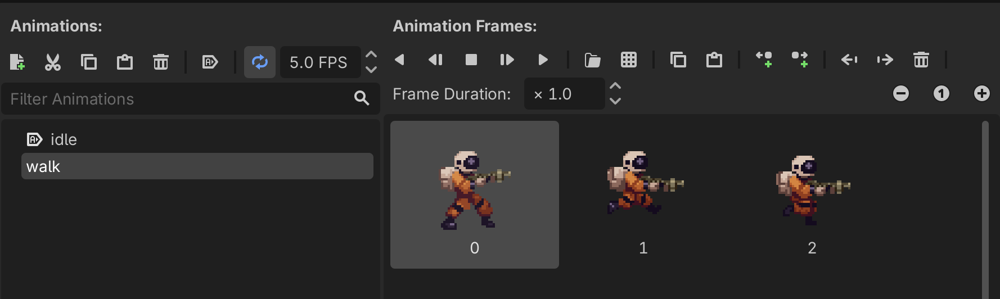

# Godot 2D Platformer - level 7 animationer
I [level 6](../lesson06/) fik vi vores `Player` til at bevæge sig ved at lave to komponenter, en `HorizontalMovementComponent` og en `InputComponent`.

Men! Der er ikke meget sjov ved den måde vores spiller bevæger sig på. Den vender altid på den samme måde og den animerer ikke.

Lad os rette op på det ved at lave en `AnimationComponent` i denne level. Let's go!

## Lad os - som altid - lige tænke os om først
Hvad er det vi gerne vil? Ja vi vil jo gerne have en komponent der i første omgang kan afgøre om der skal spilles en "walk" eller en "idle" animation (senere skal den også håndtere at vi hopper, skyder og dør men det tar' vi senere).

Hvad kan vi bruge til at afgøre om det skal være "walk" eller "idle" vi spiller? 

Det er vel om der er trykket på en "bevæg dig" tast eller ej.

Men hey! Det lavede vi jo i vores `InputComponent`

`input_component.horizontal_direction` giver os et tal som er -1, 0 eller 1. Det kan vi da bruge.

Hvis `horizontal_direction == 0` så spil "idle" animationen, ellers så spil "walk" animationen.

Nemt :)

## AnimationCompoent - Skelet
Vi skal igeenem samme show som da vi lavede de andre komponenter.

1. Lav en ny Node2D
2. Kald den "AnimationComponent"
3. Gem dem som `animation_component.tscn` under "components"
4. Tilføj et script til "AnimationComponent"

Det ser sådan her ud:



## Script
Scriptet kan vi også starte på, det skal have en `class_name` som de andre

```gdscript
class_name AnimationComponent
extends Node
```

Og hvad så? Hvad er det vi skal animere? Det er en `AnimatedSprite2D` så hvis vi nu sørger for at sætte den som en '@export sprite: AnimatedSprite2D' når vi bruger vores `AnimationComponent` så er det nemt.

Så vi tilføjer:

```gdscript
@export_subgroup("Nodes")
@export var sprite: AnimatedSprite2D
```

til vores script så det ser sådan her ud:

```gdscript
class_name AnimationComponent
extends Node

@export_subgroup("Nodes")
@export var sprite: AnimatedSprite2D
```

Og så kan vi skrive vores funktion.

Vi blev enige om at den skulle have en `horizontal_direction` med ind som parameter og den skal ikke returnere nogen værdi. 

Vi laver en liste så vi kan strege ud undervejs:

- [ ] Tag en `horizontal_direction` som input og returner ikke noget
- [ ] Find ud af om vi skal spille "walk" eller "idle" animation

### Funktionens signatur
Når vi skriver sådan en funktion kalder vi "den måde funktionen ser ud på" for dens signatur.

Så i det her tilfælde vil vi have en funktion som:

- hedder `handle_move_animation`
- tager en `horizontal_direction` af typen `float` som input parameter
- ikke returnerer noget

Så det skriver vi:

`func handle_move_animation(horizontal_direction: float) -> void:`

Det var skridt 1

- [X] Tag en `horizontal_direction` som input og returner ikke noget
- [ ] Find ud af om vi skal spille "walk" eller "idle" animation

### Hvilken animation skal vi spille?
Hvad var det vi aftalte ovenfor?

> Hvis `horizontal_direction == 0` så spil "idle" animationen, ellers så spil "walk" animationen.

OK, nemt:

```gdscript
if horizontal_direction == 0:
	sprite.play("idle")
else:
	sprite.play("walk")
```

Det var skridt 2

- [X] Tag en `horizontal_direction` som input og returner ikke noget
- [X] Find ud af om vi skal spille "walk" eller "idle" animation

Her er hele vores script

```gdscript
class_name AnimationComponent
extends Node

@export_subgroup("Nodes")
@export var sprite: AnimatedSprite2D

func handle_move_animation(direction: float) -> void:
	if horizontal_direction == 0:
		sprite.play("idle")
	else:
		sprite.play("walk")
```

### Men...
Nu har vi sagt at der _skal_ være en animation der hedder "idle" og en der hedder "walk" på de scenes vi vil bruge sammen med vores `AnimationComponent`. 

Men det er vel også OK, hvis vi sørger for at bruge de navne kan vi tilgæld nemt styre alle animationer ved at tilføje en `AnimationComponent` og binde den op med den rigtige `AnimatedSprite2D` og så skal vi ikke tænke på mere...det er da nemt.

## Tilføj `AnimationCompoent` til `Player`
Vi skal igennem det samme show som da vi tilføjede `GravityComponent`, `HorizontalMovementComponent` og `InputComponent`. Du kan sikkert huske det men for en god ordens skyld:

Præcis på samme måde som vi tilføjede `GravityComponent` tilføjer vi nu `AnimationComponent` til vores `Player` ved at:

1. Tilføje en `@export var animation_component: AnimationComponent` til vores `Player` script
2. "Instantiate Child scene" og tilføje `animation_component.tscn` på vores `Player`
3. Assigne `AnimationComponent` til "Animation Component" i "Inspectoren" for vores "Player"

Og! Som noget nyt skal vi have bundet vores `Player`s `AnimatedSprite2D` fast til `sprite` variablen på vores `AnimationComponent`. Det gør vi sådan her:

1. I venstre side af skærmen, under `Player` klikker vi på den `AnimationComponent` som vi lige tilføjede.
2. I "Inspectoren" i højre side kan vi se at der under "Aninamtion Component" er en "Nodes" gruppe, og i den er der en "Sprite" værdi som vi kan trykke "Assign" ud for

Det ser sådan her ud



3. Tryk på "Assign" og vælg `AnimatedSprite2D` under vores `Player` node



### Så mangler vi lige en vigtig detalje
Nemlig en "walk" animation.

Den laver du præcis som du lavede din "idle" animation. Under assets kan du finde et sprite sheet der hedder "space-marine-walk.png" som du kan trække ind i dit projekt og bruge.

Det ser sådan her ud:



Kør din animation.

Hmmm...den ser lidt sjov ud hvis du looper animationen, som om der er en frame der ikke skal være der.

Fjern den første frame ved at klikke på den, og så på skraldespanden i øverste højre hjørne



Kør så animationen igen. Bedre!

## Brug `AnimationComponent` i vores `Player` script
Så er vi klar til den sjove del, nemlig at bruge vores `AnimationComponent` sammen med vores `Player`. 

Vi _kunne_ godt smide vores kode sammen med de andre i `_physics_process` men...at styre en animation har vel _egentlig_ ikke noget med fysik motoren at gøre har det?

Nej så lad os i stedet bruge den almindelige `_process` funktion som vi også brugte i vores 2D space shooter.

Vi tilføjer

```gdscript
func _process(delta: float) -> void:
```

Og hvad gør vi så? Ja vi har jo vores `animation_component` og på den har vi vores `handle_move_animation` funktion som vi kan kalde med den aktuelle `horizontal_direction` som vi kan få fra vores `input_component`. 

Det ser sådan her ud:

```gdscript
func _process(delta: float) -> void:
	animation_component.handle_move_animation(input_component.horizontal_direction)
```

Kør dit spil.

Jaeh ja! Vores `AnimatedSprite2D` spiller "idle" animationen når vi står stille og "walk" når vi bevæger os.

Meeen...når vi bevæger os mod venstre vender vores `AnimatedSprite2D` sig ikke om, men moonwalker i stedet og ja, det er ser da også meget fedt ud men vi er kræsne så vi vil hellere have at figuren vender sig rigtigt.

## Vend dig om!
Det er heldigvis en nem opgave i Godot.

Vi kigger i [dokumentation](https://docs.godotengine.org/en/stable/classes/class_animatedsprite2d.html#class-animatedsprite2d-property-flip-h) og ser at på `AnimatedSprite2D` finder vi en property der hedder `flip_h`

Der står:

> If true, texture is flipped horizontally.

Det betyder at vi kan sige til vores `AnimatedSprite2D` at den skal vende animationen spejlvendt hvis `flip_h = true`.

Så nu skal vi bare finde ud af hvad der kan afgøre at vi skal sætte `flip_h` til at være `true`.

Igen har vi vores `horizontal_direction`.

Hvis den er -1 går vi mod venstre og så vil vi gerne sætte `flip_h = true`.

Lad os rette det i vores `AnimationComponent`.

### Tilføjelse til vores `AnimationComponent` script
Hop ind i `animation_component` scriptet.

Det her kan gøres på mange måder men lad os lave en ny funktion som er lidt defensiv og så kan vi kalde den fra vores `handle_move_animation`.

Så vi laver en ny funktion med følgende signatur:

`func handle_horizontal_flip(horizontal_direction: float) -> void:`

Og hvad vil vi så? Altså 

- Hvis `horizontal_direction == 0` vil vi ikke gøre noget.
- Hvis `horizontal_direction < 0` vil vi sige `flip_direction = true`
- Hvis `horizontal_direction > 0` vil vi sige `flip_direction = false`

Det ser sådan her ud:

```gdscript
func handle_horizontal_flip(horizontal_direction: float) -> void:
    # hvis horizontal_direction == 0 vil vi ikke gøre noget
	if horizontal_direction == 0:
        # return betyder...stop her
		return
		
    # Hvis `horizontal_direction < 0`
    if horizontal_direction < 0:
        # vil vi sige `flip_direction = true
		sprite.flip_h = true
    # Hvis `horizontal_direction > 0
	else:
        # vil vi sige `flip_direction = false`
		sprite.flip_h = false
```

Så mangler vi bare at kalde vores funktion fra `handle_move_animation`

```gdscript
func handle_move_animation(horizontal_direction: float) -> void:
	handle_horizontal_flip(horizontal_direction)
	if horizontal_direction == 0:
		sprite.play("idle")
	else:
		sprite.play("walk")
```

Her er hele vores script:

```gdscript
class_name AnimationComponent
extends Node

@export_subgroup("Nodes")
@export var sprite: AnimatedSprite2D

func handle_horizontal_flip(horizontal_direction: float) -> void:
	if horizontal_direction == 0:
		return

	if horizontal_direction < 0:
		sprite.flip_h = true
	else:
		sprite.flip_h = false

func handle_move_animation(horizontal_direction: float) -> void:
	handle_horizontal_flip(horizontal_direction)
	if horizontal_direction == 0:
		sprite.play("idle")
	else:
		sprite.play("walk")
```

Kør dit spil igen og nyd hvordan vores spiller nu vender sig rigtigt når vi skifter retning.

## Godt arbejde!
Det kan godt være at du stadig tænker

> Hvorfor pokker skal vi lave alle de komponenter, er det ikke bare en masse arbejde?

Men prøv at tænk på hvor nemt det bliver når vi skal til at lave vores `Walker`. Hvis vi bare sørger for at lave en "walk" og en "idle" animation behøver vi - næsten - ikke gøre mere for at få animationer foræret, det er da fedt!

Men...vi glæder os over det forkerte, lad os være glade for at vi nu har en `AnimationComponent` og at vores `Player` begynder at komme til live.

I [næste](../lesson08/) level vil vi forsøge at få vores `Player` til at kunne hoppe også, så når du er klar kan du hoppe videre...vi ses!