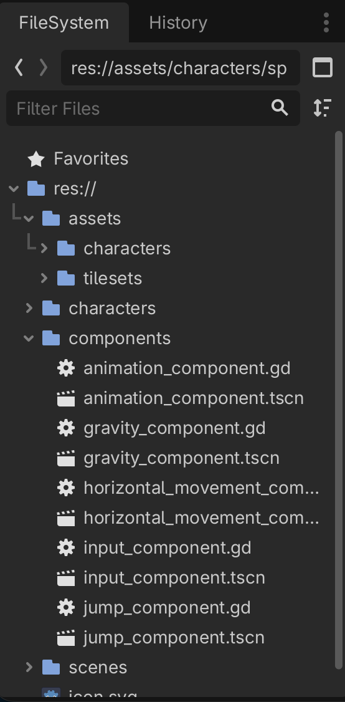
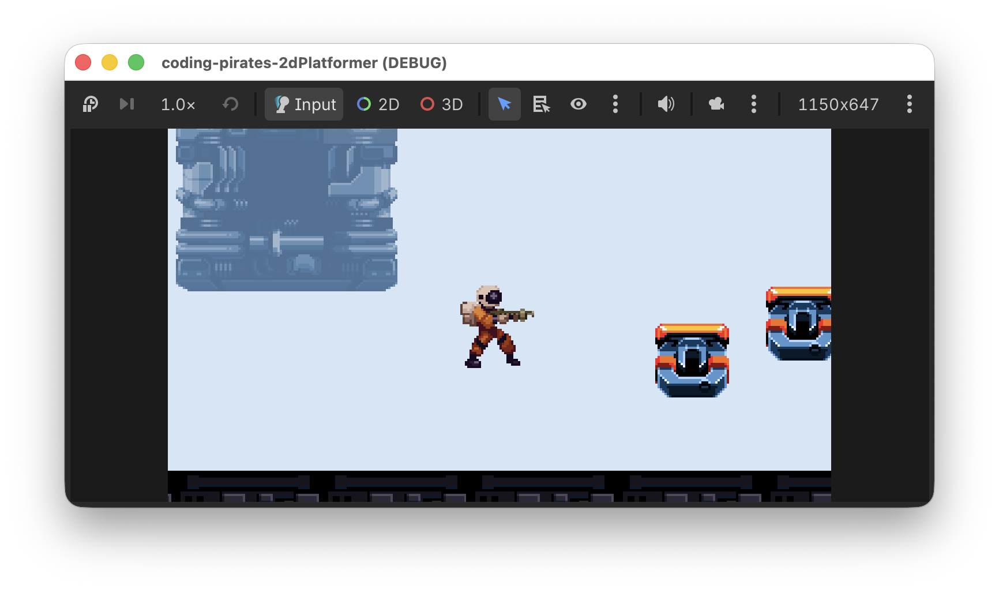
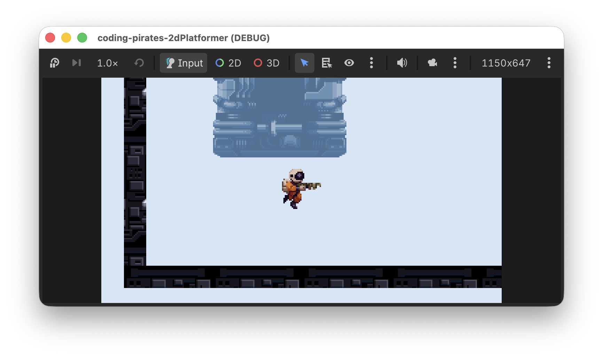

# Godot 2D Platformer - level 8 hop!
I [level 7](../lesson07/) fik vores `Player` lidt mere liv og kan nu løbe i begge retninger. Det er jo meget godt men den skal vel også kunne hoppe. Lad os få det til at ske i denne lektion.

Du kender godt første spørgsmål.

## Hvad er det vi gerne vil?
Få vores spiller til at hoppe!

Godt, hvad kræver det?

Ja det kræver vel at vi ved om der er trykket på en tast så vi skal bede vores `CharacterBody2D` om at hoppe.

Godt, det var den første ting vi skal lave så:

- [ ] find ud af om der er trykket på "up"

OK, når så vi har det, hvad vil vi så, eller, sagt på en anden måde, hvordan fik vi vores `CharacterBody2D` til at bevæge sig fra side til side? Lad os lige kigge i vores `HorizontalMovementComponent`:

`body.velocity.x = move_toward(body.velocity.x, direction * speed, horizontal_change_speed)`

Ah ja, det var `velocity.x` vi skruede på.

Men hvis vi så vil have vores `CharacterBody2D` til at hoppe _op_, så må det vel være `velocity.y` vi skal ændre, og det skal vel være et negativt tal sådan at vi bevæger os opad, tættere på 0 som er øverste venstre hjørne.

Så noget kode som det her:

`body.velocity.y = -100`

Kunne måske gøre det?

Men hvordan kommer vi så ned igen?

Det er vel vores `GravityComponent` der styrer det, husk at den har den her funktion:

```gdscript
func handle_gravity(body: CharacterBody2D, delta: float) -> void:
	if not body.is_on_floor():
		body.velocity.y += gravity
```

Så...hvis `body` ikke står på gulvet, så træk den ned mod gulvet. Nemt!

Lad os opdatere vores liste:

- [ ] find ud af om der er trykket på "up"
- [ ] lav en ny `JumpComponent` som kan opdatere `velocity.y`

Og så kan vi vist godt starte.

## Find ud af om der er trykket på "up"
Vi laver en ny funktion i vores `InputComponent`.

- Funktionen kalder vi `jump_was_pressed`
- den tager ingen input
- den returnerer en bool værdi (bool er en forkortelse for Boolean som betyder at værdien kan være sand eller falsk, ja eller nej, 1 eller 0)

Prøv og se om du selv kan skrive signaturen.

Vores funktion skal bare svare på et simpelt spørgsmål: Har spilleren trykket på vores "up" knap.

Igen, prøv og se om du selv kan skrive den linie kode der skal til, kig evt. i vores gamle 2D space shooter, der gjorde vi det samme.

Her er vores bud:

```gdscript
func jump_was_pressed() -> bool:
	return Input.is_action_just_pressed("up")
```

Hak ved første skridt

- [X] find ud af om der er trykket på "up"
- [ ] lav en ny `JumpComponent` som kan opdatere `velocity.y`

## Lav en ny `JumpComponent`
Du har gjordet det nogle gange efterhånden.

1. Lav en ny Node2D
2. Kald den "JumpComponent"
3. Gem dem som `jump_component.tscn` under "components"
4. Tilføj et script til "JumpComponent"

Det ser sådan her ud:



## Script
Scriptet kan vi også starte på, det skal have en `class_name` som de andre

```gdscript
class_name JumpComponent
extends Node
```

Og så skal vi have lavet en funktion:

- som vi kalder `handle_jump`
- den skal tage to input parametre
  - en `CharacterBody2D` som vi kalder `body`
  - en `bool` som vi kalder `jump_requested`
- og den skal ikke ikke returnere noget

Igen, prøv selv, du kan godt :)

Hvad var det så vores funktion skulle gøre? 

Vi blev enige om at den skulle opdatere `velocity.y` på den `body` den arbejder med _hvis_ der var trykket på "up".

Men...lille krølle!

Den skal vel _kun_ opdatere `velocity.y` hvis vi _står_ på jorden. Hvis vi beder den om at opdatere `velocity.y` mens vi er _i luften_, jamen så bliver vi vel ved med at flyve opad, det dur ikke.

Så...vi er nødt til at kigge på om `body.is_on_floor()` og kun hvis det er tilfældet vil vi ændre på `velocity.y`.

Så altså:

1. Lav en `@export var jump_velocity: float = -350` så vi kan justere hvor højt der skal hoppes.
2. Tilføj til vores funktion som du lige har lavet en signatur til så den:
  - Kigger om `jump_requested` og body.is_on_floor()
  - Og hvis det er sandt, så opdaterer den `vody.velocity.y` til at være lig med `jump_velocity`

Prøv selv, du kan stadig godt.

Her er vores færdige script

```gdscript
class_name JumpComponent
extends Node

@export_subgroup("Settings")
@export var jump_velocity: float = -350.0

func handle_jump(body: CharacterBody2D, jump_requested: bool) -> void:
	if jump_requested and body.is_on_floor():
		body.velocity.y = jump_velocity
```

Det var andet skridt

- [X] find ud af om der er trykket på "up"
- [X] lav en ny `JumpComponent` som kan opdatere `velocity.y`

## Tilføj `JumpComponent` til `Player`
Vi har været der før.

Præcis på samme måde som vi tilføjede `GravityComponent` tilføjer vi nu `JumpComponent` til vores `Player` ved at:

1. Tilføje en `@export var jump_component: JumpComponent` til vores `Player` script
2. "Instantiate Child scene" og tilføje `jump_component.tscn` på vores `Player`
3. Assigne `JumpComponent` til "Jump Component" i "Inspectoren" for vores "Player"

## Opdater `Player` script
Nu kan vi i `_physics_process` kalde `handle_jump` på vores `jump_component`. Tilføj den her linie i _physics_process funktionen:

```gdscript
jump_component.handle_jump(self, input_component.jump_was_pressed())
```

Og kør så dit spil og prøv og hop



Det ser jo sådan set OK ud...bortset fra at når vi hopper løber vi stadig gennem luften. Det kan vi godt gøre bedre ved at tilføje et par nye animationer.

## Opdater vores `AnimationComponent`
Hvad vil vi? 

Vi vil gerne tilføje to nye animationer:

- "jump" til når vi bevæger os opad i vores hop
- "fall" til når vi bevæger os nedad i vores hop

Tilføj dem. du skal bruge `space-marine-jump.png` til dem begge to og så skal du kun vælge _nogle_ frames.

- til "jump" vælger du de tre første
- til "fall" vælger du de tre sidste

## Men hvordan ved vi om vi hopper eller falder?
Nu har vi vores animationer, men de kræver jo så at vi kan se om man bevæger sig opad eller nedad...hvem kan fortælle os det mon?

`GravityComponent` kunne være et godt bud. Vi har den her funktion nu:

```gdscript
func handle_gravity(body: CharacterBody2D, delta: float) -> void:
	if not body.is_on_floor():
		body.velocity.y += gravity * delta
```

Så den kigger allerede på om man ikke står på en platform.

Vi kan vel udvide den, så den også lige gemmer to variabler:

- `var is_jumping: bool` hvis vi _ikke_ er `on_floor` og vi hopper opad, altså hvis velocity.y < 0
- `var is_falling: bool` hvis vi _ikke_ er `on_floor` og vi falder nedad, altså hvis velocity.y > 0

### Udvid `GravityComponent`

Vi kan:

- tilføje `var is_jumping: bool`
- tilføje `var is_falling: bool`
- hvis _ikke_ vi `is_on_floor()` så kigger vi på hvad `body.velocity.y` er:
  - hvis den er < 0 bevæger vi os opad og så er `is_jumping = true`
  - hvis den er > 0 er tyngdekraften begyndt at trække os nedad og så er `is_falling = true`
- hvis vi `is_on_floor()` så er vi lige flinke og sætter dem begge to til false.

Prøv selv, her er vores script

Det ser sådan her ud:

```gdscript
class_name GravityComponent
extends Node

@export_subgroup("Settings")
@export var gravity: float = 1000

var is_jumping: bool = false
var is_falling: bool = false

func handle_gravity(body: CharacterBody2D, delta: float) -> void:
	if not body.is_on_floor():
		body.velocity.y += gravity * delta
		
		if body.velocity.y < 0:
			# Vi flytter os opad
			is_jumping = true
			is_falling = false
		elif body.velocity.y > 0:
			# Vi falder nedad
			is_jumping = false
			is_falling = true
	else:
		is_jumping = false
		is_falling = false
```

## Tilbage til `AnimationComponent`
Eftersom vores `Walker` _ikke_ skal kunne hoppe vil vi ikke have logikken for hvilken animation der skal vises ind i den eksisterende funktion, så vi laver en ny:

- funktionen skal hedde `handle_jump_animation`
- den skal tage to input parametre:
  - `is_jumping` af typen `bool`
  - `is_falling` af typen `bool`
- og den skal ikke returnere nogen værdi
- hvis `is_jumping` så spil "jump" animationen
- hvis `is_falling` så spil "fall" animationen

Prøv at skriv den i scriptet for `AnimationComponent`, her er vores bud:

```gdscript
func handle_jump_animation(is_jumping: bool, is_falling: bool) -> void:
	if is_jumping:
		sprite.play("jump")
	elif is_falling:
		sprite.play("fall")
```

## Tilføj til `Player` script
Sidste skridt, brug vores nye funktion i vores `Player` script, prøv at se om du kan regne ud hvad der skal tilføjes i `_process` funktionen.

Her er vores bud hvis du giver fortabt:

```gdscript
func _process(delta: float) -> void:
	animation_component.handle_move_animation(input_component.horizontal_direction)
	animation_component.handle_jump_animation(gravity_component.is_jumping, gravity_component.is_falling)
```

Prøv nu at kør dit spil igen og nyd de fine animationer



## Tada
Vores spil begynder at ligne noget nu. For at citere the Julekalender 

> I can hop I can run and it's very very fun

I [næste lektion](../lesson09/) skal vi til at skyde, vi ses!
