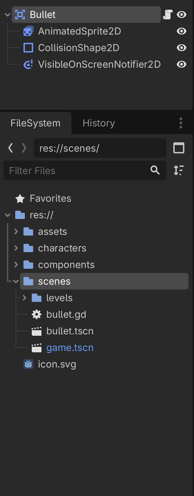
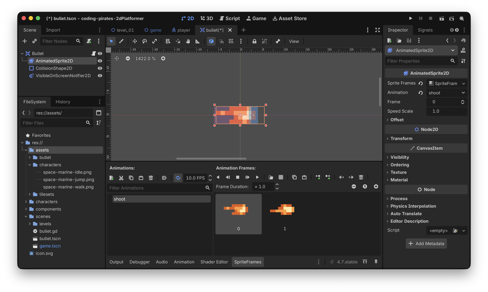
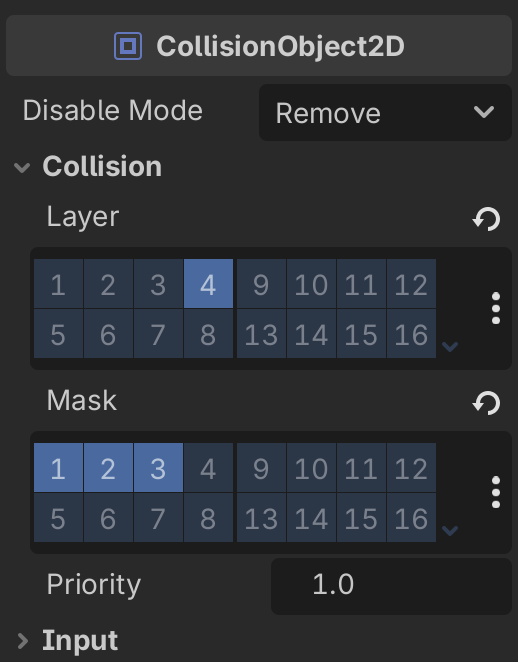
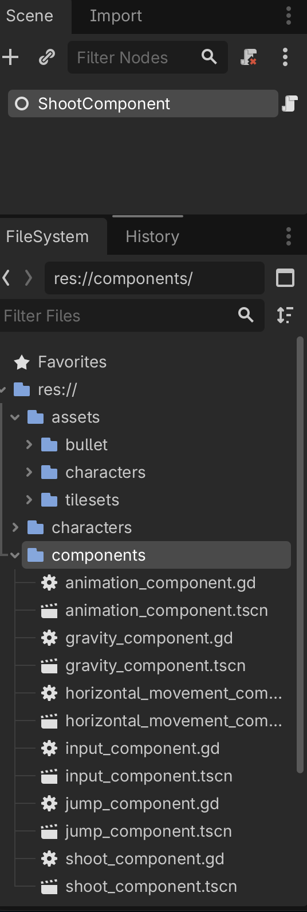
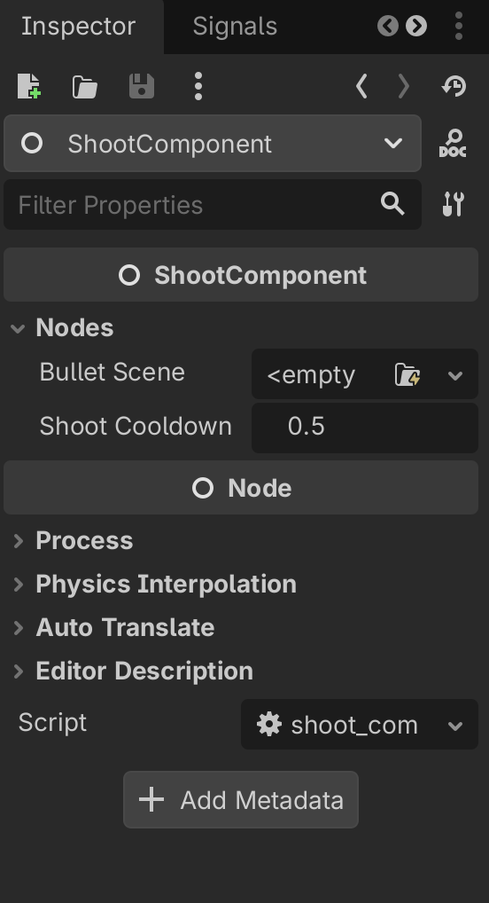
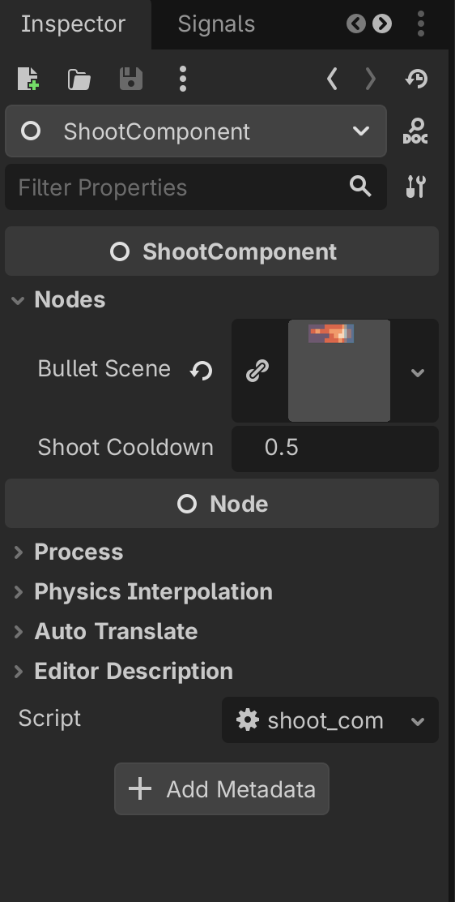

# Godot 2D Platformer - level 9 skyd!
I [level 8](../lesson08/) fik vi vores `Player` til at hoppe så nu kan vi bevæge os rundt men hvis vi skal overleve mødet med fjender skal vi også kunne skyde, lad os kigge på det i denne lektion.

Så...

## Hvad er det vi gerne vil?
Få vores spiller til at skyde!

OK, det har vi jo gjort før i vores 2D space shooter, mest da vi skulle sætte kugler fra vores fjender. Det kræver at vi:

- Opdager at der er trykket på "skyd"
- Opretter en ny `Bullet` scene
- Sætter `Bullet`s position og retning ud fra vores egen position og retning
- Lader `Bullet`s script håndtere resten 

Første skridt er let, ligesom vi kunne spørge vores `InputComponent` om `jump_was_pressed()` så vil vi også kunne spørge om `shoot_was_pressed()`

Så skal vi have lavet en ny `Bullet` scene af typen `Area2D` og have sat en `AnimatedSprite2D` og så videre på den.

Og til sidste del kan vi lave en `ShootComponent` med en funktion som vi - til at starte med - giver:

- Vores position
- Vores retning

Og ud fra det kan `ShootComponent` så

- Oprette en `Bullet`
- Sætte position og retning på `Bullet`
- Tilføje `Bullet` til vores "verden" så den bevæger sig

Så...tre ting vi skal have lavet, vi kan lave en liste så vi kan krydse af efterhånden som vi kommer fremad.

- [ ] Tilføj `shoot_was_pressed()` til `InputComponent`
- [ ] Lav en ny `Bullet` scene
- [ ] Lav en ny `ShootComponent` som vi kan bruge til at skyde med

Lad os fyre den af!

## Tilføj `shoot_was_pressed()` til `InputComponent`
Nemt! Kig på vores eksisterende `InputComponent` og se om du kan lave funktionen selv inden du kigger her nedenfor. Du skal ~stjæle~ søge kraftig inspiration i den eksisterende `jump_was_pressed()` funktion.

```gdscript
func shoot_was_pressed() -> bool:
	return Input.is_action_just_pressed("fire")
```

Bang! Videre

- [X] Tilføj `shoot_was_pressed()` til `InputComponent`
- [ ] Lav en ny `Bullet` scene
- [ ] Lav en ny `ShootComponent` som vi kan bruge til at skyde med

## Lav en ny `Bullet` scene
I "scenes" mappen laver du:

- En ny scene af typen `Area2D`
- Som du giver navnet "Bullet"
- Og gemmer som "bullet.tscn" i "scenes" mappen

Og så tilføjer du:

- En `AnimatedSprite2D` node
- En `CollisionShape2D` node
- En `VisibleOnScreenNotifier` så vi kan rydde op når vi forsvinder
- Et script som du gemmer sammen med scenen under navnet "bullet.gd"

Det ser sådan her ud



### Tilføj animation og collision shape
Under de assets du downloadede kan du finde filen "bullet.png" som har to billeder.

- Opret en ny mappe kaldet "bullets" under "assets" og træk så "bullets.png" ind i den nye mappe
- Nu kan du bruge den på din `AnimatedSprite2D` til at lave en animation som vi kalder for "shoot"
- Tilføj en "Rectangle" shape til din `CollisionShape2D` og ret den til så den passer med spidsen af vores kugle (det er den lyseblå frame)
- Ret også størrelsen på din `VisibleOnScreenNotifier` til så den passer med størrelsen af vores kugle billede (det er den lilla/rødlige frame)

Nu skulle det gerne se sådan her ud ved dig



### Og så en vigtig ting som du _ikke_ vil springe over at læse!
Godt :)

Vi skal jo lige huske at sætte "CollisionLayer" og "CollisionMask" for vores `Bullet`, ellers kommer den jo aldrig til at ramme noget.

Så:

1. Vælg din `Bullet` i venstre side
2. I "Inspectoren" i højre side finder du sektionen omkring "CollisionObject2D"

Og herunder finder du nu settings for "CollisionLayer" og "CollisionMask" ved at folde "Collision" sektionen ud

Kan du huske dem?

- CollisionLayer...hvilket lag vil vi gerne selv være i? Vi har jo lavet et lag kaldet "Bullets" (nummer 4) så det vælger vi
- CollisionMask...hvilke lag vil vi gerne støde sammen med? Det er vel næsten alt, Terrain, Player og Enemies, lag 1, 2 og 3, så dem vælger vi

Vær sikker på at det ser sådan her ud:



### Script
Videre til vores script. Vi vil - i første omgang - gerne tre ting:

- [ ] Lave en `add` funktion så vi kan tilføje en `Bullet` et andet sted fra
- [ ] Implementere `_physics_process` så vores kugle flytter sig
- [ ] Lytte på vores `VisibleOnScreenNotifier2D` og fjerne vores kugle når den flyver ud af skærmen

Lad os tage dem en af gangen

#### Add funktion
Hvad vil vi?

Vi vil have en funktion som vi kalder `add` og som tager:

- En position som vi kalder `pos` som er af typen `Vector2` som fortæller os hvor kuglen skal placeres
- En direction som vi kalder `dir` som er af typen `Vector` som fortælles os om vi skal skyde mod venstre (x = -1) eller højre (x = 1) afhængigt af hvor den der har skudt kigger henad
- Et offset som vi kalder `offset` som er af typen `Vector2` så vi kan justere positionen lidt (så det ser ud som om skuddet kommer fra spidsen af et gevær og ikke inde fra maven af vores `Player` f.eks)
- Funktionen skal ikke returnere noget

Lad os skrive signaturen:

```gdscript
func add(pos: Vector2, dir: Vector2, offset: Vector2) -> void:
```

Og så kan vi bruge de parametre til at:

- Beregne og sætte vores `Bullet`s `position` som også er en `Vector2` (altså en X og en Y værdi).
  - X værdien er pos.x + (offset.x * dir)
  - Y værdien er pos.y + (offset.y * dir)
- Gemme `dir` så vi kan bruge den i `_physics_process`
- Finde ud af om vi skal flippe `AnimatedSprite2D.flip_h` ud fra `dir`
- Starte `AnimatedSprite2D`s animation

Det ser sådan her ud:

```gdscript
# Skal vi skyde mod venstre eller højre
var direction: Vector2 = Vector2.RIGHT

func add(pos: Vector2, dir: Vector2, offset: Vector2) -> void:
	# regn x og y ud for vores bullet
	var x_pos = pos.x + (dir.x * offset.x)
	var y_pos = pos.y + (dir.y * offset.y)
	
	# og sæt vores Bullets position ud fra de 
	# udregnede værdier
	position = Vector2(x_pos, y_pos)
	
	# gem direction
	direction = dir
	
	# hvordan skal vores animation vende?
	$AnimatedSprite2D.flip_h = dir.x < 0
	$AnimatedSprite2D.play("shoot")
```

Puha, det var det første - og heldigvis sværeste skridt:

- [X] Lave en `add` funktion så vi kan tilføje en `Bullet` et andet sted fra
- [ ] Implementere `_physics_process` så vores kugle flytter sig
- [ ] Lytte på vores `VisibleOnScreenNotifier2D` og fjerne vores kugle når den flyver ud af skærmen

#### `_physics_process`
Implementationen af `_physics_process` er lettere.

Vi skal bruge:

- en hastighed
- en delta værdi
- en retning

Det eneste vi ikke har er en hastighed så lad os tilføje det som en `@export var speed: float = 400` øverst i vores script.

Og så ser `_physics_process` sådan her ud:

```gdscript
func _physics_process(delta: float) -> void:
	position += speed * delta * direction
```

Her er hele vores script:

```gdscript
extends Area2D

@export_subgroup("Properties")
@export var speed: float = 400.0

# Skal vi skyde mod venstre eller højre
var direction: Vector2 = Vector2.RIGHT

func add(pos: Vector2, dir: Vector2, offset: Vector2) -> void:
	# regn x og y ud for vores bullet
	var x_pos = pos.x + (dir.x * offset.x)
	var y_pos = pos.y + (dir.y * offset.y)
	
	# og sæt vores Bullets position ud fra de 
	# udregnede værdier
	position = Vector2(x_pos, y_pos)
	
	# gem direction
	direction = dir
	
	# hvordan skal vores animation vende?
	$AnimatedSprite2D.flip_h = dir.x < 0
	$AnimatedSprite2D.play("shoot")
	
func _physics_process(delta: float) -> void:
	position += speed * delta * direction
```

Tada

- [X] Lave en `add` funktion så vi kan tilføje en `Bullet` et andet sted fra
- [X] Implementere `_physics_process` så vores kugle flytter sig
- [ ] Lytte på vores `VisibleOnScreenNotifier2D` og fjerne vores kugle når den flyver ud af skærmen

#### Fjerne kugle når den forlader skærmen
Det vi gerne vil her - som vi også gjorde i vores 2D space shooter - er, at connecte til det signal der hedder "screen_exited" på vores `VisibleOnScreenNotifier2D`

Vi har tidligere brugt "Inspectoren" til at connecte til Signals men...vi er gamle og garvede nu, så vi kan gøre det hele i vores script.

Det kræver at vi 
- i `_ready` siger at vi gerne vil lytte på "screen_exited" og hvad der skal ske når det signal bliver sendt
- og så laver vi den funktion der skal kaldes når "screen_exited" kaldes.

Det ser sådan her ud, først fortæller vi at vi gerne vil connected til "screen_exited" på vores `VisibleOnScreenNotifier2D` og at når det signal bliver fyret, så vil vi kalde en funktion som vi kalder `_on_screen_exited`

```gdscript
func _ready() -> void:
	$VisibleOnScreenNotifier2D.connect("screen_exited", _on_screen_exited)
```

Og nu vil der så komme røde streger på den linie vi lige skrev og vi vil få fejlen:

> Error at (10, 57): Identifier "_on_screen_exited" not declared in the current scope.

Hvilket bare betyder: "Hey!!! Du har sagt at der skal kaldes en funktion der hedder `_on_screen_exited` men jeg kan ikke finde den!! Hjælp!! Stop alt!!

Rolig nu, vi skal jo først til at lave den, det gør vi nu:

```gdscript
func _on_screen_exited() -> void:
	queue_free()
```

Og så blev der ro. Her er hele vores script:

```gdscript
extends Area2D

@export_subgroup("Properties")
@export var speed: float = 400.0

# Skal vi skyde mod venstre eller højre
var direction: Vector2 = Vector2.RIGHT

func _ready() -> void:
	$VisibleOnScreenNotifier2D.connect("screen_exited", _on_screen_exited)

func add(pos: Vector2, dir: Vector2, offset: Vector2) -> void:
	# regn x og y ud for vores bullet
	var x_pos = pos.x + (dir.x * offset.x)
	var y_pos = pos.y + (dir.y * offset.y)
	
	# og sæt vores Bullets position ud fra de 
	# udregnede værdier
	position = Vector2(x_pos, y_pos)
	
	# gem direction
	direction = dir
	
	# hvordan skal vores animation vende?
	$AnimatedSprite2D.flip_h = dir.x < 0
	$AnimatedSprite2D.play("shoot")
	
func _physics_process(delta: float) -> void:
	position += speed * delta * direction
	
func _on_screen_exited() -> void:
	queue_free()
```

Tada igen

- [X] Lave en `add` funktion så vi kan tilføje en `Bullet` et andet sted fra
- [X] Implementere `_physics_process` så vores kugle flytter sig
- [X] Lytte på vores `VisibleOnScreenNotifier2D` og fjerne vores kugle når den flyver ud af skærmen

Og vi kan strege endnu mere

- [X] Tilføj `shoot_was_pressed()` til `InputComponent`
- [X] Lav en ny `Bullet` scene
- [ ] Lav en ny `ShootComponent` som vi kan bruge til at skyde med

Videre til sidste del som binder det hele sammen

## Lav en ny `ShootComponent`
Vi skal have lavet en ny component som vi kan bruge til at skyde med, det er det sædvanlige cirkus

1. Lav en ny Node2D
2. Kald den "ShootComponent"
3. Gem dem som `shoot_component.tscn` under "components"
4. Tilføj et script til "ShootComponent"

Det ser sådan her ud:



### Script
Vores script skal:

1. Afgøre om vi kan skyde eller ej, så vi skal bruge en `var can_shoot: bool = true`
2. Hvis vi kan skyde, så lav en ny `Bullet` scene, så vi skal også bruge en `PackedScene` som vi gjorde i vores 2D space shooter
3. Kalde `add` på vores nye `Bullet`
4. Starte en cooldown timer så vi ikke kan skyde lige med det samme

Lad os tage det skridt for skridt

#### Skelet og variabler vi skal bruge
Som vi fandt ud af ovenfor skal vi bruge nogle variabler:

1. `can_shoot: bool = true` for at afgøre om vi kan skyde eller ej
2. `@export var bullet_scene: PackedScene` for at kunne lave en ny `Bullet`
3. `@export var shoot_cooldown_period: float = 0.5` for at vi ikke kan skyde lige med det samme

Lad os lave det, sammen med det sædvanlige `class_name` i toppen af vores script.

```gdscript
class_name ShootComponent
extends Node

@export_subgroup("Nodes")
@export var bullet_scene: PackedScene
@export var shoot_cooldown_period: float = 0.5

var can_shoot: bool = true
```

#### `handle_shoot_requested` funktion
Vi skal have lavet en funktion

- Der hedder `handle_shoot_requested`
- Som tager en input parameter kaldet `pos` af typen `Vector2`
- Og en anden input parameter kaldet `dir` også af typen `Vector2`
- Og en tredje input parameter kaldet `offset` også af typen `Vector2`
- Og som ikke returnerer noget

Lad os lave den signatur:

```gdscript
func handle_shoot_requested(pos: Vector2, dir: Vector2, offset: Vector2) -> void:
```

Og så logikken

- Kan vi skyde?
- Hvis vi kan skyde så lav en ny `Bullet` og kald `add` på den
- Og tilføj den til view hierakiet
- Og start en cooldown timer

Omkring timer. Her har vi også tidligere lavet en `Timer` og forbundet til den, men det kan vi også gøre smartere som du kan se nedenfor:

```gdscript
func handle_shoot_requested(pos: Vector2, dir: Vector2, offset: Vector2) -> void:
	# må vi overhovedet skyde?
	if not can_shoot:
		# næh...nå men så stopper vi da bare her!
		return
		
	# lav en ny bullet
	var bullet = bullet_scene.instantiate()
	
	# og sæt den op med de rigtige værdier
	bullet.add(pos, dir, offset)
	
	# og smid den i view hierakiet
	get_tree().root.add_child(bullet)
	
	# sørg for at vi ikke kan skyde med det samme
	can_shoot = false
	
	# vent!
	await get_tree().create_timer(shoot_cooldown_period).timeout
	# og sig at nu kan vi skyde igen
	can_shoot = true
```

Det skulle være det for vores `ShootComponent` i første omgang

- [X] Tilføj `shoot_was_pressed()` til `InputComponent`
- [X] Lav en ny `Bullet` scene
- [X] Lav en ny `ShootComponent` som vi kan bruge til at skyde med

Sidste runde!

## Tilføj `ShootComponent` til `Player`
Vi har været der før.

1. Tilføj en `@export var shoot_component: ShootComponent` til vores `Player` script
2. "Instantiate Child scene" og tilføje `shoot_component.tscn` på vores `Player`
3. Assigne `ShootComponent` til "Shoot Component" i "Inspectoren" for vores "Player"

Men! Vi skal også lige huske at trække "bullet.tscn" til "Bullet Scene" på vores "ShootComponent" under vores "Player"

Så.

1. Under "Player" i venstre side vælger du "ShootComponent"
2. I "Inspectoren" i højre side finder du "ShootComponent" og herunder "Nodes"



3. Nu kan du trække din "bullet.tscn" til "Bullet Scene" så den bliver assigned



## Opdater `Player` script
Og så...endelig, efter meget arbejde, er vi der hvor det bliver nemt.

I vores `Player` script kan vi nu i `_process`:

Spørge vores `InputComponent` om `shoot_was_pressed()` og hvis det var tilfældet skal vi regne ud om vi kigger mod venstre eller højre, hvem kan hjælpe os med det?

Det kan `AnimationComponent` vel, den har styr på om `flip_h` er sat eller ej.

### Udvid `AnimationComponent`
Vi laver lige en lille hjælpefunktion på `AnimationComponent` som kan give os:

- -1 hvis vi kigger mod venstre
- 1 hvis vi kigger mod højre

Tilføj den her funktion i din `AnimationComponent`

```gdscript
func get_sprite_direction() -> float:
	return -1 if sprite.flip_h else 1
```

### Tilbage i `Player` script
Hvor vi nu har alle brikker:

1. Hvis vores `InputComponent` siger at `shoot_was_pressed()`
2. Så spørger vi `AnimationComponent` om `get_sprite_direction()`
3. Og så kan vi kalde `handle_shoot_requested` på`ShootComponent` med:
  - Vores egen `position`
  - Den `direction` vi lige har fået at vide
  - Et offset på x = 16 så vi får lidt luft på X aksen mellem vores `CharacterBody2D` og `Bullet`

Det ser sådan her ud i `_process`:

```gdscript
if input_component.shoot_was_pressed():
	var direction = Vector2.LEFT if animation_component.get_sprite_direction() == -1 else Vector2.RIGHT
	shoot_component.handle_shoot_requested(position, direction, Vector2(16, 0))
```

Og for en god ordens skyld er her hele vores `Player` script:

```gdscript
extends CharacterBody2D

@export_subgroup("Nodes")
@export var animation_component: AnimationComponent
@export var gravity_component: GravityComponent
@export var horizontal_movement_component: HorizontalMovementComponent
@export var input_component: InputComponent
@export var jump_component: JumpComponent
@export var shoot_component: ShootComponent

func _physics_process(delta: float) -> void:
	gravity_component.handle_gravity(self, delta)
	horizontal_movement_component.handle_horizontal_movement(self, input_component.horizontal_direction)
	jump_component.handle_jump(self, input_component.jump_was_pressed())
	move_and_slide()
	
func _process(delta: float) -> void:
	animation_component.handle_move_animation(input_component.horizontal_direction)
	animation_component.handle_jump_animation(gravity_component.is_jumping, gravity_component.is_falling)
	
	if input_component.shoot_was_pressed():
		var direction = Vector2.LEFT if animation_component.get_sprite_direction() == -1 else Vector2.RIGHT
		shoot_component.handle_shoot_requested(position, direction, Vector2(16, 0))
```

## Sandhedens time
Kør dit spil og prøv at skyd! Pew pew!

## Kanon!
Det var en lang lektion men nu kan vi skyde og er klar til at møde nogle fjender. Men hvor er de? Lad os begynde at tilføje dem i næste lektion, nu skulle alt vores komponent arbejde gerne begynde at gøre det nemt. Vi kan i alle tilfælde bruge `GravityComponent`, `MoveComponent` og `AnimationComponent` med det samme, vi skal godtnok lige regne ud hvordan vi fortæller vores fjender hvilken vej de skal gå men det er der heldigvis _også_ en løsning på.

Glæd dig og vi ses i [næste lektion](../lesson10/)!
