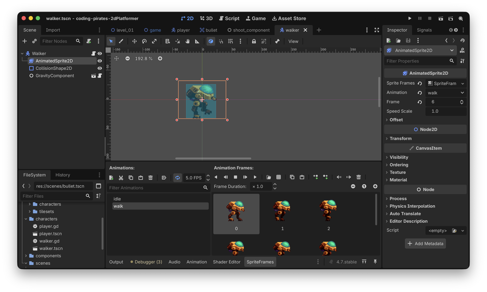
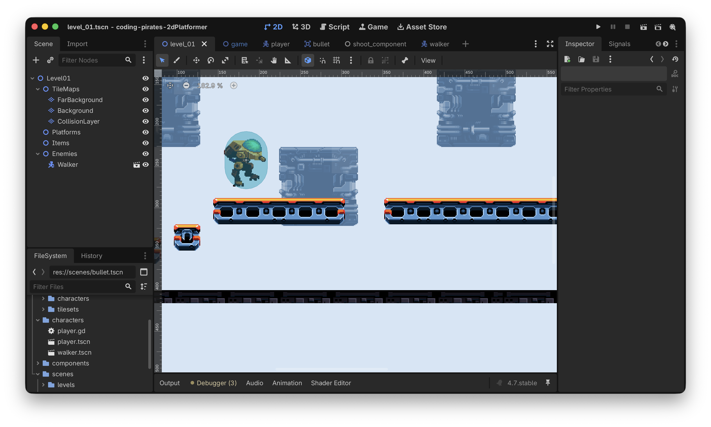
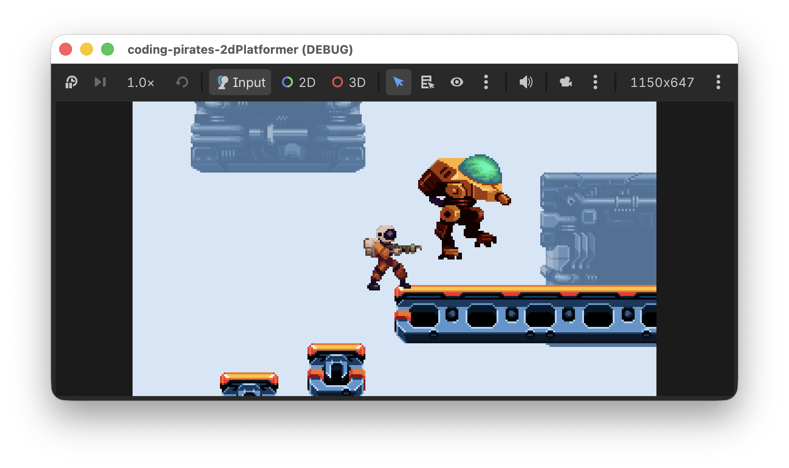
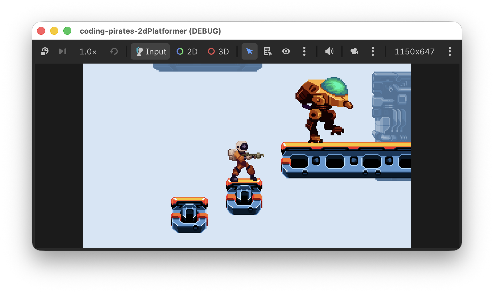

# Godot 2D Platformer - level 10 fjender
Efter [level 9](../lesson09/) kan vi nu skyde, så kunne det jo være sjovt hvis der var noget at skyde _på_ også!

Lad os lave det!

## Enemy
Vores fjender er i første omgang nogle store onde 2 benede robotter, tænk ED-209 fra Robocop eller AT-STs fra Star Wars f.eks. (og hvis du ikke ved hvem de er, så har du nogle film du skal have set!)

I første omgang skal vi igennem en masse rutinearbejde som vi har gjort mange gange før, så lad os lave en liste og arbejde os igennem det.

- [ ] Lav en ny 2D scene af typen `CharacterBody2D`, gem den i "characters" mappen som "walker"
- [ ] Tilføj `AnimatedSprite2D` og `CollisionShape2D` noder, begge som children direkte under `CharacterBody2D`
- [ ] Tilføj 2 animationer til `AnimatedSprite2D` og husk at følg den navnestandard vi aftalte i [level 7](../lesson07/) omkring navnene på vores animationer. I begge tilfælde kan du bruge spritesheetet kaldet "bipedal-unit.png" som du finder i assets mappen.
  - [ ] Vi skal bruge en "idle" animation, du kan bruge den første frame fra "bipedal-unit.png" til den
  - [ ] Og så skal vi bruge en "walk" animation der bruger alle frames i "bipedal-unit.png"
- [ ] Sæt `collision_layer` og `collision_mask`
  - [ ] `collision_layer` er "Enemies" laget (lag 3)
  - [ ] `collision_mask` er "Terrain" (lag 1)

Du kan godt selv nu, så vi ses på den anden side :)

Her er et enkelt screenshot af vores setup, **bemærk** at vi har brugt et `Rectangle` til vores `CollisionShape2D`



Og så det bedste, strege ud fra listen

- [X] Lav en ny 2D scene af typen `CharacterBody2D`, gem den i "characters" mappen som "walker"
- [X] Tilføj `AnimatedSprite2D` og `CollisionShape2D` noder, begge som children direkte under `CharacterBody2D`
- [X] Tilføj 2 animationer til `AnimatedSprite2D` og husk at følg den navnestandard vi aftalte i [level 7](../lesson07/) omkring navnene på vores animationer. I begge tilfælde kan du bruge spritesheetet kaldet "bipedal-unit.png" som du finder i assets mappen.
  - [X] Vi skal bruge en "idle" animation, du kan bruge den første frame fra "bipedal-unit.png" til den
  - [X] Og så skal vi bruge en "walk" animation der bruger alle frames i "bipedal-unit.png"
- [X] Sæt `collision_layer` og `collision_mask`
  - [X] `collision_layer` er "Enemies" laget (lag 3)
  - [X] `collision_mask` er "Terrain" (lag 1)


## Tilføj vores Walker til Level01
I [level 2](../lesson02/) var vi super organiserede og lavede en masse "kasser" vi kunne putte ting i i vores `Level01` scene, tak til os!

Nu kan vi så i `Level01` 

- Klikke på "Enemies" "kassen"
- "Instantiate Child Scene"
- Vælge vores `walker.tscn`
- Flytte den hen på en platform

Det ser sådan her ud ved os nu:



Prøv at kør dit spil og se om du kan finde vores walker. 



Højst undervældende! Den svæver bare frit i luften og gør ingenting.

Nej...for det har vi jo ikke fortalt den, men nu kommer vores komponenter i spil og gør det nemt!

## Script og components
Start med at lav et nyt script til vores Walker, gem det sammen med `walker.tscn` som `walker.gd`

### GravityComponent
Nu kan vi tilføje vores `GravityComponent` til `Walker`en præcis på samme måde som vi gjorde til vores `Player`.

1. Tilføj en `@export var gravity_component: GravityComponent` til vores `Walker` script
2. "Instantiate Child scene" og tilføje `gravity_component.tscn` på vores `Walker`
3. Assigne `GravityComponent` til "Gravity Component" i "Inspectoren" for vores "Walker"

Og så kan vi rette vores `walker.gd` script til så vi bruger vores fine `GravityComponent` i `_physics_process`. 

**Husk** at tilføj `move_and_slide()` sidst i `_physics_process`, ellers sker der ikke meget.

Her er hele scriptet:

```gdscript
extends CharacterBody2D

@export_subgroup("Nodes")
@export var gravity_component: GravityComponent

func _physics_process(delta: float) -> void:
	gravity_component.handle_gravity(self, delta)
	
	# Husk den her!
	move_and_slide()
```

Kør dit spil igen.

Bedre, nu står vores Walker da i det mindste på jorden.



Lad os få den til at gå også.

### HorizontalMovementComponent
Tilføj vores `HorizontalMovementComponent` på samme måde som du lige har gjort med `GravityComponent`.

Som default har vi sat speed i vores `HorizontalMovementComponent` til 150. Det er måske lidt for hurtigt til sådan en Walker som vi gerne vi have skal gå mere tungt og langsomt.

Så vi skruer lige ned for tempoet i `HorizontalMovementComponent` bare for vores Walker. Hvordan kan vi gøre det?

Jo vi har jo den her i `HorizontalMovementComponent`

`@export var speed: float = 150`

Den kan vi jo få fat i, i vores `@export var horizontal_movement_component: HorizontalMovementComponent` variabel i `walker.gd` scriptet.

Hvis vi nu implementerer `_ready` funktionen som bruges til netop sådan nogle ting, så kan vi sætte hastigheden der til f.eks. 50:

```gdscript
func _ready() -> void:
	horizontal_movement_component.speed = 50
```

Og så skal vi bare kalde funktionen `handle_horizontal_movement` som vi lavede på `HorizontalMovementComponent`.

#### Men hov!
Hvad var det nu den funktion tog af parametre?

`func handle_horizontal_movement(body: CharacterBody2D, direction: float) -> void`

direction? 

Det var jo super nemt med vores Player, der fik vi jo at vide om man havde trykket til venstre eller til højre, men det kan vi jo ikke her hvor vores Walker bare skal gå frem og tilbage på en platform.

Hvordan løser vi det?

Det løser vi på en pæn måde i [næste level](../lesson11/) så i første omgang kan vi bare altid gå i en retning, lad os sige højre, altså 1.

#### Så er vi klar til at kalde `handle_horizontal_movement``

Hvis vi bare altid går mod højre ser det sådan her ud:

```gdscript
extends CharacterBody2D

@export_subgroup("Nodes")
@export var gravity_component: GravityComponent
@export var horizontal_movement_component: HorizontalMovementComponent

func _ready() -> void:
	horizontal_movement_component.speed = 50

func _physics_process(delta: float) -> void:
	gravity_component.handle_gravity(self, delta)
	horizontal_movement_component.handle_horizontal_movement(self, 1)
	# Husk den her!
	move_and_slide()
```

Kør dit spil igen...jaeh, joeh, vi har en Walker der bevæger sig mod højre, men ingen animationer og når den når kanten af en platform falder den ned og fortsætter mod højre, det vidste vi jo sådan set godt.

- Animationerne kan vi løse her
- Det der med at den falder ned fixer vi elegant i [næste level](../lesson11/) med en `RayCast2D` node fra Godot...de har tænkt på alt for os :)

### AnimationComponent
Vi kan genbruge den samme `AnimationComponent` så tilføj den, præcis som du tilføjede `GravityComponent` og `HorizontalMovementComponent` ovenfor.

Husk lige at du skal tilføje "Sprite" til din `AnimationComponent` under din Walker præcis som du gjorde da du tilføjede den til din Player i [level 7](../lesson07/)

Og så kan vi kalde `animation_component.handle_move_animation` i `_process` præcis som vi gjorde med vores Player tidligere.

Her er vores bud, bemærk at vi lige har lavet en ny lokal variabel:

`var current_movement_direction: float = 1` 

i vores `walker.gd` script fordi vi skal bruge den samme retning til både movement og animations håndtering.

```gdscript
extends CharacterBody2D

@export_subgroup("Nodes")
@export var animation_component: AnimationComponent
@export var gravity_component: GravityComponent
@export var horizontal_movement_component: HorizontalMovementComponent

var current_movement_direction: float = 1

func _ready() -> void:
	horizontal_movement_component.speed = 50

func _physics_process(delta: float) -> void:
	gravity_component.handle_gravity(self, delta)
	horizontal_movement_component.handle_horizontal_movement(self, current_movement_direction)
	# Husk den her!
	move_and_slide()
	
func _process(delta: float) -> void:
	animation_component.handle_move_animation(current_movement_direction)
```

Kør dit spil igen og se nu...vores Walker overholder tyngeloven, bevæger sig og animerer og det har kostet os meget lidt arbejde her anden gang fordi vi allerede havde komponenter til at håndtere arbejdet for os.

## Godt arbejde!
Nu har vi fjender der flytter sig, de falder så ud over kanten men det løser vi elegant i [næste level](../lesson11/), på gensyn!