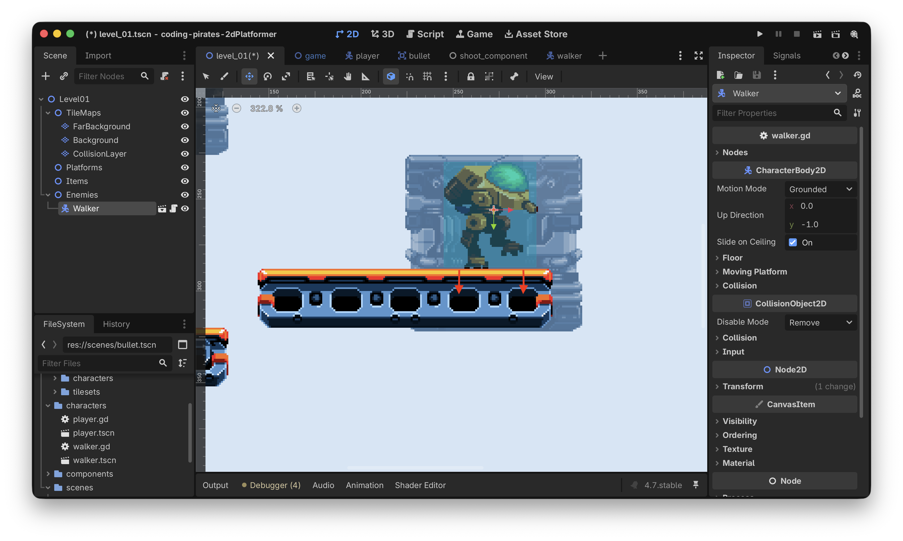
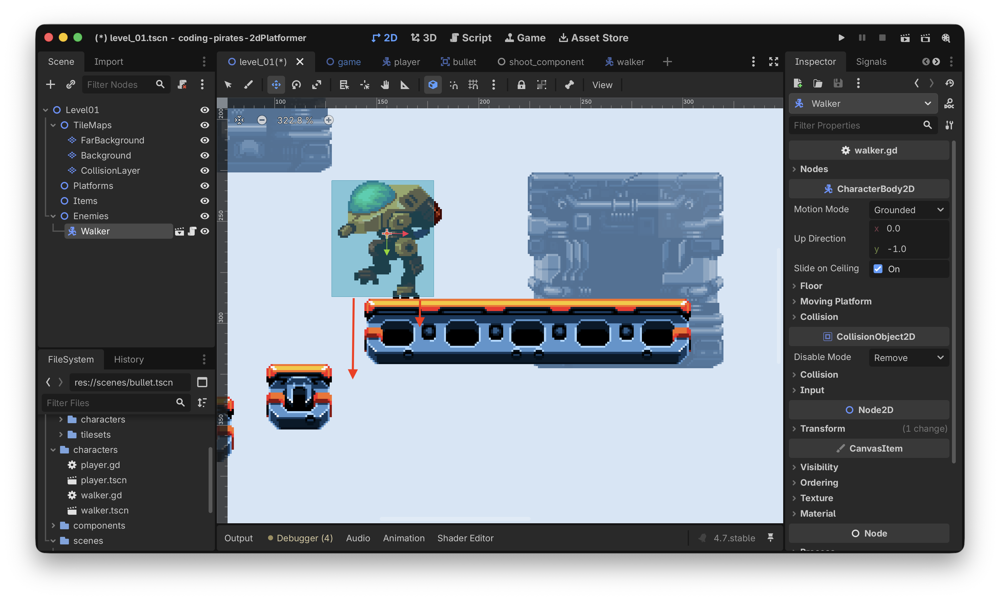
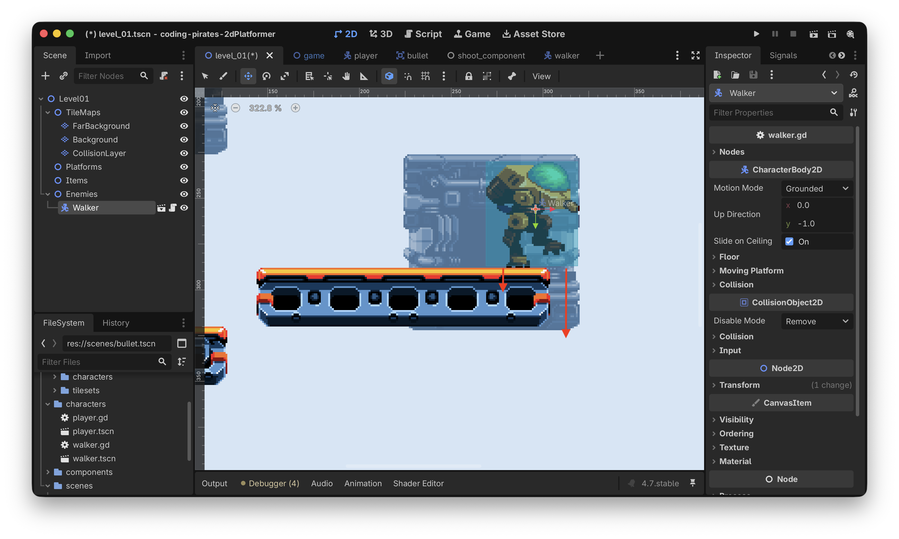
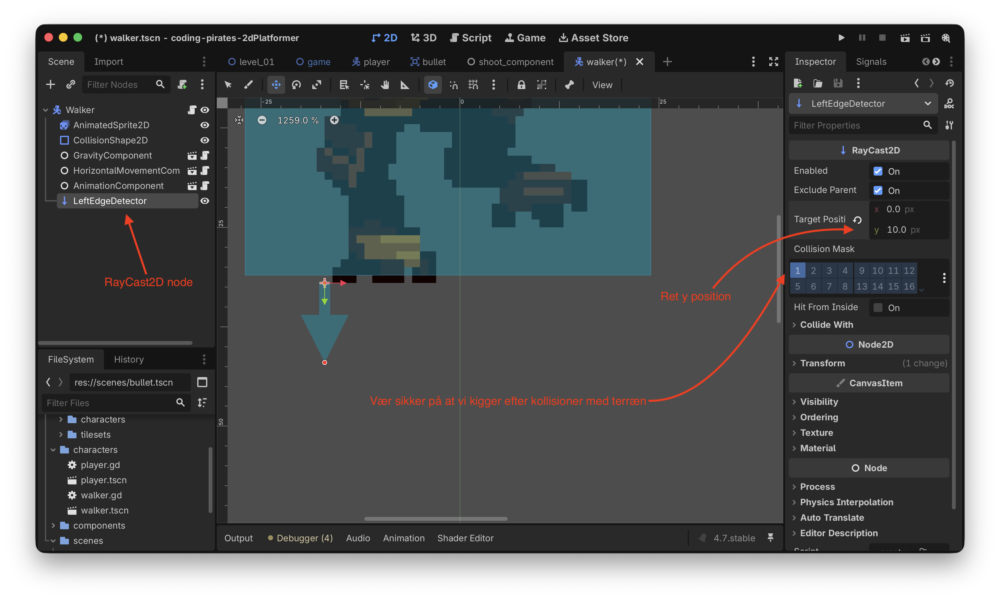
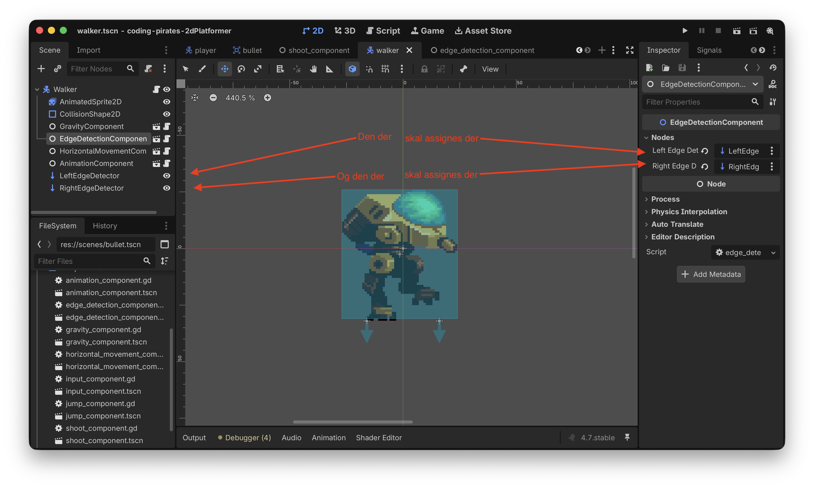
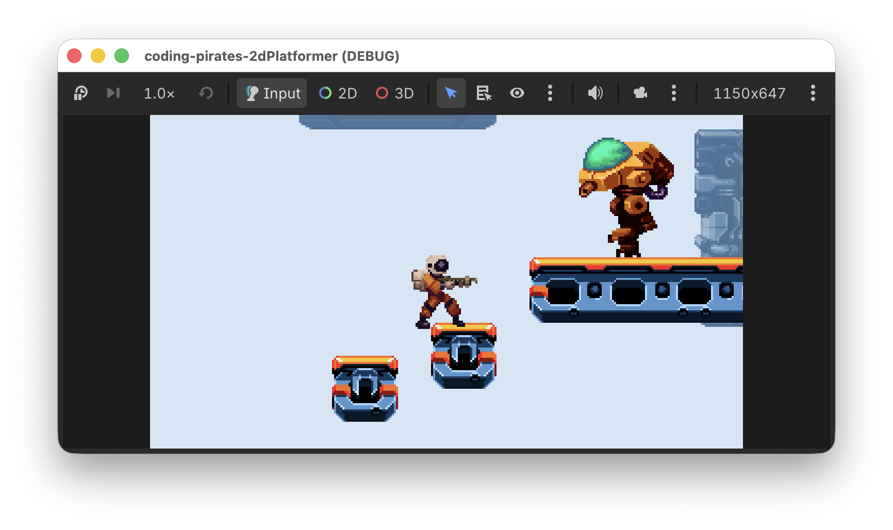
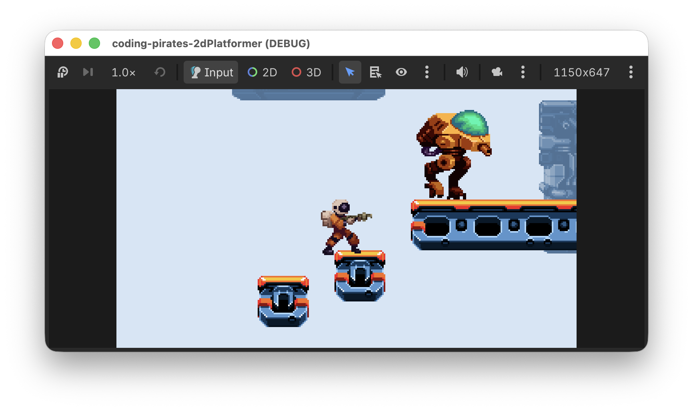

# Godot 2D Platformer - level 11 fjender der vender
I [level 10](../lesson10/) Fik vi lavet en Walker der tramper frem og...nej ikke tilbage...endnu, det jo det vi skal at lave nu.

## Problemet
Lad os lige gentage problemet.

- Vi har en Walker
- Den Walker har en `HorizontalMovementComponent`
- En `HorizontalMovementComponent` kræver en `direction` for at vide hvilken vej vi skal gå
- `direction` skal være enten -1 hvis vi vil gå til venstre eller 1 hvis vi vil gå til højre
- Hvor skal vi få den direction fra?

I [level 10](../lesson10/) løste vi det ved at sætte direction til altid at være 1, hvilket betød at vi altid gik mod højre og på et tidspunkt faldt vi ud over den platform vi gik på.

Så...vi vil gerne lavet "noget" sådan at vores Walker kan

- Gå på en platform, lad os sige at den starter med at gå mod højre så `direction` = 1
- Når den rammer _højre_ kant af platformen vil vi gerne have den til at vende om, altså flippe `direction` til -1
- Og omvendt, når den rammer _venstre_ kant af platformen vil vi gerne have den til at vende om igen, altså flippe `direction` tilbage til 1

Den gode nyhed er at det er nemt i Godot, vi kan bruge det der hedder en `RayCast2D` til at hjælpe os.

## `RayCast2D`
Vi læser i [dokumentationen](https://docs.godotengine.org/en/stable/classes/class_raycast2d.html) hvor der står:

> A raycast represents a ray from its origin to its target_position that finds the closest object along its path, if it intersects any.

Huh?? OK vi læser det lige 4 gange mere og oversætter.

Altså, det er "noget" som kan sende en ray, altså en stråle fra dens origin, altså der hvor den er og hvis den stråle rammer nogle objekter på sin vej, så får vi besked. Forestil dig en lommelygte som du kan lyse med i et mørkt rum og som gør at du kan se ting som lyset rammer.

OK, hvad kan vi bruge det til?

Vi kunne jo sætte en `RayCast2D` node lige til venstre for vores Walker og en anden `RayCast2D` node lige til højre for vores Walker og lade dem begge to pege ned i jorden, og så kunne vi spørge om de to rammer noget.

Hvis de begge to rammer noget ved vi at der er platform under os

 

Hvis den venstre _ikke_ rammer noget ved vi at vi har ramt venstre side af platformen og kan så vende om

 

Og omvendt, hvis den højre _ikke_ rammer noget ved vi at vi har ramt højre side af platformen og kan så vende om



Lad os lave det!

Hvad skal vi lave? Vi skal

- [ ] Have tilføjet to `RayCast2D` noder til vores Walker
- [ ] Have lavet en `EdgeDetectionComponent` som tager to `RayCast2D` noder og en `current_direction` som input og som så kan give os en opdateret `direction` tilbage
- [ ] Bruge vores nye `EdgeDetectionComponent` sammen med vores Walker

Lad os komme i gang

## Tilføj `RayCast2D` noder til vores Walker
- Find `walker.tscn` i 2D mode og vælg/klik på rod "Walker" noden
- Tilføj en `RayCast2D` child node
- Omdøb den til at hedde "LeftEdgeDetector"
- Træk den på plads så den sidder lige ud for venstre fod
- I "Inspectoren" i venstre side skal vi lige rette et par ting
  - Under "RayCast2D" kan du rette y værdien for "Target Position" til at være 10, der er ingen grund til at kigge længere væk end 10 pixels
  - Sæt "Collision Mask" til "Terrain", altså 1 sådan at vi kigger efter om vi rammer platforme

Det skulle gerne se sådan her ud



Nu kan du kopiere din LeftEdgeComponent og rette kopien til at hedde "RightEdgeComponent" og sætte den ud for din Walkers højre fod.

Det var skridt et

- [X] Have tilføjet to `RayCast2D` noder til vores Walker
- [ ] Have lavet en `EdgeDetectionComponent` som tager to `RayCast2D` noder og en `current_direction` som input og som så kan give os en opdateret `direction` tilbage
- [ ] Bruge vores nye `EdgeDetectionComponent` sammen med vores Walker

## Lav ny `EdgeDetectionComponent`
Vi kan starte med skelettet, det har ikke ændret sig.

1. Lav en ny Node
2. Kald den "EdgeDetectionComponent"
3. Gem dem som `edge_detection_component.tscn` under "components"
4. Tilføj et script til "EdgeDetectionComponent"
5. Tilføj `class_name EdgeDetectionComponent` til vores script

```gdscript
class_name EdgeDetectionComponent
extends Node
```

Og så er vi klar til logikken.

### Adgang til left og right `RayCast2D` noder
Ligesom i vores `AnimationComponent` laver vi det sådan at vi, når vi sætter vores `EdgeDetectionComponent` op, skal sætte en `left_edge_detector` og en `right_edge_detector` op fra starten, så skal vi ikke bekymre os om det mere.

Det betyder at vi skal have to `@export` variabler af typen `RayCast2D` og vi er lige gode ved fremtids os selv og putter dem i en fin subgroup så vi kan se dem i "Inspectoren" når vi skal konfigurere.

```gdscript
@export_subgroup("Nodes")
@export var left_edge_detector: RayCast2D
@export var right_edge_detector: RayCast2D
```

### `handle_edge_detection` funktion
Og så er vi klar til selve logikken. Hvad er det nu vi gerne vil?

Vi vil gerne tage den nuværende `direction` som vores Walker går i som en input parameter og så vil vi kigge på om

- Hvis `left_edge_detector` _og_ `right_edge_detector` begge to rammer jorden, så er vi stadig på en platform og så sender vi bare den nuværende `direction` retur
- Hvis `left_edge_detector` _ikke_ rammer jorden er vi på vej ud over venstre kant og skal derfor vende os om og gå mod højre, altså skal `direction` nu være 1
- Omvendt, hvis `right_edge_detector` _ikke_ rammer jorden er vi på vej ud over højre kant og skal derfor vende os om og gå mod venstre, altså skal `direction` nu være -1

Det efterlader så spørgsmålet...hvordan kan vi spørge en `RayCast2D` node om den rammer jorden? Vi må tilbage i dokumentationen og grave og vi finder funktionen [is_colliding](https://docs.godotengine.org/en/stable/classes/class_raycast2d.html#class-raycast2d-method-is-colliding), det er jo præcis den vi skal bruge.

Så har vi alle brikker til puslespillet og kan gå i gang, prøv selv!

- Funktionen skal hedde `handle_edge_detection`
- Den skal tage en parameter af typen `float` som vi kalder `current_direction`
- Den skal returnere en værdi af typen `float`
- Og så skal den indeholde logikken ovenfor

Her er hele vores forsøg

```gdscript
class_name EdgeDetectionComponent
extends Node

@export_subgroup("Nodes")
@export var left_edge_detector: RayCast2D
@export var right_edge_detector: RayCast2D

func handle_edge_detection(current_direction: float) -> float:
	# rammer både venstre og højre edge detector jorden?
	if left_edge_detector.is_colliding() and right_edge_detector.is_colliding():
		# ja det gjorde de, så bare gå videre i samme retning
		return current_direction
	
	# nå, vi er ved at ramme en kant
	# er det venstre kant?
	if not left_edge_detector.is_colliding():
		# ja det er det, vend om og gå mod højre
		return 1.0
	
	# det var ikke venstre kant, er det højre så?
	if not right_edge_detector.is_colliding():
		# ja det er det, vend om og gå mod venstre
		return -1.0
		
	# logisk skulle vi ikke kunne ende her så vi returnerer 
	# current_direction
	return current_direction
```

Det var skridt to

- [X] Have tilføjet to `RayCast2D` noder til vores Walker
- [X] Have lavet en `EdgeDetectionComponent` som tager to `RayCast2D` noder og en `current_direction` som input og som så kan give os en opdateret `direction` tilbage
- [ ] Bruge vores nye `EdgeDetectionComponent` sammen med vores Walker

## Brug vores nye `EdgeDetectionComponent` med vores Walker
Det er den nemme del!

- Du skal have tilføjet `EdgeDetectionComponent` som en en Child Scene på din `walker.tsch`
- Og som en `@export var edge_detection_component: EdgeDetectionComponent` i dit `walker.gd` script
- Og så skal du have bundet tingene sammen, husk at sætte `LeftEdgeDetector` og `RightEdgeDetector` op i de to variabler du lavede i dit `edge_detector_component.gd` script

Det ser sådan her ud:



Og så kan vi opdatere vores `walker.gd` script til at opdatere `current_movement_direction` ved hjælp af `edge_detection_component.handle_edge_detection` i `_physics_process`

Her er hele `walker.gd` scriptet:

```gdscript
extends CharacterBody2D

@export_subgroup("Nodes")
@export var animation_component: AnimationComponent
@export var edge_detection_component: EdgeDetectionComponent
@export var gravity_component: GravityComponent
@export var horizontal_movement_component: HorizontalMovementComponent

var current_movement_direction: float = -1

func _ready() -> void:
	horizontal_movement_component.speed = 50

func _physics_process(delta: float) -> void:
	gravity_component.handle_gravity(self, delta)
    current_movement_direction = edge_detection_component.handle_edge_detection(current_movement_direction)
	horizontal_movement_component.handle_horizontal_movement(self, current_movement_direction)

	# Husk den her!
	move_and_slide()
	
func _process(delta: float) -> void:
	animation_component.handle_move_animation(current_movement_direction)
```

Kør dit spil og hold øje med Walkeren der nu forhåbenlig går frem og tilbage på platformen.




## Godt arbejde!
Vi har nu nogle fjender der bevæger sig _nogenlunde_ intelligent. Hvis du vil kan du jo også bruge `EdgeDetectionComponent` til at få fjender til at gå mellem to vægge, det kræver bare at dine `RayCast2D` noder peger til siderne i stedet for at pege nedad.

I [næste lektion](../lesson12/) skal vi til at skyde på vores fjender, vi ses!
