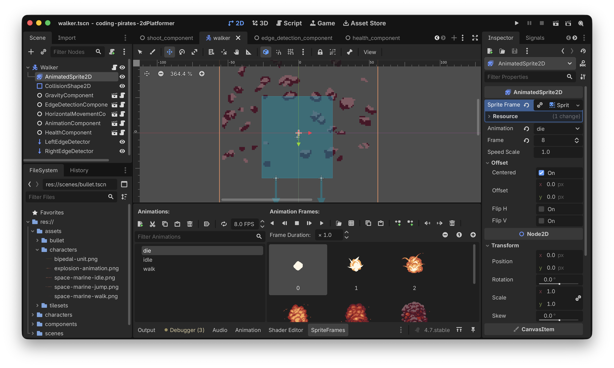
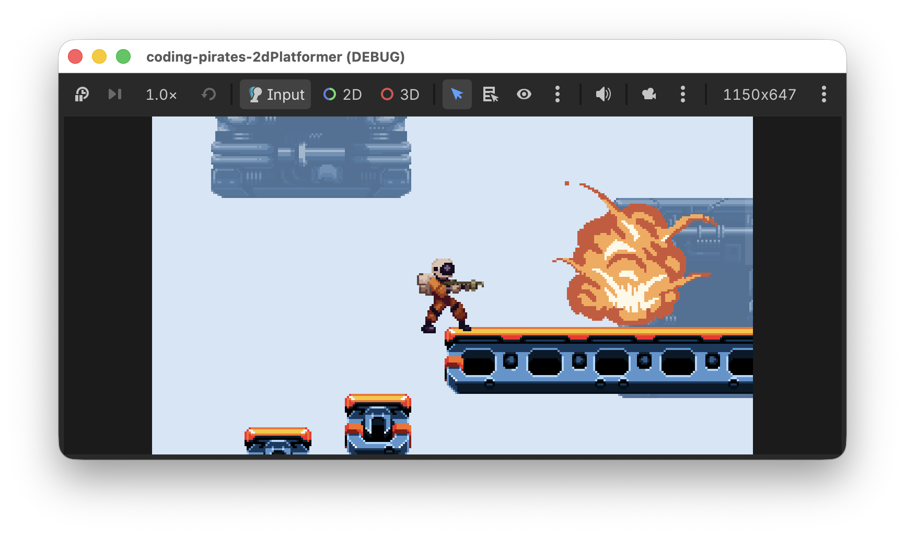

# Godot 2D Platformer - level 12 fjender der dør
I [level 11](../lesson11/) fik vi vores Walker til at gå frem og tilbage på en platform.

Lad os fejre det, ved at kunne skyde dem!

## Hvad skal vi lave
Lad os tænke os om. Hvilke dele er involveret når vi skal have fjenderne til at blive ramt af skud?

- Vores `Bullet` kan sige at den har ramt "noget" i dens `_on_body_entered` som vi skrev i [level 9](../lesson09/). Det skal vi vel have udvidet så vi kan spørge om det den har ramt er en fjende
- Så skal vi have udvidet vores `Walker` med en `hit` funktion som vi kan kalde fra vores `Bullet`
- Den `hit` funktion skal tælle `Walker`ens helbred ned, 
- Derfor kunne det være smart hvis vi har en `HealthComponent` som kunne holde styr på helbred og som vi kunne bruge både til `Walker` og `Player`. `HealthComponent` bliver oprettet med en `health` værdi (et tal, f.eks 3 for vores `Walker`) og skal så - i første omgang - kunne to ting:
    - tælle `health` ned hvis man er ramt
    - kunne svare på om man `is_dead` (altså hvis `health` = 0)
- Hvis vores `Walker`s `HealthComponent` melder `is_dead` skal vi have vores `AnimationComponent` til at afspille en "die" animation
- Og så skal vi fjerne vores `Walker` fra vores `Level01`

OK, det kan vi jo bryde ned og lave det om til en liste som vi kan arbejde os frem efter, altså:

- [ ] Udvid `Bullet` til at kunne se _hvad_ den har ramt
- [ ] Tilføj `hit` funktion på `Walker`
- [ ] Opret ny `HealthComponent` 
- [ ] Tilføj `HealthComponent` til `Walker`
- [ ] Opret ny "die" animation
- [ ] Udvid `AnimationComponent` til at håndtere at en karakter dør
- [ ] Håndter at vores Walker er død

Puha, mange punkter! Lad os komme i gang.

## Udvid `Bullet` til at kunne se _hvad_ den har ramt
I vores `bullet.gd` har vi:

```gdscript
func _on_body_entered(body: Node2D) -> void:
	queue_free()
```

Som lige nu bare fjerner vores `Bullet` fra skærmen når den har ramt noget.

Hvis nu vi udvider den til at kigge på den `body` parameter den får med ind, og som fortæller os _hvad_ det er vi har ramt, så kan vi styre hvad der skal ske.

Der er to ting vi kan ramme.

- Væg/gulv, altså noget af typen `TileMapLayer`
- `CharacterBody2D` som kan være enten `Walker` eller senere `Player` når vores `Walker` skal kunne skyde igen (og det skal den!)

Lad os tage dem en af gangen.

### Har vi ramt noget af typen `TileMapLayer`?
I Godot kan vi spørge om noget `is` af en type, så vi kan sige:

`if body is enellerandentype`

Altså...det vi har ramt, er det af en bestemt type?

Det kan vi bruge sådan her:

```gdscript
func _on_body_entered(body: Node2D) -> void:
	if body is TileMapLayer:
		queue_free()
```

Kør dit spil nu og prøv at skyd ind i muren. Vores kugler forsvinder stadig, perfekt, hak ved den.

### Har vi ramt noget af typen `CharacterBody2D`?
Nu har vi lært om `is` så vi burde vel kunne udvide vores `on_body_entered` med et check mere:

```gdscript
func _on_body_entered(body: Node2D) -> void:
	if body is TileMapLayer:
		queue_free()
	if body is CharacterBody2D:
		## hvad skal vi gøre her??
```

Og ja...hvad skal vi så gøre? Ja vi ved jo at vi har ramt en `CharacterBody2D` og det betyder at det er enten en `Walker` eller senere - når vores `Walker` kan skyde - en `Player` vi har ramt.

Lige som vi gjorde i vores 2D space shooter kan vi lave en funktion på `Walker`/`Player` som vi kalder.

Så, til at starte med "leger vi" at der findes en funktion kaldet `hit` på alle `CharacterBody2D`s som vores `Bullet` rammer. Så kan vi skrive:

```gdscript
func _on_body_entered(body: Node2D) -> void:
	if body is TileMapLayer:
		queue_free()
	if body is CharacterBody2D:
		body.hit()
		queue_free()
```

Og det kan vi optimere lidt. Vi kalder i begge tilfælde `queue_free` for at fjerne vores `Bullet` når den har ramt noget. Vi kan lave det om så vi _altid_ kalder `queue_free` og så kan vi helt fjerne checket på om det er en `TileMapLayer` vi ramt.

Sådan her:

```gdscript
func _on_body_entered(body: Node2D) -> void:
	if body is CharacterBody2D:
		body.hit()
		
	queue_free()
```

Kør dit spil igen og skyd ind i muren, kuglerne forsvinder stadig, perfekt!

Skyd så på din `Walker`...ups, vi får en fejl:

> Invalid call. Nonexistent function 'hit' in base 'CharacterBody2D (walker.gd)'.

Nonexistent function 'hit'. Vi forsøger at kalde en funktion som ikke eksisterer. Nej det har Godot jo ret i, vi har ikke lavet funktionen endnu.

Den laver vi lige om lidt, men først, lad os lige tænke lidt mere.

Vi vil gerne vide _hvor_ meget skade vores `Bullet` har gjort da den ramte, og nu vi er i gang med at drømme kunne det være fedt hvis man selv kunne styre hvor meget skade hver enkelt `Bullet` skulle gøre, det kunne jo være vi ville lave nogle super kraftige laser skud eller sådan noget senere.

Så, to ting:

1. Lad os lave en `@export var damage: int = 1` i `bullet.gd` så vi har mulighed for at overskrive den værdi senere hvis vi vil lave kraftigere kugler
2. Vi sender `damage` med i `hit` som parameter så vores `Walker` ved hvad der har ramt den.

Prøv selv, du kan godt :)

Vores færdige `bullet.gd` script ser sådan her ud:

```gdscript
extends Area2D

@export_subgroup("Properties")
@export var speed: float = 400.0
@export var damage: int = 1

# Skal vi skyde mod venstre eller højre
var direction: Vector2 = Vector2.RIGHT

func _ready() -> void:
	$VisibleOnScreenNotifier2D.connect("screen_exited", _on_screen_exited)
	connect("body_entered", _on_body_entered)

func add(pos: Vector2, dir: Vector2, offset: Vector2) -> void:
	# regn x og y ud for vores bullet
	var x_pos = pos.x + (dir.x * offset.x)
	var y_pos = pos.y + (dir.y * offset.y)
	
	# og sæt vores Bullets position ud fra de 
	# udregnede værdier
	position = Vector2(x_pos, y_pos)
	
	# gem direction
	direction = dir
	
	# hvordan skal vores animation vende?
	$AnimatedSprite2D.flip_h = dir.x < 0
	$AnimatedSprite2D.play("shoot")
	
func _physics_process(delta: float) -> void:
	position += speed * delta * direction
	
func _on_body_entered(body: Node2D) -> void:
	if body is CharacterBody2D:
		body.hit(damage)
		
	queue_free()
	
func _on_screen_exited() -> void:
	queue_free()
```

Perfekt, det var step et:

- [X] Udvid `Bullet` til at kunne se _hvad_ den har ramt
- [ ] Tilføj `hit` funktion på `Walker`
- [ ] Opret ny `HealthComponent` 
- [ ] Tilføj `HealthComponent` til `Walker`
- [ ] Opret ny "die" animation
- [ ] Udvid `AnimationComponent` til at håndtere at en karakter dør
- [ ] Håndter at vores Walker er død

Videre!

## Tilføj `hit` funktion på `Walker`
Da vi kørte vores spil lige før fik vi en fejl fordi vi ikke _har_ en `hit` funktion på vores `Walker`, lad os rette op på det.

Tilføj en `hit` funktion på `walker.gd` der tager en `int` parameter som vi kalder `damage`. I første omgang kan den bare printe ud at vi er ramt.

```gdscript
func hit(damage: int) -> void:
	print("av! ", damage)
```

Kør dit spil igen og prøv at skyd på din `Walker`, nu skulle den gerne printe i "Output" hver gang den bliver ramt

> av! 1

Super, det var step to

- [X] Udvid `Bullet` til at kunne se _hvad_ den har ramt
- [X] Tilføj `hit` funktion på `Walker`
- [ ] Opret ny `HealthComponent` 
- [ ] Tilføj `HealthComponent` til `Walker`
- [ ] Opret ny "die" animation
- [ ] Udvid `AnimationComponent` til at håndtere at en karakter dør
- [ ] Håndter at vores Walker er død

## Opret ny `HealthComponent` 
Så skal vi have lavet en ny `HealtComponent` som kan holde styr på hvor meget health den `CharacterBody2D` den er tilknyttet har. Og det vil så sige at `Walker` får en `HealthComponent` og senere får vores `Player` også en `HealthComponent`.

Lad os lige gentage hvad det var vi skrev ovenfor at vores `HealtComponent` skal

> - Derfor kunne det være smart hvis vi har en `HealthComponent` som kunne holde styr på helbred og som vi kunne bruge både til `Walker` og `Player`. `HealthComponent` bliver oprettet med en `health` værdi (et tal, f.eks 3 for vores `Walker`) og skal så - i første omgang - kunne to ting:
>    - tælle `health` ned hvis man er ramt
>    - kunne svare på om man `is_dead` (altså hvis `health` = 0)

Så det vil sige vi skal have:

1. en `health` variabel af typen `int`
2. en funktion kaldet `hit` som tager en parameter af typen `int` kaldet `damage` med ind, ikke har nogen returværdi, og som så tæller `health` ned
3. en funktion kaldet `is_dead` som ikke tager nogle parametre med ind og som returnerer en `bool` (altså enten `true` eller `false`) alt efter om `health` er < 0 eller ej
4. Lad os lige tænke lidt fremad og tilføje en `max_health` også, som er en setting vi kan styre udefra og som angiver hvor meget `health` man _max_ kan have. Til at starte med sætter vi så `health` = `max_health`

Vi har skrevet det så mange gange så nu burde du kunne huske hvordan man laver en ny `HealthComponent`, så prøv dig frem og sig til hvis du sidder fast.

Her er vores `health_component.gd` script som dækker de 4 punkter ovenfor:

```gdscript
class_name HealthComponent
extends Node

@export_category("Settings")
@export var max_health: int = 3

var health: int = max_health

func hit(damage: int) -> void:
	health -= damage
	
func is_dead() -> bool:
	return health <= 0
```

Og så kan vi strege step tre

- [X] Udvid `Bullet` til at kunne se _hvad_ den har ramt
- [X] Tilføj `hit` funktion på `Walker`
- [X] Opret ny `HealthComponent` 
- [ ] Tilføj `HealthComponent` til `Walker`
- [ ] Opret ny "die" animation
- [ ] Udvid `AnimationComponent` til at håndtere at en karakter dør
- [ ] Håndter at vores Walker er død

## Tilføj `HealthComponent` til `Walker`
Så skal vi have tilføjet vores nye `HealthComponent` til vores `Walker`. Igen har du efterhånden gjort det nogle gange så prøv og se om du ikke kan selv.

Nu kan vi så bruge vores nye `HealthComponent` i vores `walker.gd` script. 

Erstat 

```gdscript
func hit(damage: int) -> void:
	print("av! ", damage)
```

med et kald til `hit` funktionen som vi lige har lavet i vores `HealthComponent`

```gdscript
func hit(damage: int) -> void:
	health_component.hit(damage)
```

Og så skal vi vel også lige checke om vi er døde eller ej, det kan vi gøre som det første i `_process`

```gdscript
extends CharacterBody2D

@export_subgroup("Nodes")
@export var animation_component: AnimationComponent
@export var edge_detection_component: EdgeDetectionComponent
@export var gravity_component: GravityComponent
@export var health_component: GravityComponent
@export var horizontal_movement_component: HorizontalMovementComponent

var current_movement_direction: float = -1

func _ready() -> void:
	horizontal_movement_component.speed = 50

func _physics_process(delta: float) -> void:
	gravity_component.handle_gravity(self, delta)
	current_movement_direction = edge_detection_component.handle_edge_detection(current_movement_direction)
	horizontal_movement_component.handle_horizontal_movement(self, current_movement_direction)
	
	# Husk den her!
	move_and_slide()
	
func _process(delta: float) -> void:
	if health_component.is_dead():
		print("goodbye cruel world")
		
	animation_component.handle_move_animation(current_movement_direction)
	
func hit(damage: int) -> void:
	health_component.hit(damage)
```

Kør dit spil igen og skyd din `Walker` 3 gange. Nu skulle det gerne vælte ud i "Output" med:

> goodbye cruel world
> goodbye cruel world
> goodbye cruel world
> goodbye cruel world
> ...

Perfekt, det var step fire.

- [X] Udvid `Bullet` til at kunne se _hvad_ den har ramt
- [X] Tilføj `hit` funktion på `Walker`
- [X] Opret ny `HealthComponent` 
- [X] Tilføj `HealthComponent` til `Walker`
- [ ] Opret ny "die" animation
- [ ] Udvid `AnimationComponent` til at håndtere at en karakter dør
- [ ] Håndter at vores Walker er død

Vi skal nok komme tilbage og lave det pænt i step syv, lad os komme videre til at lave en ny "die" animation.

## Opret ny "die" animation
I vores `Walker`s `AnimatedSprite2D` skal du tilføje en ny animation.

- Kald animationen "die"
- Du kan bruge sprite sheetet "explosion-animation.png" som du finder i "Explosions" mappen i assets

Det ser sådan her ud ved os hvis du skal have noget at kigge efter



Hak ved step fem

- [X] Udvid `Bullet` til at kunne se _hvad_ den har ramt
- [X] Tilføj `hit` funktion på `Walker`
- [X] Opret ny `HealthComponent` 
- [X] Tilføj `HealthComponent` til `Walker`
- [X] Opret ny "die" animation
- [ ] Udvid `AnimationComponent` til at håndtere at en karakter dør
- [ ] Håndter at vores Walker er død

Tjuhej hvor det går, videre til step 6

## Udvid `AnimationComponent` til at håndtere at en karakter dør
Så skal vi have lavet en funktion så vores `AnimationComponent` kan afspille vores nye "die" animation.

Det ser sådan her ud:

```gdscript
func handle_die_animation() -> void:
	sprite.play("die")
	await sprite.animation_finished
```

Læg mærke til line to:

`await sprite.animation_finished`

Den gør at vores funktion først siger til hvem end der kalder den at "nu er jeg færdig", når animationen er spillet færdig. Det bliver nyttigt for os lige om lidt.

I første omgang kan vi hakke step seks af på listen:

- [X] Udvid `Bullet` til at kunne se _hvad_ den har ramt
- [X] Tilføj `hit` funktion på `Walker`
- [X] Opret ny `HealthComponent` 
- [X] Tilføj `HealthComponent` til `Walker`
- [X] Opret ny "die" animation
- [X] Udvid `AnimationComponent` til at håndtere at en karakter dør
- [ ] Håndter at vores Walker er død

Og så skal vi have bundet det hele sammen i en smuk sløjfe i `walker.gd` scriptet

## Håndter at vores Walker er død
Nu har vi alle byggeklodserne klar.

I `_process` ved vi allerede om vi `is_dead` eller ej, det kan vi spørge vores `HealtComponent` om.

Du så tidligere at vi printede "goodbye cruel world" ud en masse gange. Det er jo fordi `_process` kører 60 gange i sekundet, så vi er nødt til lige at have en lokal variabel der holder styr på om vi er igang med at dø og kun kalder vores "håndter at `Walker`en er død" første gang vi rammer `is_dead`.

Lad os lave en lokal variable i scriptet:

`var is_dying: bool = false`

Så har vi den som flag til at holde styr på om vi er ved at dø eller ej.

Og så kan vi lave et check i `_process` på om vi er ved at dø eller ej.

Hvis vi er ved at dø skal vi ikke gøre mere i `_process`, det ser sådan her ud:

```gdscript
func _process(delta: float) -> void:
	if is_dying:
		return

    ... mere kode her under
```

Så nu siger vi hver gang process kører: Er du ved at dø? Så skal du ikke gøre mere!

Ellers kan vi jo checke om man `is_dead` og hvis man er, så kalder vi en funktion kaldet `die()` som vi skriver lige om lidt. Vores `_process` ser nu sådan her ud:

```gdscript
func _process(delta: float) -> void:
	# er vi ved at dø, så bare stop her
	if is_dying:
		return
		
	# Kun hvis vi er døde kommer vi videre her til
	# Er vi så døde i mellemtiden?
	if health_component.is_dead():
		# Ja det var vi, så kald die funktionen der
		# sørger for at vi dør pænt :)
		await die()
		
	# Vi var ikke døde så vi kører bare videre
	animation_component.handle_move_animation(current_movement_direction)
```

Bemærk at vi `await`er `die` funktionen for at vente på at den kører færdig inden vi gør mere.

### `die` funktionen
Nå, vi har sparket problemet foran os, men nu kan vi ikke undgå det mere. Lige nu er vi der hvor vi er ramt så mange gange at vi skal dø.

Hvad skal der ske når vi dør?

1. Vi skal sætte `is_dying` til `true` så vi ikke ryger videre i `_process` mens vi er i gang med at dø
2. Vi skal sætte `current_movement_direction` til 0 så vi stopper med at gå mens vi dør
3. Vi skal sætte `physics_process` til `false`, hvilket gør at vi ikke kalder `_physics_process` mere, det er der ingen grund til mens vi dør
4. Vi skal `await`e at vores `animation_component` afspiller "die" animationen
5. Når alt det er færdigt kan vi rydde op efter os selv med `queue_free`

Prøv at skriv funktionen selv inden du kigger på vores forsøg:

```gdscript
func die() -> void:
	# flip is_dying så vi ikke ryger i _process igen
	is_dying = true
	
	# stop så vi ikke går videre
	current_movement_direction = 0
	
	# gør så player kan løbe igennem animationen
	set_physics_process(false)
	
	# vent på at die animationen spiller færdig
	await animation_component.handle_die_animation()
	
	# og ryd pænt op
	queue_free()
```

Her er hele `walker.gd` scriptet:

```gdscript
extends CharacterBody2D

@export_subgroup("Nodes")
@export var animation_component: AnimationComponent
@export var edge_detection_component: EdgeDetectionComponent
@export var gravity_component: GravityComponent
@export var health_component: HealthComponent
@export var horizontal_movement_component: HorizontalMovementComponent

var current_movement_direction: float = -1
var is_dying: bool = false

func _ready() -> void:
	horizontal_movement_component.speed = 50
	is_dying = false
	

func _physics_process(delta: float) -> void:
	print("physics_process")
	gravity_component.handle_gravity(self, delta)
	current_movement_direction = edge_detection_component.handle_edge_detection(current_movement_direction)
	horizontal_movement_component.handle_horizontal_movement(self, current_movement_direction)
	
	# Husk den her!
	move_and_slide()
	
func _process(delta: float) -> void:
	print("_process is_dying: ", is_dying)
	# er vi ved at dø, så bare stop her
	if is_dying:
		return
		
	print("not dying")
		
	# Kun hvis vi er døde kommer vi videre her til
	# Er vi så døde i mellemtiden?
	if health_component.is_dead():
		# Ja det var vi, så kald die funktionen der
		# sørger for at vi dør pænt :)
		print("dying")
		await die()
		
	# Vi var ikke døde så vi kører bare videre
	animation_component.handle_move_animation(current_movement_direction)
	
func hit(damage: int) -> void:
	health_component.hit(damage)
	
func die() -> void:
	# flip is_dying så vi ikke ryger i _process igen
	is_dying = true
	
	# stop så vi ikke går videre
	current_movement_direction = 0
	
	# gør så player kan løbe igennem animationen
	set_physics_process(false)
	
	# vent på at die animationen spiller færdig
	await animation_component.handle_die_animation()
	
	# og ryd pænt op
	queue_free()
```

Kør dit spil igen og prøv at skyd din `Walker`...die scum!



Og med det kan vi strege sidste punkt på vores lange liste

- [X] Udvid `Bullet` til at kunne se _hvad_ den har ramt
- [X] Tilføj `hit` funktion på `Walker`
- [X] Opret ny `HealthComponent` 
- [X] Tilføj `HealthComponent` til `Walker`
- [X] Opret ny "die" animation
- [X] Udvid `AnimationComponent` til at håndtere at en karakter dør
- [X] Håndter at vores Walker er død

## Phew!
Det var en lang omgang men nu har vi flere af byggeklodserne til når vi skal håndtere at vores `Player` er ramt.

Og helt ærlig, det er da ikke fair at vi kan skyde på de der Walkers men at de ikke kan skyde på os, er det? Nej vel er det ej! Så i [næste level](../lesson13/) begynder vi at få vores fjender til at skyde tilbage. 

I første omgang vil vi gøre sådan at fjenderne kan se os når vi kommer tæt på dem og så de vender sig om efter os, det bliver godt så skynd dig videre til næste level, vi ses.