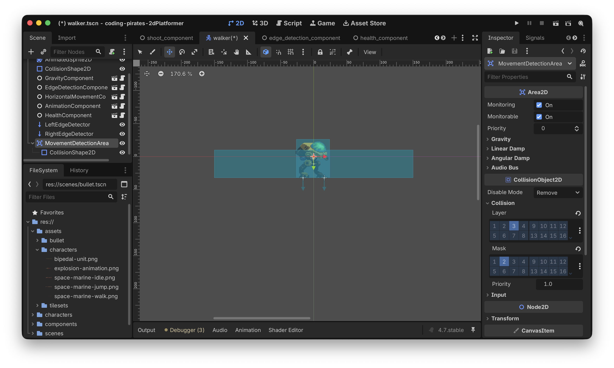
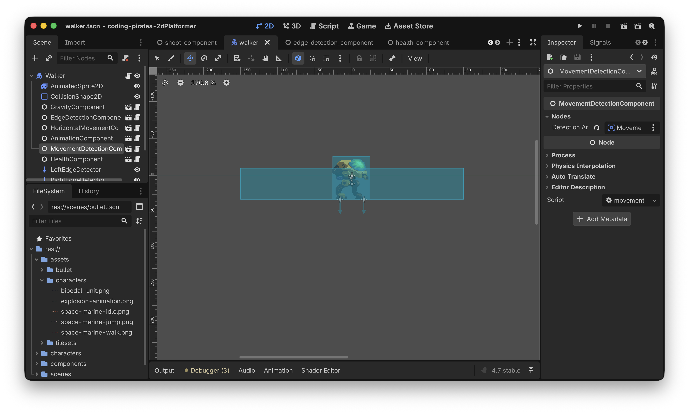

# Godot 2D Platformer - level 13, fjender der vender - part II
Efter [level 12](../lesson12/) kan vi nu skyde vores `Walker` og det er jo meget godt, men også samtidig lidt snyd, for den kan ikke skyde os!

Lad os få rettet op på det. I den her level og den næste level vil vi lave det sådan at:

- En `Walker` stopper med at gå og vender sig efter vores `Player` når spilleren kommer tæt kommer tæt nok på `Walkeren`
- Når `Player` er i nærheden og `Walker`en har vendt sig efter den, vil `Walker`en skyde salver af kugler efter `Player`

Første del klarer vi i denne level og i [næste level](../lesson14/) begynder vi så at skyde.

Lad os tænke os om

## Hvad er det vi gerne vil?
Vores `Walker` går frem og tilbage på en platform. Nu vil vi gerne lave det sådan at når vores `Player` kommer "tæt på" `Walker`en skal den 

- Stoppe med at gå
- Vende sig efter `Player`en

Hvordan kan vi gøre det?

Vi kan være kreative og tilføje en ny `CollisionShape2D` til et nyt `Area2D` som vi tilføjer på vores `Walker` Lad os kalde det area for `MovementDetectionArea`. Den `CollisionShape2D` kan vi så lave større end vores `Walker`. Husk at et `Area2D` kan sende to forskellige _signals_ som vi kan bruge:

- [body-entered](https://docs.godotengine.org/en/stable/classes/class_area2d.html#class-area2d-signal-body-entered) når vores `MovementDetectionArea` støder sammen med en `CollisionBody2D` som vi har registreret i vores "collision_mask"
- [body-exited](https://docs.godotengine.org/en/stable/classes/class_area2d.html#class-area2d-signal-body-exited) når vores `MovementDetectionArea` ikke længere støder sammen med en `CollisionBody2D` som vi har registreret i vores "collision_mask"

Alt det kan vi pakke pænt ned i en `MovementDetectionComponent` som vi kan give vores `Walker`s `MovementDetectionArea` som parameter.

Så kan vi lade vores `MovementDetectionComponent` connecte til "body-entered" og "body-exited" signalerne på det `MovementDetectionArea` den har fået ind, og lade den holde styr på om der er en `Player` i nærheden.

Og med det kan vi i vores `Walker`s `_physics_process` checke om der er en `Player` i nærheden eller ej, og ud fra det kan vi så standse vores `Walker` og med lidt snedig vektor matematik få den til at vende sig efter `Player`en.

Vi har vist nok nu til at kunne lave en indledende liste:

- [ ] Lav en ny `MovementDetectionComponent`
- [ ] Lav et nyt `Area2D` og `CollisionShape2D` på vores `Walker`
- [ ] Tilføj `MovementDetectionComponent` til `Walker`
- [ ] Skriv logik på `Walker` der kan afgøre om der er en `Player` i nærheden eller ej
- [ ] Vend `Walker` efter `Player` når den er i nærheden og stop med at gå
- [ ] Gå når `Player` ikke længere er i nærheden

Let's go!

## Lav en ny `MovementDetectionComponent`
Du kender rutinen så du får det bare i stikordsform nu:

- Ny komponent som vi kalder `MovementDetectionComponent`
- Tilføj script
- I script skal der være en `@export var detection_area: Area2D`
- Og så skal du i `_ready` funktionen connecte to funktioner som du skriver til signalerne "body_entered", og "body_exited"
- Endelig skal vi også lige have en `func has_target() -> bool` som vi kan bruge i `Walker`s `_physics_process` til at afgøre om der er en `Player` i nærheden eller ej

Prøv og se om du selv kan.

Her er vores forsøg:

```gdscript
class_name MovementDetectionComponent
extends Node

@export_group("Nodes")
@export var detection_area: Area2D

var target: Node2D = null

func _ready() -> void:
	detection_area.body_entered.connect(_on_body_entered)
	detection_area.body_exited.connect(_on_body_exited)

func has_target() -> bool:
	return target != null
	
# Connected functions
func _on_body_entered(body: Node2D) -> void:
	target = body
	
func _on_body_exited(body: Node2D) -> void:
	target = null
```

Det var step 1

- [X] Lav en ny `MovementDetectionComponent`
- [ ] Lav et nyt `Area2D` og `CollisionShape2D` på vores `Walker`
- [ ] Tilføj `MovementDetectionComponent` til `Walker`
- [ ] Skriv logik på `Walker` der kan afgøre om der er en `Player` i nærheden eller ej
- [ ] Vend `Walker` efter `Player` når den er i nærheden og stop med at gå
- [ ] Gå når `Player` ikke længere er i nærheden

Videre.

## Lav et nyt `Area2D` og `CollisionShape2D` på vores `Walker`
Heller ikke så meget nyt her, så igen får du det i stikordsform

- Tilføj et nyt `Area2D` direkte under din `Walker`s `CharacterBody2D` rod node
- Kald dit tilføjede `Area2D` for `MovementDetectionArea`
- Tilføje en `CollisionShape2D` som child på dit `MovementDetectionArea`
- Giv det en `RectangleShape2D` som Shape i "Inspectoren"
- Tilret din `RectangleShape2D` så den er bredere end din `Walker`
- Husk at sætte "Collision Layer" til "Enemy" (layer 3) og "Collision Mask" til "Player" (layer 2) for dit `MovementDetectionArea`

Her er vores forsøg



Det var step 2

- [X] Lav en ny `MovementDetectionComponent`
- [X] Lav et nyt `Area2D` og `CollisionShape2D` på vores `Walker`
- [ ] Tilføj `MovementDetectionComponent` til `Walker`
- [ ] Skriv logik på `Walker` der kan afgøre om der er en `Player` i nærheden eller ej
- [ ] Vend `Walker` efter `Player` når den er i nærheden og stop med at gå
- [ ] Gå når `Player` ikke længere er i nærheden

## Tilføj `MovementDetectionComponent` til `Walker`
Igen...stikord :)

- Tilføj `MovementDetectionComponent` til `Walker` både i 2D editoren og i `walker.gd` scriptet
- Husk at connect `MovementDetectionArea` til `detection_area` variablen som vi oprettede i vores `movement_detection_component.gd` script

Det ser sådan her ud ved os:



Det var step 3

- [X] Lav en ny `MovementDetectionComponent`
- [X] Lav et nyt `Area2D` og `CollisionShape2D` på vores `Walker`
- [X] Tilføj `MovementDetectionComponent` til `Walker`
- [ ] Skriv logik på `Walker` der kan afgøre om der er en `Player` i nærheden eller ej
- [ ] Vend `Walker` efter `Player` når den er i nærheden og stop med at gå
- [ ] Gå når `Player` ikke længere er i nærheden

Tju hej hvor det gå, men nu kommer vi også til de lidt mere svære ting :)

## Skriv logik på `Walker` der kan afgøre om der er en `Player` i nærheden eller ej
Nu har vi en komponent der kan fortælle os om der er en `Player` i nærheden af vores `Walker` eller ej. Lad os prøve at se om den virker.

Vi kan starte simpelt med at lave en ny funktion som vi kalder `handle_player_detection() -> void`.

I den kan vi så lave en hurtig `if` sætning og bare printe ud om der er en `Player` i nærheden.

Det ser sådan her ud:

```gdscript
func handle_player_detection() -> void:
	if movement_detection_component.has_target():
		print("Player nearby")
	else:
		print("Nothing here")
```

Kald din nye funktion som en del af `_physics_process`:

```gdscript
func _physics_process(delta: float) -> void:
	gravity_component.handle_gravity(self, delta)
	
	handle_player_detection()
	
	current_movement_direction = edge_detection_component.handle_edge_detection(current_movement_direction)
		
	horizontal_movement_component.handle_horizontal_movement(self, current_movement_direction)
	
	# Husk den her!
	move_and_slide()
```

Kør dit spil og prøv at bevæg dig tæt på din `Walker`. Du skulle gerne se tekst i din "Output" konsol a'la det her:

> Nothing here ...
> Player nearby ...
> Nothing here ...

Hvis ikke du gør så check at du har sat din `Player`s "Collision Layer" til "Player" (layer 2) og at alt er forbundet som det skal være.

Det var en start på step 4

- [X] Lav en ny `MovementDetectionComponent`
- [X] Lav et nyt `Area2D` og `CollisionShape2D` på vores `Walker`
- [X] Tilføj `MovementDetectionComponent` til `Walker`
- [X] Skriv logik på `Walker` der kan afgøre om der er en `Player` i nærheden eller ej
- [ ] Vend `Walker` efter `Player` når den er i nærheden og stop med at gå
- [ ] Gå når `Player` ikke længere er i nærheden

## Vend `Walker` efter `Player` når den er i nærheden og stop med at gå
Nå, nu bliver det interessant. Vi vil gerne vende os i retning af `Player` når den er i nærheden, hvordan kan vi gøre det?

Vi er vel nødt til at vide _hvor_ vores `Player` er i forhold til vores `Walker` og ud fra det kan vi så regne en retning ud.

Husk at i Godot 2D er vores noder egentlig bare koordinater i et koordinat system.

Så f.eks. kunne

- vores `Player` stå i position (1,1)
- vores `Walker` stå i position (10, 1)

Og det ville betyde at vores `Player` stod til venstre for `Walker`en (x værdien er mindre) og vi skulle derfor kalde vores `animation_component`s `handle_horizontal_flip` med -1

Omvendt hvis

- vores `Player` stod i position (20,1)
- vores `Walker` stod i position (10, 1)

ville vores `Player` stå til højre for `Walker`en og vi skulle derfor kalde vores `animation_component`s `handle_horizontal_flip` med 1.

Urgh...det lyder som en frygtelig masse matematik...og så udenfor skoletiden! Det gider vi jo ikke.

Godt nyt...det behøver vi heller ikke, Godot kan klare alt det her for os forholdsvist nemt.

Vi kan lave en ny funktion på vores `MovementDetectionComponent` som kan regne ud hvor vores `Walker` står i forhold til vores `Player`.

Det ser sådan her ud:

```gdscript
func direction_to_target(from: Node2D) -> Vector2:
	# Har vi overhovedet et target?
	if target == null:
		# Næh, nå men så bare returner 0, 0
		return Vector2.ZERO
	# Træk de to positioner fra hinanden
	# og returner en normaliseret værdi
	# altså en Vector hvor x og y begge er mellem 0 og 1
	return (target.global_position - from.global_position).normalized()
```

Det her er den interessante linie:

`return (target.global_position - from.global_position).normalized()`

Vi trækker "from"s globale position (som er en `Vector2`) fra vores "target"s globale position.

Det giver os så en `Vector2` som fortæller os hvor target er i forhold til from.

Tilsidst kalder vi [normalized](https://docs.godotengine.org/en/stable/classes/class_vector2.html#class-vector2-method-normalized).

I dokumentationen står der:

> Returns the result of scaling the vector to unit length. 

Huh?? Ja, rolig, det betyder bare at vi altid får en værdi som er justeret ned så både x og y værdien er et tal mellem -1 og 1.

Lad os prøve at erstatte vores `handle_player_detection` i `walker.gd` med det her og se hvad den skriver ud:

```gdscript
func handle_player_detection() -> void:
	var direction = movement_detection_component.direction_to_target(self)
	print(direction)
```

Kør dit spil igen og prøv at få din `Walker` til at se dig.

Hvis vi står til venstre for `Walker`en får vi værdier som dem her:

> (-0.999904, 0.013846)
> (-0.999556, 0.029783)

Hvis vi står til højre for `Walker`en får vi værdier som dem her:

> (0.972757, 0.231828)
> (0.971871, 0.235513)

Og hvis `Walker`en _ikke_ kan se os får vi

> (0, 0)

Godt. Det kan vi bruge til noget i vores `handle_player_detection`

- Hvis movement_detection_component.has_target() _og_ `player_detected` er `false`
  - Så sætter vi lige et `player_detected` flag til `true` så vi kan se at vi er i gang med at vende os (husk at `_physics_process` kører 60 gange i sekundet, vi vil kun vende os første gang vi opdager at der er en `Player` tæt på)
  - Og så finder vi ud af hvor `Walker`en er i forhold til `Player`
  - Og så gemmer vi den gamle retning vi gik i i en variabel vi kalder `previous_movement_direction`
  - Og så sætter vi `current_movement_direction` til 0 så vi står stille
  - Og vender os rigtigt ved at kalde `animation_component.handle_horizontal_flip`
- Hvis _ikke_ movement_detection_component.has_target() _og_ `player_detected` er `true` betyder det at `Player` er forsvundet for os igen
  - Så vi flipper `player_detected` til `false`
  - Og sætter `current_movement_direction` tilbage til dens gamle værdi som vi gemte i `previous_movement_direction`

Lad os prøve at skrive det, prøv endelig selv hvis du har mod på det. Her er vores foreslag:

```gdscript
func handle_player_detection() -> void:
	# Der er et target og vi kan ikke behandlet det endnu
	# Let's go!
	if movement_detection_component.has_target() and not player_detected:
		# Registrer at vi er ved at vende os
		player_detected = true

		var new_direction = movement_detection_component.direction_to_target(self)
		# Gem den gamle retning
		previous_movement_direction = current_movement_direction
				
		# Stå stille
		current_movement_direction = 0

		# Vend os rigtigt
		if new_direction.x < 0:
			animation_component.handle_horizontal_flip(-1)
		elif new_direction.x > 0:
			animation_component.handle_horizontal_flip(1)
						
	# Target er væk igen og det er første loop
	# siden det forsvandt, vi nulstiller
	elif !movement_detection_component.has_target() and player_detected:
		# Nulstil værdier
		player_detected = false
		current_movement_direction = previous_movement_direction
```

Og...så skal vi lige opdatere `_physics_process` så den kun opdaterer `current_movement_direction` hvis ikke `player_detected` er `true`

```gdscript
func _physics_process(delta: float) -> void:
	gravity_component.handle_gravity(self, delta)
	
	handle_player_detection()
	
	if not player_detected:
		current_movement_direction = edge_detection_component.handle_edge_detection(current_movement_direction)
		
	horizontal_movement_component.handle_horizontal_movement(self, current_movement_direction)
	
	# Husk den her!
	move_and_slide()
```

Kør dit spil igen. Nu skulle vores `Walker` gerne vende sig om og stå stille når vi kommer tæt på _og_ når vi så kommer uden for rækkevidde skulle den gerne begynde at bevæge sig igen! Det er da temmelig fedt!

Ooooog, vi kan slette både step 5 og 6

- [X] Lav en ny `MovementDetectionComponent`
- [X] Lav et nyt `Area2D` og `CollisionShape2D` på vores `Walker`
- [X] Tilføj `MovementDetectionComponent` til `Walker`
- [X] Skriv logik på `Walker` der kan afgøre om der er en `Player` i nærheden eller ej
- [X] Vend `Walker` efter `Player` når den er i nærheden og stop med at gå
- [X] Gå når `Player` ikke længere er i nærheden

For en god ordens skyld er her hele `walker.gd` så du kan sammenligne:

```gdscript
extends CharacterBody2D

@export_subgroup("Nodes")
@export var animation_component: AnimationComponent
@export var edge_detection_component: EdgeDetectionComponent
@export var gravity_component: GravityComponent
@export var health_component: HealthComponent
@export var horizontal_movement_component: HorizontalMovementComponent
@export var movement_detection_component: MovementDetectionComponent

var current_movement_direction: float = -1
var previous_movement_direction: float = current_movement_direction
var is_dying: bool = false
var player_detected: bool = false

func _ready() -> void:
	horizontal_movement_component.speed = 50
	is_dying = false
	
func _physics_process(delta: float) -> void:
	gravity_component.handle_gravity(self, delta)
	
	handle_player_detection()
	
	if not player_detected:
		current_movement_direction = edge_detection_component.handle_edge_detection(current_movement_direction)
		
	horizontal_movement_component.handle_horizontal_movement(self, current_movement_direction)
	
	# Husk den her!
	move_and_slide()
	
func _process(delta: float) -> void:
	# er vi ved at dø, så bare stop her
	if is_dying:
		return
		
	# Kun hvis vi er døde kommer vi videre her til
	# Er vi så døde i mellemtiden?
	if health_component.is_dead():
		# Ja det var vi, så kald die funktionen der
		# sørger for at vi dør pænt :)
		await die()
		
	# Vi var ikke døde så vi kører bare videre
	animation_component.handle_move_animation(current_movement_direction)
	
func hit(damage: int) -> void:
	health_component.hit(damage)
	
func handle_player_detection() -> void:
	# Der er et target og vi kan ikke behandlet det endnu
	# Let's go!
	if movement_detection_component.has_target() and not player_detected:
		# Registrer at vi er ved at vende os
		player_detected = true

		var new_direction = movement_detection_component.direction_to_target(self)
		# Gem den gamle retning
		previous_movement_direction = current_movement_direction
				
		# Stå stille
		current_movement_direction = 0

		# Vend os rigtigt
		if new_direction.x < 0:
			animation_component.handle_horizontal_flip(-1)
		elif new_direction.x > 0:
			animation_component.handle_horizontal_flip(1)
						
	# Target er væk igen og det er første loop
	# siden det forsvandt, vi nulstiller
	elif !movement_detection_component.has_target() and player_detected:
		# Nulstil værdier
		player_detected = false
		current_movement_direction = previous_movement_direction
		
func die() -> void:
	# flip is_dying så vi ikke ryger i _process igen
	is_dying = true
	
	# stop så vi ikke går videre
	current_movement_direction = 0
	
	# gør så player kan løbe igennem animationen
	set_physics_process(false)
	
	# vent på at die animationen spiller færdig
	await animation_component.handle_die_animation()
	
	# og ryd pænt op
	queue_free()
```

## Tada!
Puha, det var måske en lidt drøj omgang med vector matematik men heldigvis er Godot god til at hjælpe os.

Skulle du nu have lyst til at læse mere om vector matematik og hvad man kan i Godot kan du læse mere i deres [dokumentation](https://docs.godotengine.org/en/stable/tutorials/math/vector_math.html).

Og ellers skal vi vel bare videre og have vores `Walker` til at skyde tilbage på os når den ser os. Den gode nyhed er at vi også _her_ skal vide _hvor_ `Player` er så vi kan sætte kuglerne rigtigt så det var ikke spildt arbejde med det matematik.

På gensyn i [næste level](../lesson14/)