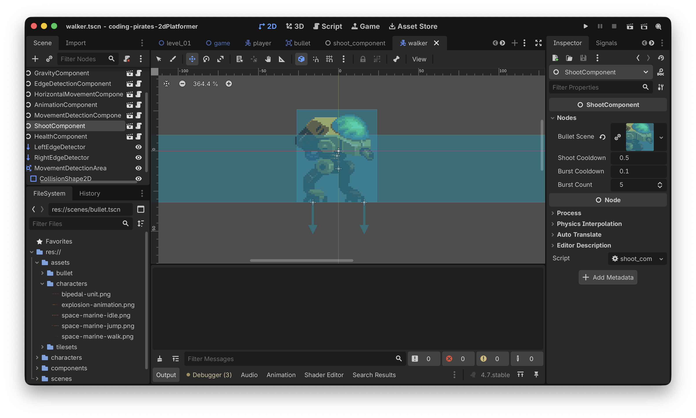

# Godot 2D Platformer - level 14, fjender der skyder
Efter [level 13](../lesson13/) kan vores `Walker` nu standse og vende sig i retning af os når vi kommer tæt nok på den. Nu skal vi have den til at skyde efter os også.

Den gode nyhed er at vi allerede har en `ShootComponent`, meeeeen for at vores spil skal være bare _lidt_ svært kunne det være fedt hvis vores `Walker` skød en salve på 5 skud efter os når den så os, så vi skal have udvidet vores `ShootComponent` med en ny funktion.

Lad os gå i gang, du ved hvad første spørgsmål er...

## Hvad er det vi gerne vil?
Vi har allerede håndteret at `Walker`en "får øje på os" og vender sig om efter os.

Vi kender også "retningen" fra `Walker` til `Player`, den regnede vi ud sidste gang som en normaliseret `Vector2`.

Så nu vil vi gerne i vores `walker.gd` script - når `Walker` får øje på `Player` og `player_detected` derfor er `true` kalde en ny funktion på vores `ShootComponent`, lad os kalde funktionen `handle_burst_shoot_requested`.

Den funktion minder meget om vores allerede eksisterende `handle_shoot_requested` funktion på `ShootComponent` så lad os lige kigge på den funktion:

```gdscript
func handle_shoot_requested(pos: Vector2, dir: Vector2, offset: Vector2) -> void:
	# må vi overhovedet skyde?
	if not can_shoot:
		# næh...nå men så stopper vi da bare her!
		return
		
	# lav en ny bullet
	var bullet = bullet_scene.instantiate()
	
	# og sæt den op med de rigtige værdier
	bullet.add(pos, dir, offset)
	
	# og smid den i view hierakiet
	get_tree().root.add_child(bullet)
	
	# sørg for at vi ikke kan skyde med det samme
	can_shoot = false
	
	# vent!
	await get_tree().create_timer(shoot_cooldown_period).timeout
	# og sig at nu kan vi skyde igen
	can_shoot = true
```

Forskellen er bare at vi gerne vil kalde det her:

```gdscript
	# lav en ny bullet
	var bullet = bullet_scene.instantiate()
	
	# og sæt den op med de rigtige værdier
	bullet.add(pos, dir, offset)
	
	# og smid den i view hierakiet
	get_tree().root.add_child(bullet)
```

fem gange efter hinanden med et lille mellemrum mellem hvert skud. Hvordan kan vi gøre det?

Du har sikkert regnet det ud, vi kan bruge _endnu_ en timer ligesom vi gjorde i vores `handle_shoot_requested`, så vi skal bruge et tidsinterval som vi venter, lad os kalde det `burst_cooldown_period` og lad os give det et kort interval, f.eks 0.1 sekund.

Så kan vi lave en "tæller" variabel, lad os kalde den `shot_index` og så lave en løkke som vi kører igennem 5 gange (fordi vi gerne vil skyde 5 skud), hvor vi siger noget i retning af:

```gdscript
for shot_index in 5:
    # lav ny bullet som vi gjorde ovenfor
    
    # start timeren
    burst_cooldown_timer.start()

    # vent på at den bliver færdig
    await get_tree().create_timer(burst_cooldown_period).timeout

    # og så starter vi loopet forfra igen
```

### Men hov!
Du tænker sikkert allerede nu

> OK nu laver vi det samme "lav en ny bullet" kode to steder, både i `handle_shoot_requested` og i `handle_burst_shoot_requested`, det er da fjollet!

Og du har jo ret! Så den logik kan vi trække ud i en separat funktion som vi kan kalde begge steder fra.

Nu har vi vist alle brikkerne klar så vi kan lave en liste:

- [ ] Træk "opret skud" logik ud i separat funktion
- [ ] Lav ny `handle_burst_shoot_requested` funktion
- [ ] Kald `handle_burst_shoot_requested` fra `walker.gd` script

Lad os gå i gang

## Træk "opret skud" logik ud i separat funktion
Den er nem!

Lad os lave en ny intern funktion i vores `ShootComponent` 

- Funktionen skal hedde `_spawn_bullet`
- Den skal tage de samme tre parametre som `handle_shoot_requested` allerede tager
- Den skal ikke returnere noget
- Vi skal flytte logikken til at oprette og sætte en ny `Bullet`
- Vi skal kalde den nye `_spawn_bullet` funktion fra vores eksisterende `handle_shoot_requested`

Prøv at se om du selv kan...det kan du godt!

Her er vores bud:

```gdscript
class_name ShootComponent
extends Node

@export_subgroup("Nodes")
@export var bullet_scene: PackedScene
@export var shoot_cooldown_period: float = 0.5

var can_shoot: bool = true

func handle_shoot_requested(pos: Vector2, dir: Vector2, offset: Vector2) -> void:
	# må vi overhovedet skyde?
	if not can_shoot:
		# næh...nå men så stopper vi da bare her!
		return
		
	_spawn_bullet(pos, dir, offset)
	
	# sørg for at vi ikke kan skyde med det samme
	can_shoot = false
	
	# vent!
	await get_tree().create_timer(shoot_cooldown_period).timeout
	# og sig at nu kan vi skyde igen
	can_shoot = true
	
func _spawn_bullet(pos: Vector2, dir: Vector2, offset: Vector2) -> void:
	# lav en ny bullet
	var bullet = bullet_scene.instantiate()
	
	# og sæt den op med de rigtige værdier
	bullet.add(pos, dir, offset)
	
	# og smid den i view hierakiet
	get_tree().root.add_child(bullet)	
```

Kør dit spil, bare for at være sikker på at vi stadig kan skyde.

Det var step et

- [X] Træk "opret skud" logik ud i separat funktion
- [ ] Lav ny `handle_burst_shoot_requested` funktion
- [ ] Kald `handle_burst_shoot_requested` fra `walker.gd` script

## Lav ny `handle_burst_shoot_requested` funktion
Så skal vi have lavet vores nye funktion.

Vi nåede ovenfor frem til at vi skal bruge:

- En ny `burst_cooldown_period` variabel af typen `float` så vi kan styre intervallet mellem hvert skud i en salve
- En ny `burst_count` variabel af typen `int` så vi kan styre hvor mange skud der er i en salve

Og så selve funktionen som vi definerede ovenfor.

Igen...prøv selv, du kan godt :)

Her er vores færdige `shoot_component.gd` script:

```gdscript
class_name ShootComponent
extends Node

@export_subgroup("Nodes")
@export var bullet_scene: PackedScene
@export var shoot_cooldown_period: float = 0.5

# Variabler til at skyde en salve
@export var burst_cooldown_period: float = 0.1
@export var burst_count: int = 5

var can_shoot: bool = true
	
func handle_shoot_requested(pos: Vector2, dir: Vector2, offset: Vector2) -> void:
	# må vi overhovedet skyde?
	if not can_shoot:
		# næh...nå men så stopper vi da bare her!
		return
		
	_spawn_bullet(pos, dir, offset)
	
	# sørg for at vi ikke kan skyde med det samme
	can_shoot = false
	
	# vent!
	await get_tree().create_timer(shoot_cooldown_period).timeout
	# og sig at nu kan vi skyde igen
	can_shoot = true
	
func handle_burst_shoot_requested(pos: Vector2, dir: Vector2, offset: Vector2) -> void:
	# Igen...må vi overhovedet skyde?
	if not can_shoot:
		# næh...nå men så stopper vi da bare her!
		return
		
	# sørg for at vi ikke kan skyde med det samme
	can_shoot = false

	# Skyd en salve
	for shot_index in burst_count:
		_spawn_bullet(pos, dir, offset)
		
		await get_tree().create_timer(burst_cooldown_period).timeout

	# vent!
	await get_tree().create_timer(shoot_cooldown_period).timeout
	# og sig at nu kan vi skyde igen
	can_shoot = true
	
func _spawn_bullet(pos: Vector2, dir: Vector2, offset: Vector2) -> void:
	# lav en ny bullet
	var bullet = bullet_scene.instantiate()
	
	# og sæt den op med de rigtige værdier
	bullet.add(pos, dir, offset)
	
	# og smid den i view hierakiet
	get_tree().root.add_child(bullet)	
```

Det var step to

- [X] Træk "opret skud" logik ud i separat funktion
- [X] Lav ny `handle_burst_shoot_requested` funktion
- [ ] Kald `handle_burst_shoot_requested` fra `walker.gd` script

Tid til at binde det hele sammen!

## Kald `handle_burst_shoot_requested` fra `walker.gd` script
Første skridt er at vi lige skal have tilføjet en `ShootComponent` til vores `Walker` som vi gjorde for vores `Player` i [level 9](../lesson09/).

- Husk at tilføj `@export var shoot_component: ShootComponent` til `walker.tscn`
- Husk at tilføj vores `bullet.tscn` som "Bullet Scene" i "Inspectoren" til højre som vi har gjort her nedenfor



Og så kan vi rette i vores script så vi kan skyde i `_physics_process`:

```gdscript
func _physics_process(delta: float) -> void:
	gravity_component.handle_gravity(self, delta)
	
	handle_player_detection()
	
	if not player_detected:
		current_movement_direction = edge_detection_component.handle_edge_detection(current_movement_direction)
	else:
		# Der er en player i nærheden...skyd!
		
		# først finder vi ud af retningen mellem walker og player
		var new_direction = movement_detection_component.direction_to_target(self)
		
		# og så skyder vi!
		shoot_component.handle_burst_shoot_requested(global_position, new_direction, Vector2(32, 0))
		
	horizontal_movement_component.handle_horizontal_movement(self, current_movement_direction)
	
	# Husk den her!
	move_and_slide()
```

Læg mærke til at vi lige laver lidt luft mellem `Walker` og `Bullet` med den her parameter:

`Vector2(32, 0)`

Prøv og kør dit spil.

Hmmm! Når vores `Walker` opdager os skyder den...men den skyder sig selv...hvorfor det mon? Kan du regne det ud?

## Tid til at genbesøge `bullet.gd`
Vi var lidt for effektive da vi lavede vores `_on_body_entered` i `bullet.gd`. Her er den:

```gdscript
func _on_body_entered(body: Node2D) -> void:
	if body is CharacterBody2D:
		body.hit(damage)
		
	queue_free()
```

Når vores `Walker` skyder, rammer den sin egen collision shape med det samme, hvilket gør at vi ryger ind i `_on_body_entered` og eftersom `Walker` er en `CharacterBody2D` jamen så giver vi os selv skade.

Det er jo dumt!

Vi kan løse det på flere måder:

1. Vi kan bare øge afstanden mellem `Walker` og `Bullet` når vi kalder `handle_burst_shoot_requested`
2. Vi kan sende et gruppenavn med ind til vores `Bullet` sådan at vi lige checker hvad det er vi gerne vil ramme. Altså sådan at når en `Player` skyder siger vi at den skal ramme noget der er i gruppen "Enemies" og omvendt, når det er en `Walker` der skyder, siger vi at den skal ramme noget der er i gruppen "Player.

Option 1 virker som den nemme og hurtige løsning men...hvis vi laver den vil det stadig være sådan at _en_ `Walker` kan ramme og dræbe en anden `Walker`, det vil vi vel ikke.

Så vi går efter option 2 og det betyder at vi skal:

- [ ] Udvide `add` funktionen i `bullet.gd` til at tage en parameter med ind som fortæller _hvad_ vi vil ramme.
- [ ] Udvide `_on_body_entered` funktionen i `bullet.gd` til at checke om det så er _den_ gruppe vi har ramt og kun hvis det er det vil vi rent faktisk kalde `hit`funktionen
- [ ] Udvide vores `ShootComponent` så den nu sender _hvad_ vi vil ramme videre fra hhv. `Player` og `Walker` til `Bullet` når vi skyder
- [ ] Rette vores `Player` og `Walker` til så de:
  - [ ] Melder sig selv ind i de relevante grupper når de bliver oprettet
  - [ ] Sender gruppen de vil ramme med ind i den opdaterede `add` funktion når de skyder

Nemt! Lad os gå i gang

### Udvide `add` funktionen i `bullet.gd`
Vi skal sende en parameter med i `add` funktionen som vi kan gemme til senere på vores `Bullet`. 

Lad os kalde den `group_to_hit` af typen `String` i første omgang og lad os starte med at definere en variabel på vores `bullet.gd` så vi kan gemme den

`var group_to_hit: String`

Og så skal vi have den med som parameter på `add` og gemme den:

```gdscript
func add(pos: Vector2, dir: Vector2, offset: Vector2, target_group: String) -> void:
	# gem group_to_hit så vi kan checke det senere
	group_to_hit = target_group
	
	# regn x og y ud for vores bullet
    mere kode herunder som ikke er ændret
```

Det var step 1

- [X] Udvide `add` funktionen i `bullet.gd` til at tage en parameter med ind som fortæller _hvad_ vi vil ramme.
- [ ] Udvide `_on_body_entered` funktionen i `bullet.gd` til at checke om det så er _den_ gruppe vi har ramt og kun hvis det er det vil vi rent faktisk kalde `hit`funktionen
- [ ] Udvide vores `ShootComponent` så den nu sender _hvad_ vi vil ramme videre fra hhv. `Player` og `Walker` til `Bullet` når vi skyder
- [ ] Rette vores `Player` og `Walker` til så de:
  - [ ] Melder sig selv ind i de relevante grupper når de bliver oprettet
  - [ ] Sender gruppen de vil ramme med ind i den opdaterede `add` funktion når de skyder

Videre

### Udvide `_on_body_entered` funktionen
Nu har vi en `group_to_hit` som vi kan checke op imod, sådan her:

```gdscript
func _on_body_entered(body: Node2D) -> void:
	if body is TileMapLayer:
		queue_free()
		
	if body is CharacterBody2D and body.is_in_group(group_to_hit):
		body.hit(damage)
		queue_free()
```

Bemærk at vi kun vil kalde `queue_free` hvis det er den rigtige gruppe...derfor bliver vi også nødt til at checke på `TileMapLayer` igen desværre.

Det var step 2

- [X] Udvide `add` funktionen i `bullet.gd` til at tage en parameter med ind som fortæller _hvad_ vi vil ramme.
- [X] Udvide `_on_body_entered` funktionen i `bullet.gd` til at checke om det så er _den_ gruppe vi har ramt og kun hvis det er det vil vi rent faktisk kalde `hit`funktionen
- [ ] Udvide vores `ShootComponent` så den nu sender _hvad_ vi vil ramme videre fra hhv. `Player` og `Walker` til `Bullet` når vi skyder
- [ ] Rette vores `Player` og `Walker` til så de:
  - [ ] Melder sig selv ind i de relevante grupper når de bliver oprettet
  - [ ] Sender gruppen de vil ramme med ind i den opdaterede `add` funktion når de skyder

Videre til step 3

### Udvid vores `ShootComponent`
Nu kræver vores `Bullet`s `add` funktion en `target_group` parameter så den skal vi også lige kunne sende med ind i vores `ShootComponent` så _den_ kan sende det videre når der skal skydes.

Så vores `handle_shoot_requested` og `handle_burst_shoot_requested` skal have tilføjet en `target_group` parameter som så sendes med ned i `_spawn_bullet`.

Prøv selv, Godot skal nok fortælle dig hvad du mangler :)

Her er vores opdaterede `ShootComponent`:

```gdscript
class_name ShootComponent
extends Node

@export_subgroup("Nodes")
@export var bullet_scene: PackedScene
@export var shoot_cooldown_period: float = 0.5

# Variabler til at skyde en salve
@export var burst_cooldown_period: float = 0.1
@export var burst_count: int = 5

var can_shoot: bool = true
	
func handle_shoot_requested(pos: Vector2, dir: Vector2, offset: Vector2, target_group: String) -> void:
	# må vi overhovedet skyde?
	if not can_shoot:
		# næh...nå men så stopper vi da bare her!
		return
		
	_spawn_bullet(pos, dir, offset, target_group)
	
	# sørg for at vi ikke kan skyde med det samme
	can_shoot = false
	
	# vent!
	await get_tree().create_timer(shoot_cooldown_period).timeout
	# og sig at nu kan vi skyde igen
	can_shoot = true
	
func handle_burst_shoot_requested(pos: Vector2, dir: Vector2, offset: Vector2, target_group: String) -> void:
	# Igen...må vi overhovedet skyde?
	if not can_shoot:
		# næh...nå men så stopper vi da bare her!
		return
	
	# sørg for at vi ikke kan skyde med det samme
	can_shoot = false

	# Skyd en salve
	for shot_index in burst_count:
		_spawn_bullet(pos, dir, offset, target_group)
		
		await get_tree().create_timer(burst_cooldown_period).timeout

	# vent!
	await get_tree().create_timer(shoot_cooldown_period).timeout
	# og sig at nu kan vi skyde igen
	can_shoot = true
	
func _spawn_bullet(pos: Vector2, dir: Vector2, offset: Vector2, target_group: String) -> void:
	# lav en ny bullet
	var bullet = bullet_scene.instantiate()
	
	# og sæt den op med de rigtige værdier
	bullet.add(pos, dir, offset, target_group)
	
	# og smid den i view hierakiet
	get_tree().root.add_child(bullet)	
```

Det var step 3...videre

- [X] Udvide `add` funktionen i `bullet.gd` til at tage en parameter med ind som fortæller _hvad_ vi vil ramme.
- [X] Udvide `_on_body_entered` funktionen i `bullet.gd` til at checke om det så er _den_ gruppe vi har ramt og kun hvis det er det vil vi rent faktisk kalde `hit`funktionen
- [X] Udvide vores `ShootComponent` så den nu sender _hvad_ vi vil ramme videre fra hhv. `Player` og `Walker` til `Bullet` når vi skyder
- [ ] Rette vores `Player` og `Walker` til så de:
  - [ ] Melder sig selv ind i de relevante grupper når de bliver oprettet
  - [ ] Sender gruppen de vil ramme med ind i den opdaterede `add` funktion når de skyder

### Ret `Player` og `Walker`
Vi skal to ting her:

1. Fortælle hvilken gruppe vi er i
2. Fortælle hvad vi vil ramme

Begge dele kan vi gøre direkte i scripts.

#### Hvilken gruppe er vi i?
I både `player.gd` og `walker.gd` kan du tilføje `add_to_group` i `_ready` (du skal lige lave funktionen i `player.gd`)

Det ser sådan her ud for `player.gd`

`add_to_group("Player")`

Og sådan her for `walker.gd`

`add_to_group("Enemy")`

#### Hvad vil vi ramme?
Vi har jo udvidet vores `ShootComponent` til nu at tage en `target_group` med så det skal vi lige huske at gøre når vi kalder `shoot_component`. 

Her er vores opdatede `player.gd` script:

```gdscript
extends CharacterBody2D

@export_subgroup("Nodes")
@export var animation_component: AnimationComponent
@export var gravity_component: GravityComponent
@export var horizontal_movement_component: HorizontalMovementComponent
@export var input_component: InputComponent
@export var jump_component: JumpComponent
@export var shoot_component: ShootComponent

func _ready() -> void:
	add_to_group("Player")
	
func _physics_process(delta: float) -> void:
	gravity_component.handle_gravity(self, delta)
	horizontal_movement_component.handle_horizontal_movement(self, input_component.horizontal_direction)
	jump_component.handle_jump(self, input_component.jump_was_pressed())
	move_and_slide()
	
func _process(delta: float) -> void:
	animation_component.handle_move_animation(input_component.horizontal_direction)
	animation_component.handle_jump_animation(gravity_component.is_jumping, gravity_component.is_falling)
	
	if input_component.shoot_was_pressed():
		var direction = Vector2.LEFT if animation_component.get_sprite_direction() == -1 else Vector2.RIGHT
		shoot_component.handle_shoot_requested(position, direction, Vector2(16, 0), "Enemy")
```

Og så kan du selv regne ud hvad der skal ske i `walker.gd` :)

Hold nu op alt det vi kan strege nu!

- [X] Udvide `add` funktionen i `bullet.gd` til at tage en parameter med ind som fortæller _hvad_ vi vil ramme.
- [X] Udvide `_on_body_entered` funktionen i `bullet.gd` til at checke om det så er _den_ gruppe vi har ramt og kun hvis det er det vil vi rent faktisk kalde `hit`funktionen
- [X] Udvide vores `ShootComponent` så den nu sender _hvad_ vi vil ramme videre fra hhv. `Player` og `Walker` til `Bullet` når vi skyder
- [X] Rette vores `Player` og `Walker` til så de:
  - [X] Melder sig selv ind i de relevante grupper når de bliver oprettet
  - [X] Sender gruppen de vil ramme med ind i den opdaterede `add` funktion når de skyder

Oooog

- [X] Træk "opret skud" logik ud i separat funktion
- [X] Lav ny `handle_burst_shoot_requested` funktion
- [X] Kald `handle_burst_shoot_requested` fra `walker.gd` script

## Sandhedens time!
Kør dit spil og se at `Walker`en skyder.

Hov!! Det crasher jo!

> Invalid call. Nonexistent function 'hit' in base 'CharacterBody2D (player.gd)'.

Ah ja, vi skrev jo i [level 11](../lesson11/):

> Så, til at starte med "leger vi" at der findes en funktion kaldet hit på alle CharacterBody2Ds som vores Bullet rammer.

Men den har vi jo ikke lavet på vores `Player` endnu.

Lad os bare lave en simpel implementation nu i `player.gd`

```gdscript
func hit(damage: int) -> void:
	print("Av! ", damage)
```

Og lad os så køre vores spil igen.

Perfekt, nu bliver vi ramt og kan se

> Av! 1

I "Output".

## Tada
Det var endnu en stor omgang...mest fordi vi måtte rette i eksisterende kode for at få det til at virke i alle scenarier, sådan er det tit og ofte når man programmerer.

Så nu kan fjenderne skyde på os men...vi tager stadig ikke skade, lad os få rettet op på det [næste gang](../lesson15/), på gensyn.