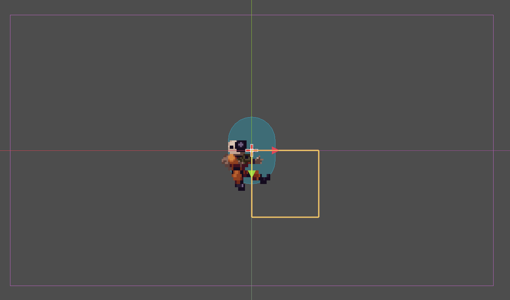
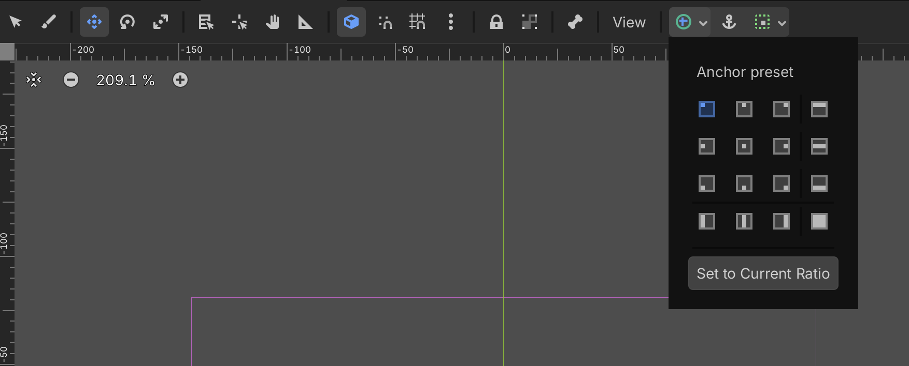
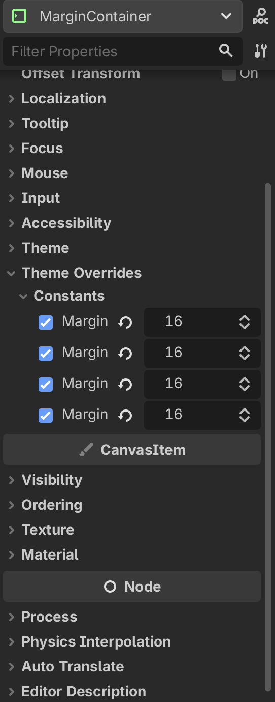
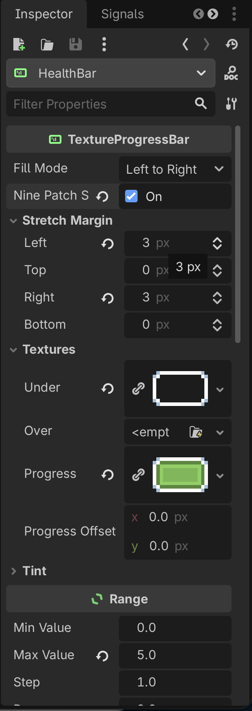
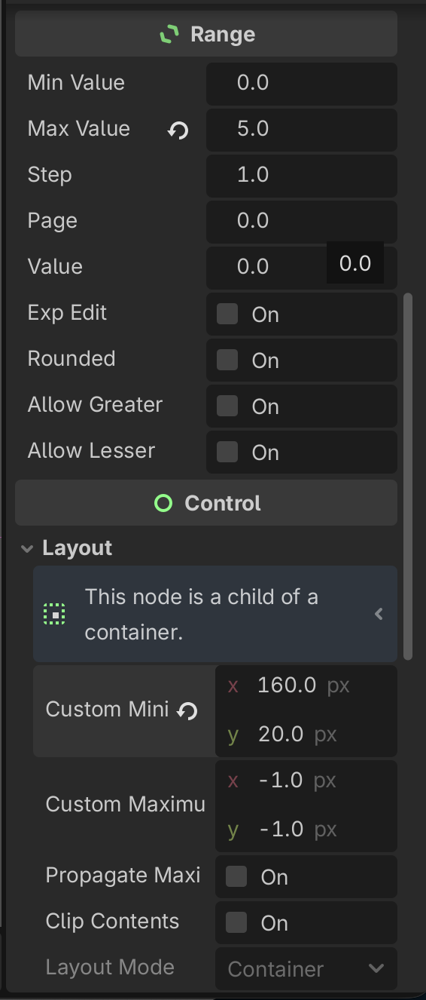
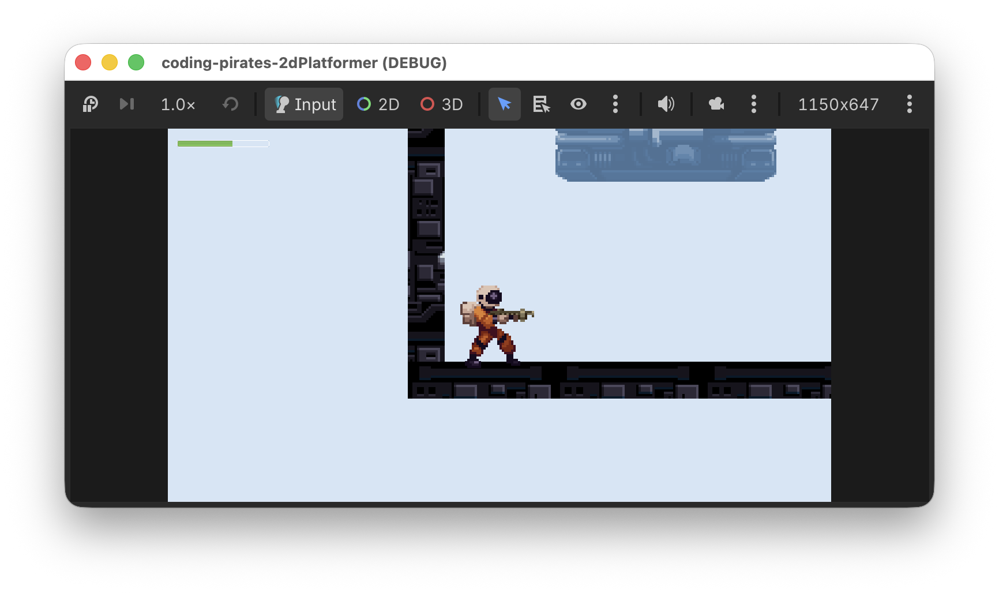

# Godot 2D Platformer - level 16 healthbar

Vores spil begynder at ligne noget nu! I de næste par lektioner vil vi finpudse og tilføje lidt UI (user interface) sådan at vi kan starte vores spil fra en start skærm, vise en Game Over skærm når man er død og alt sådan noget.

I første omgang vil vi lave en healthbar så vi kan se hvor meget energi vores `Player` har.

## Indledende tanker
Den gode nyhed er at der ikke skal lavet nye komponenter til den opgave. 

Du tænker måske

> At opdatere en healthbar...er det ikke en opgave for vores `HealthComponent`?

First of all...godt tænkt! Men...hvad ville konsekvensen være hvis vi lod vores `HealthComponent` stå for at opdatere en healthbar?

Det ville betyde at _alle_ som bruger en `HealthComponent` nu også skulle have en healthbar og det vil vi vel ikke have for vores `Walker` f.eks. Så derfor er det - i dette tilfælde - ikke `HealthComponent`s opgave at opdatere healthbar, det er en ren `Player` ting, men `Player` bruger så værdierne som den kan få fra `HealthComponent`.

Så det vi skal er:

- [ ] Tilføje en `TextureProgressBar` - pænt pakket ind - til vores `Player`
- [ ] Opdatere `TextureProgressBar` med `health_component.health`

Lad os komme i gang.

## Tilføje en `TextureProgressBar` til vores `Player`
Vi skal igennem mange af de samme øvelser som vi lavede i vores 2D space shooter da vi tilføjede en healthbar den gang.

I første omgang skal vi have et sted vi kan smide noget UI i, så vi tilføjer et [`CanvasLayer`](https://docs.godotengine.org/en/stable/classes/class_canvaslayer.html) som er lag som ligger sig i et lag ovenpå vores andre noder så det altid er synligt.

### MarginContainer
I vores UI lag vil vi smide ovres healthbar men vi er nødt til lige at pakke den lidt pænt ind så den ikke bare klæber direkte til kanten af skærmen.

Til det kan vi bruge en [`MarginContainer`](https://docs.godotengine.org/en/stable/tutorials/ui/gui_containers.html#margin-container), som er en container vi kan putte andre ting i, og `MarginContainer` vil så sørge for at der kommer det luft omkring dens "children" som vi har fortalt den at der skal være.

Så vi tilføjer en `MarginContainer` i vores `CanvasLayer`.

Nu kan du se en gul firkant i midten af vores `Player` scene.



Den viser hvor vores `MarginContainer` vil placere sig. Så nu kunne man tro at hvis vi tilføjede en healthbar i vores `MarginContainer` nu ville den svæve rundt midt på skærmen.

Det vil den ikke, det er en "fejl" i den måde Godot renderer UI på. Men vi skal alligevel lige være sikre på at vores `MarginContainer` står rigtigt.

Den gode nyhed er at det er nemt at gøre! Vi skal bruge "anchors" som fortæller en `MarginContainer` (eller andre "controls" - som man kalder UI komponenter samlet i Godot) hvor de skal sætte sig.

Med anchors kan vi sige "`MarginContainer` sæt dig i øverste venstre hjørne", og så gør den det, uanset hvor "øverste venstre hjørne" så end er.

Du kan læse mere om anchors i [dokumentationen her](https://docs.godotengine.org/en/stable/tutorials/ui/size_and_anchors.html)

I topbaren over vores scene kan du nu, hvis du vælger `MarginContainer` se et lille plus i en grøn cirkel. Tryk på det for at se, hvor vores `MarginContainer` sidder



Som du kan se er "Top Left" valgt i dette tilfælde (hvis den ikke er det ved dig, så vælg den). Perfekt! Det betyder at vores `MarginContainer` vil sætte sig i øverste venstre hjørne af dens parent `CanvasLayer` og dermed i øverste venstre hjørne af skærmen.

En sidste ting vi skal huske i vores `MarginContainer`...margin...når vi nu har den fine container til det!

Vælg din `MarginContainer` og kig i "Inspectoren" i højre side. Under "Theme Overrides" kan du se "Constants" og her kan du sætte margin for left, top, right og bottom. Sæt dem alle 4 til 16.



Så! Nu har vi en fin `MarginContainer` som sætter sig i øverste venstre hjørne og smækker 16px margin rundt om de ting vi putter i den.

### TextureProgressBar
Lad os nu tilføje en [`TextureProgressBar`](https://docs.godotengine.org/en/stable/classes/class_textureprogressbar.html) i vores `MarginContainer`.

Omdøb den til at hedde 

Den skal bruge et par textures som du kan finde i assets mappen:

- bar_foreground.png
- bar_background.png

Træk dem over i din res/assets mappe (gerne i en ui mappe så der er lidt styr på det)

Herefter kan du vælge din `TextureProgressBar` og trække dine nye assets over i "Inspectoren" i højre side sådan at:

- bar_foreground.png bliver assigned til Textures -> Progress
- bar_background.png bliver assigned til Textures -> Under

Og så skal vi lige huske at enable "Nine Patch Stretch" og sætte Left og Right til 3px sådan at vores progressbar kan lave en fin bar til os.

Det ser sådan her ud



Sidste to rettelser:

- Sæt "Max Value" under "Range" til 5
- Sæt "Custom Minimum Size" under "Layout" til x = 160 og y = 20 så vi kan se vores healthbar



Det var step et

- [X] Tilføje en `TextureProgressBar` - pænt pakket ind - til vores `Player`
- [ ] Opdatere `TextureProgressBar` med `health_component.health`

## Opdatere `TextureProgressBar` med `health_component.health`
Så skal vi have opdateret vores `TextureProgressBar` - som vi kaldte for `HealthBar` i vores `player.gd` script.

Vi vil gerne gøre to ting:

- [ ] I `_ready` vil vi sætte den initielle værdi op
- [ ] I `_process` vil vi opdatere med den aktuelle værdi fra `health_component`

Lad os følge samme mønster som vi har gjort før og lave en `@export var health_bar: TextureProgressBar` i vores script som vi kan assigne i 2D Workspacet som vi har gjort så mange gange med vores forskellige components.

### Sæt den initielle værdi i `_ready`
Nemt!

```gdscript
func _ready() -> void:
	# Alt hvad der har med health at gøre
	health_component.max_health = 5
	health_bar.max_value = health_component.max_health
	health_bar.value = health_component.health
	
	is_dying = false
	add_to_group("Player")
```

- [X] I `_ready` vil vi sætte den initielle værdi op
- [ ] I `_process` vil vi opdatere med den aktuelle værdi fra `health_component`

### Opdater værdien i `_process`
Nemmere!

Bemærk at vi opdaterer health uanset om vi er døende eller ej

```gdscript
func _process(delta: float) -> void:
	# er vi ved at dø, så bare stop her
	if is_dying:
		return
	
	# Opdater health uanset om vi er igang med at dø eller ej	
	health_bar.value = health_component.health		
	
	# Kun hvis vi okke er døde kommer vi videre her til
	# Er vi så døde i mellemtiden?
	if health_component.is_dead():
		# Ja det var vi, så kald die funktionen der
		# sørger for at vi dør pænt :)
		await die()
	else:
		animation_component.handle_move_animation(input_component.horizontal_direction)
		animation_component.handle_jump_animation(gravity_component.is_jumping, gravity_component.is_falling)
	
		if input_component.shoot_was_pressed():
			var direction = Vector2.LEFT if animation_component.get_sprite_direction() == -1 else Vector2.RIGHT
			shoot_component.handle_shoot_requested(position, direction, Vector2(16, 0), "Enemy")
```

- [X] I `_ready` vil vi sætte den initielle værdi op
- [X] I `_process` vil vi opdatere med den aktuelle værdi fra `health_component`

Ooooog 

- [X] Tilføje en `TextureProgressBar` - pænt pakket ind - til vores `Player`
- [X] Opdatere `TextureProgressBar` med `health_component.health`

Kør dit spil og se om ikke din progressbar opdaterer sig som den skal.

Når vi nu ser den i den virkelige verden ser den progressbar lidt lille ud hva!



Lad os lige prøve at skrue lidt på den. Ved os ser 

- x: 300
- y: 60

pænt ud, men prøv dig frem og se hvad du synes ser godt ud, det er jo dit spil :)

## Det var det
I [næste level](../lesson17/) fortsætter vi vores UI forbedringer og får lavet en Game Over skærm så vi kan dø med værdighed og starte igen. Vi ses.
