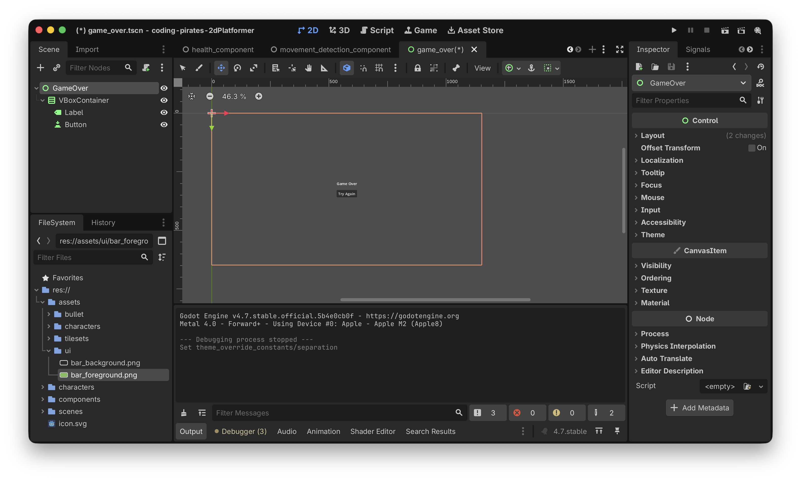
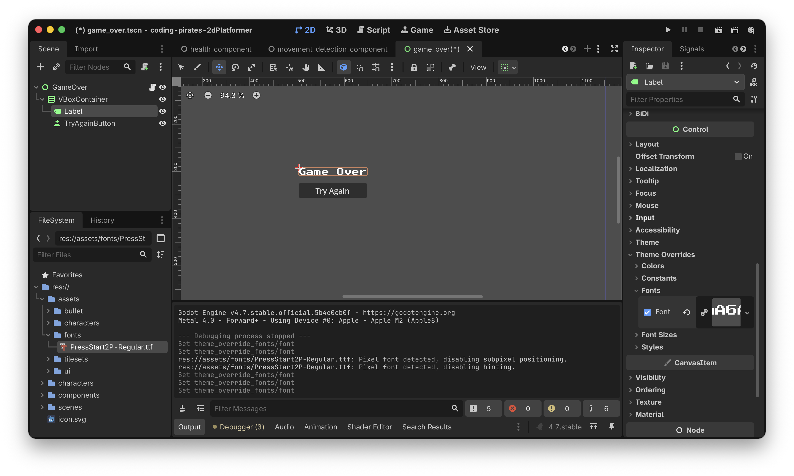
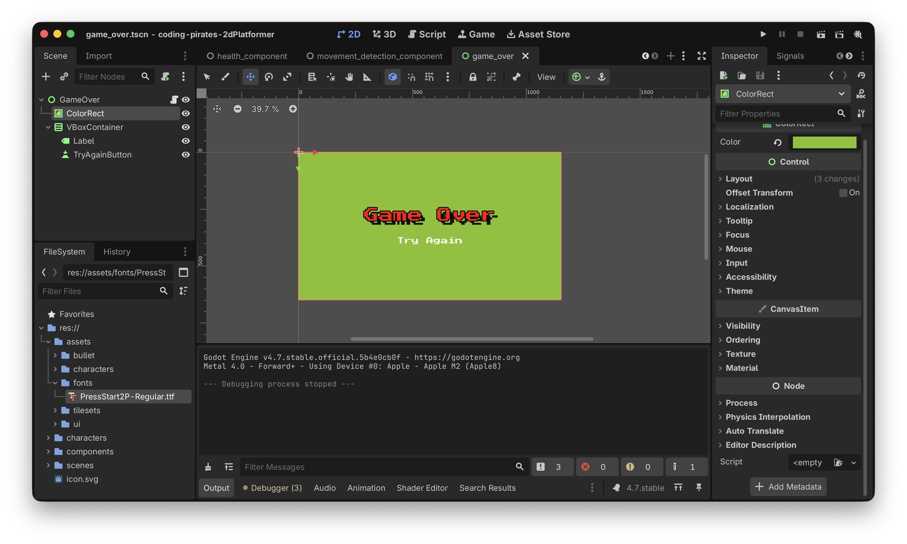

# Godot 2D Platformer - level 17 Game Over man!

I [sidste level](../lesson16/) startede vi på UI og fik lavet en healtbar.

Lad os fortsætte i UI sporet og lave en Game Over skærm som vi viser når vi er døde.

## Hvad er det vi gerne vil?
Vi vil lave en ny skærm som vi viser når vi er døde.

Vores skærm skal have en "Try Again!" knap som vi kan trykke på og starte vores spil igen.

OK...det lyder jo meget simpelt, lad os prøve at skrive nogle opgaver så vi kan komme igang:

- [ ] Ny Game Over skærm
- [ ] Naviger til Game Over når vi er døde
- [ ] Start nyt spil fra Game Over skærm

Let's go!

## Ny Game Over skærm
Du er så gammel og garvet nu at vi kan give dig opgaverne i stikordsform og så kører du bare derfra...værsågod:

- Lav en ny Scene af typen "User Interface"
- Omdøb scene til at hedde GameOver
- Gem din scene under res/scenes som "game_over.tscn"
- I roden af din GameOver scene tilføjer du en `VBoxContainer` som er endnu en container type. En `VBoxContainer` tager sit indhold og placerer det "vertikalt", altså under hinanden (gæt selv hvad en `HBoxContainer` gør :))
- Ret anchor til at være "Center"
- I din `VBoxContainer` tilføjer du en `Label` og en `Button`
- I din `Label` skriver du i text "Game Over" (kig i "Inspectoren" i højre side)
- I din `Button` skriver du i text "Try Again"

Det skulle gerne se sådan her ud



Og ja, det ligner noget der er kastet ind med en skovl men det pudser vi senere, nu vil vi bare have logikken på plads :)

Hak ved step 1

- [X] Ny Game Over skærm
- [ ] Naviger til Game Over når vi er døde
- [ ] Start nyt spil fra Game Over skærm

Videre.

## Naviger til Game Over når vi er døde
Hvordan kommer vi fra en skærm til en anden?

Det er faktisk super simpelt. Vi kan sige:

`get_tree().change_scene_to_file("navn_på_scene_vi_vil_skifte_til")`

Så! I vores `player.gd` kan vi opdatere vores `die` funktion så den efter at have afspillet "die" animationen smider os over på Game Over skærmen. 

Prøv at se om du selv kan sætte det sammen.

Her er vores `die` funktion:

```gdscript
func die() -> void:
	# flip is_dying så vi ikke ryger i _process igen
	is_dying = true
	
	# gør så player kan løbe igennem animationen
	set_physics_process(false)
	
	# vent på at die animationen spiller færdig
	await animation_component.handle_die_animation()
	
	get_tree().change_scene_to_file("res://scenes/game_over.tscn")
```

Kør dit spil og dø.

Ja...joeh, det gør jo som det skal, men det bliver meget sådan "bang bang", lad os lige vente et sekund så man kan nå at se dødsanimationen og lige tænke et enkelt "satans!!" inden man ser Game Over skærmen.

Igen...vi har brugt timers tidligere så prøv at se om du selv kan regne ud hvad der skal gøres.

Her er vores forsøg, bemærk at vi har lavet en ny `die_wait_period` variabel så vi kan styre det udefra hvis vi vil.

```gdscript
func die() -> void:
	# flip is_dying så vi ikke ryger i _process igen
	is_dying = true
	
	# gør så player kan løbe igennem animationen
	set_physics_process(false)
	
	# vent på at die animationen spiller færdig
	await animation_component.handle_die_animation()
	
	# vent lige lidt
	await get_tree().create_timer(die_wait_period).timeout
	
	# Og så vis Game Over skærmen
	get_tree().change_scene_to_file("res://scenes/game_over.tscn")
```

Hak ved step to

- [X] Ny Game Over skærm
- [X] Naviger til Game Over når vi er døde
- [ ] Start nyt spil fra Game Over skærm

Videre til step tre

## Start nyt spil fra Game Over skærm
Her skal vi vel bare gøre det modsatte...altså navigere til "game" scenen, og det skal vi så gøre fra en knap action som vi connecter til i vores script.

Så:

- Lav et nyt script på din Game Over scene
- Connect 
- Naviger tilbage til "game.tscn"

Prøv selv :)

Her er vores forsøg:

```gdscript
extends Control

@export_subgroup("Properties")
@export var try_again_button: Button

func _ready() -> void:
	try_again_button.pressed.connect(_on_try_again_pressed)

func _on_try_again_pressed() -> void:
	get_tree().change_scene_to_file("res://scenes/game.tscn")
```

Kør dit spil, dø, se Game Over skærmen og tryk på "Try Again" knappen...tada, vi kører igen :)

Hak ved step tre

- [X] Ny Game Over skærm
- [X] Naviger til Game Over når vi er døde
- [X] Start nyt spil fra Game Over skærm

## Var det det?
Vi kunne sige at det var det, opgaven er løst...meeeeen sådan er vi ikke! Det ligner jo lor...noget der er kastet ind med en skovl, det kan vi godt gøre pænere.

### Fonts
Vi kan f.eks. skifte font til en custom font.

I assets mappen kan du finde font filen "PressStart2P-Regular.ttf" som du kan kopiere til dine assets (selvfølgelig i en ny mappe som du kalder "fonts" ;))

Hvis du vil bruge en anden font kan du gå på jagt i f.eks [google fonts](https://fonts.google.com).

Herefter kan du i 2D workspacet:

- Vælge din `Label`
- I "Inspectoren" i højre side vælge "Theme Overrides" -> "Fonts"
- Trække din nye font ind



Og så kan du skrue på "Font Size" og ændre "Font Color" og vælge om der skal være en shadow og en outline.

Go crazy!

Og prøv dig frem med din `Button` bagefter, det er de samme håndtag du har at trække i her.

Her er vores slut resultat. 



Bemærk at vi har smidt en [`ColorRect`](https://docs.godotengine.org/en/stable/classes/class_colorrect.html) ind som baggrund så vi kan styre baggrundsfarven. Du kan også smide et [`TextureRect`](https://docs.godotengine.org/en/stable/classes/class_texturerect.html) ind og bruge et billede hvis du hellere vil det. Husk bare at sætte anchor til "Full Rect" så det fylder hele skærmen...hvis det er det du vil selvfølgelig :)

Bemærk også at du kan skrue på afstanden der skal være imellem elementer i en `VBoxContainer` under "Theme Overrides" -> "Constants" -> "Separation"
## Game Over?
Ja for den her level i alle tilfælde!

Ikke dårligt, nu mangler vi vel egentlig bare en start skærm så man ikke bare dropper direkte ned i vores spil. Den laver vi i [næste level](../lesson18).