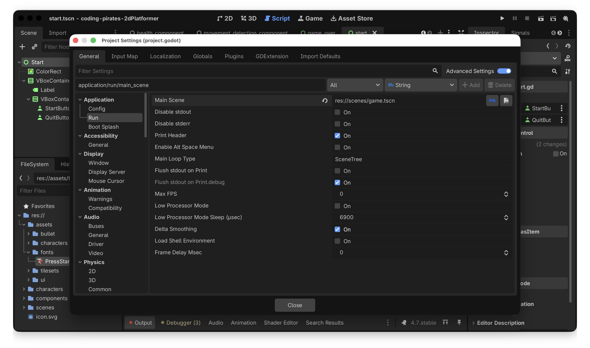
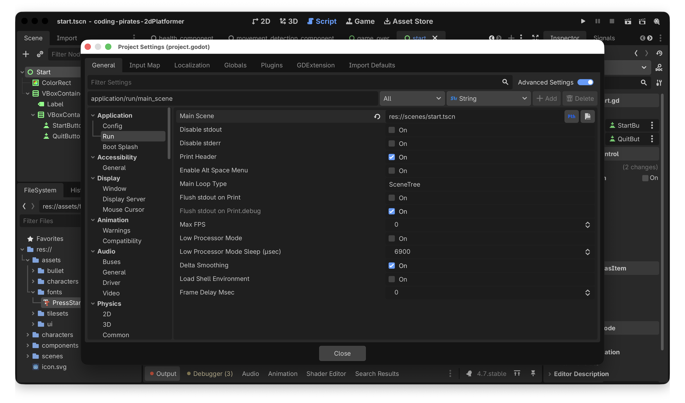
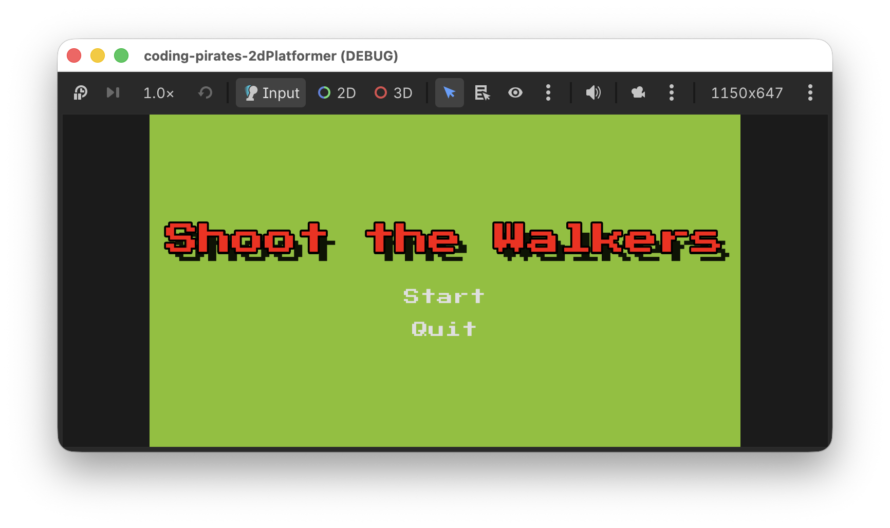

# Godot 2D Platformer - level 18, Startskærm

Vi er tæt på at have noget man kunne kalde et færdigt spil. Ja, der mangler flere levels og så videre men alle delene er ved at være her.

Sidste del er en start skærm så man ikke bare starter midt i spillet. Den skal minde meget om vores Game Over skærm fra [level 17](../lesson17/) og så have en ekstra Quit knap.

Det burde være til at overkomme forholdsvist hurtigt så lad os komme i gang.

## Liste tid
Vi skal:

- [ ] Have lavet en ny Start skærm
  - [ ] Med en titel
  - [ ] Og en Start knap
  - [ ] Og en Quit knap
- [ ] Brug vores nye Start skærm som start skærm i stedet for "Game" skærmen

Lad os komme i gang!

## Ny Start skærm
Det minder meget om det vi lavede I [level 17](../lesson17/) så du kan søge kraftig inspiration i det, dog skal du lige have en knap mere med som skal have titlen "Quit".

Kald din nye skærm for Start og gem den samme sted som du gemte din GameOver skærm.

Her er vores forsøg, bemærk at vi har en `VBoxContainer` inden i en anden `VBoxContainer` så vi kan have _en_ `separation` mellem tekst og knapper og _en anden_ `separation` mellem de enkelte knapper.

### Script
- Lav et nyt script til din `start.tscn` skærm
- Tilføj variabler til start og quit button på samme måde som før, du ved `@export var start_button: Button` f.eks.
- Connect til `pressed` på dine knapper og lav to nye funktioner så du kan reagere på at der bliver trykket på både start og quit knappen.
- Implementer dine funktioner
  - Start knappen skal gøre præcis det samme som "Try Again" knappen i vores Game Over skærm
  - Quit skal kalde `get_tree().quit()`

That's it, her er vores forsøg:

```gdscript
extends Control

@export_subgroup("Properties")
@export var start_button: Button
@export var quit_button: Button

func _ready() -> void:
	start_button.pressed.connect(_on_start_pressed)
	quit_button.pressed.connect(_on_quit_pressed)

func _on_start_pressed() -> void:
	get_tree().change_scene_to_file("res://scenes/game.tscn")
	
func _on_quit_pressed() -> void:
	get_tree().quit()
```

Det var step 1

- [X] Have lavet en ny Start skærm
  - [X] Med en titel
  - [X] Og en Start knap
  - [X] Og en Quit knap
- [ ] Brug vores nye Start skærm som start skærm i stedet for "Game" skærmen

## Brug vores nye Start skærm som start skærm i stedet for "Game" skærmen
Så skal vi have fortalt Godot at vi gerne vil bruge vores `start.tscn` som start skærm i stedet for `game.tscn` som vi ellers har gjort før.

- I top menuen vælger du "Project" -> "Project Settings"
- Under "Application" -> "Run" finder du "Main Scene" som i øjeblikket er sat til "game.tscn"



- Ret den til så vi i stedet bruger "start.tscn"



Kør dit spil. Tada! Nu starter vi på start skærmen!



Det var step 2

- [X] Have lavet en ny Start skærm
  - [X] Med en titel
  - [X] Og en Start knap
  - [X] Og en Quit knap
- [X] Brug vores nye Start skærm som start skærm i stedet for "Game" skærmen

Og....

## Det var det!
Så er vi _faktisk_ ved at være ved vejs ende i den her serie. Godt arbejde! Du har lært en masse om Godot.

Hvis du har lyst er der et par bonus levels som du kan kaste dig over og ellers kan du jo selv udvide dit spil som du vil, f.eks. med:

- Forskellige typer fjender
- Forskellige våben
- Score
- Liv
- Flere baner
- Hvad du nu kan finde på

Tak for denne gang og vi ses i en anden Godot serie :)